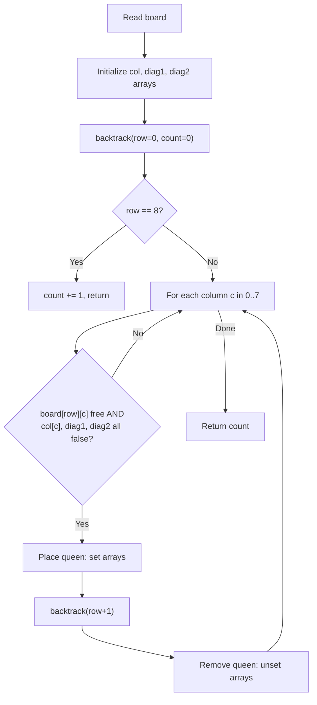

# 13. Chessboard and Queens

## 1. Problem Description

Place 8 queens on an 8x8 chessboard so that no two queens attack each other. Each square is either free (`.`) or reserved (`*`); queens can only be placed on free squares. Reserved squares do not block attacks. Count the number of valid placements.

## 2. Expected Input

8 lines, each containing 8 characters (`.` for free, `*` for reserved).

## 3. Expected Output

A single integer: the number of valid placements.

## 4. Constraints

- Board size: 8x8.
- Time limit: 1.00 s
- Memory limit: 512 MB

## 5. Examples

| Input | Output |
|---|---|
| `........`<br>`........`<br>`..*.....`<br>`........`<br>`........`<br>`.....**.`<br>`...*....`<br>`........` | `65` |

## 6. Intuition

This is the classic **N-Queens counting problem** with the additional constraint that some squares are reserved. Use backtracking: place queens row by row, and at each row, try each column that is not attacked by any previously placed queen and is not on a reserved square.

To check attacks efficiently, maintain three boolean arrays:
- `col[c]` — is column `c` occupied?
- `diag1[r + c]` — is the main diagonal (top-left to bottom-right) occupied?
- `diag2[r - c + 7]` — is the anti-diagonal (top-right to bottom-left) occupied?

## 7. Thought Process



## 8. Brute-Force Approach

Place 8 queens in all `C(64, 8) ≈ 4.4 * 10^9` ways and check each for validity. Infeasible.

## 9. Optimized Solution

```python
def solve(board: list[str]) -> int:
    """Count valid 8-queen placements avoiding reserved squares."""
    col = [False] * 8
    diag1 = [False] * 15  # r + c in [0, 14]
    diag2 = [False] * 15  # r - c + 7 in [0, 14]
    count = 0

    def backtrack(row: int) -> None:
        nonlocal count
        if row == 8:
            count += 1
            return
        for c in range(8):
            if board[row][c] == "*":
                continue
            if col[c] or diag1[row + c] or diag2[row - c + 7]:
                continue
            col[c] = diag1[row + c] = diag2[row - c + 7] = True
            backtrack(row + 1)
            col[c] = diag1[row + c] = diag2[row - c + 7] = False

    backtrack(0)
    return count


if __name__ == "__main__":
    board = [input().strip() for _ in range(8)]
    print(solve(board))
```

## 10. Why the Optimized Solution Works

**Why one queen per row**: Since two queens in the same row attack each other, and we need 8 queens on an 8x8 board, exactly one queen must be in each row. This reduces the search space from `C(64, 8)` to `8^8 ≈ 1.7 * 10^7` (try each column for each row).

**Diagonal indexing**:
- The main diagonals (going down-right) have constant `r + c`. For an 8x8 board, `r + c` ranges from `0` (top-left) to `14` (bottom-right), so we use an array of size `15`.
- The anti-diagonals (going down-left) have constant `r - c`. For an 8x8 board, `r - c` ranges from `-7` to `7`. We shift by `+7` to make it non-negative, giving range `[0, 14]`.

**Pruning**: At each row, we skip columns that are:
1. Reserved (`board[row][c] == '*'`).
2. Attacked by a previously placed queen (`col[c]`, `diag1[row+c]`, or `diag2[row-c+7]` is `True`).

**Backtracking**: After recursing, we undo the placement to allow the next column to be tried. This is the standard "choose, recurse, un-choose" pattern.

The algorithm explores at most `8! = 40320` valid partial placements (because each row's column choice eliminates columns for subsequent rows). With pruning, the actual count is much smaller.

## 11. Algorithm Used

Backtracking with constraint propagation (column and diagonal attack arrays).

## 12. Data Structures Used

- `board`: list of 8 strings (the input).
- `col`, `diag1`, `diag2`: boolean arrays of size 8, 15, 15.
- A scalar counter `count`.

## 13. Time Complexity Analysis

**`O(n!)`** for `n x n` board. For `n = 8`, this is `40320` — instant.

## 14. Space Complexity Analysis

**`O(n)`** for the recursion stack and the boolean arrays.

## 15. Step-by-Step Code Walkthrough

1. Initialize `col`, `diag1`, `diag2` to all `False`.
2. Define `backtrack(row)`:
   - If `row == 8`: we've placed all 8 queens. Increment `count` and return.
   - For each column `c` in `0..7`:
     - Skip if `board[row][c] == '*'` (reserved square).
     - Skip if `col[c]` or `diag1[row + c]` or `diag2[row - c + 7]` is `True` (attacked).
     - Place the queen: set all three arrays to `True` at the appropriate indices.
     - Recurse: `backtrack(row + 1)`.
     - Remove the queen: set all three arrays back to `False`.
3. Call `backtrack(0)` starting from row 0.
4. Return `count`.

## 16. Dry Run with Example

For an empty board (no reserved squares), the answer is `92` (the well-known count of 8-queens solutions). With the reserved squares in the example, some solutions are eliminated, giving `65`.

A snippet of the search:
- `row 0`: try columns 0, 1, 2, ..., 7. Each placement sets `col[c]`, `diag1[0+c]`, `diag2[0-c+7]`.
- `row 1`: try columns not attacked by the row-0 queen and not reserved.

The recursion tree is pruned heavily by the diagonal and column checks.

## 17. Common Pitfalls

- **Diagonal index out of range.** The formula `r - c + 7` works for 8x8 boards. For a general `n x n` board, use `r - c + (n - 1)`.
- **Forgetting to un-set the arrays** after recursion. This corrupts the state for sibling branches.
- **Confusing `diag1` and `diag2`**. `r + c` is for one direction, `r - c` for the other. Mixing them up silently produces wrong answers.
- **Reading the board with extra whitespace.** Use `.strip()` to remove trailing newlines.

## 18. Edge Cases

| Case | Expected Behavior |
|---|---|
| Empty board (no reserved) | `92` (standard 8-queens count) |
| All reserved except 8 squares in a valid placement | `1` |
| First row all reserved | `0` (no queen can be placed in row 0) |
| Heavily reserved board | `0` if no valid placement exists |

## 19. Alternative Approaches

- **Bitmask backtracking**: Use integers instead of boolean arrays. Each bit represents a column or diagonal. Faster in C++ but the algorithmic complexity is the same.
- **Precomputed solutions**: Enumerate all 92 valid 8-queen placements once, then count how many are compatible with the reserved squares. For `n = 8` this is feasible.

## 20. Related Problems

- [[5. Two Knights]]
- [[18. Tower of Hanoi]]
- [[10. N-Queens]] (NeetCode)

## 21. Key Takeaways

- **N-Queens** is the canonical backtracking problem. The pattern (row-by-row, with column and diagonal attack arrays) is essential.
- **Diagonal indexing tricks**: `r + c` for one diagonal, `r - c` (shifted) for the other. Memorize these.
- **Backtracking template**: choose, recurse, un-choose. The "un-choose" step is what makes backtracking work — without it, you'd be doing greedy search.
- **Pruning** by checking constraints before recursing is what makes backtracking feasible. Without pruning, you'd explore `8^8 ≈ 1.7 * 10^7` configurations; with pruning, you explore `8! = 40320`.
