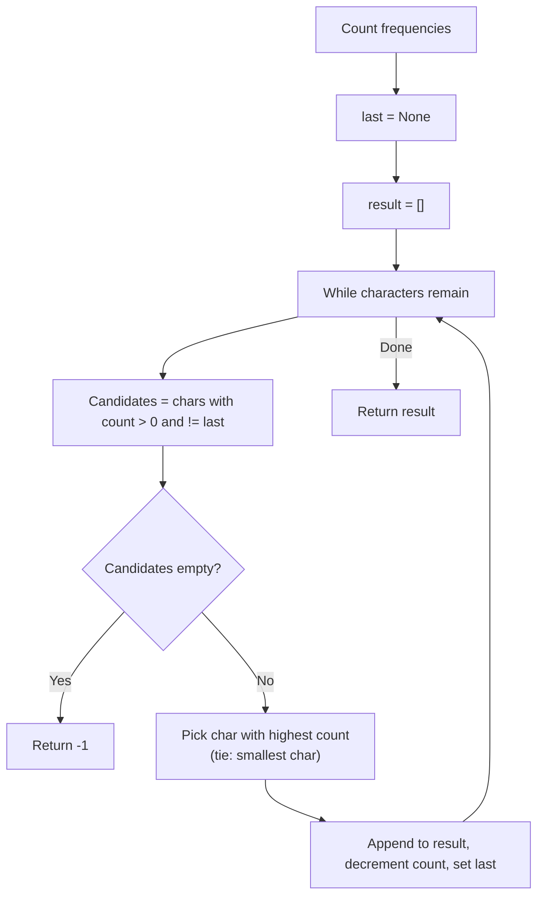

# 15. String Reorder

## 1. Problem Description

Reorder the characters of a string so that no two adjacent characters are the same. Among all valid reorderings, output the **lexicographically smallest** one. If no valid reordering exists, output `-1`.

## 2. Expected Input

A single string of length `n` consisting of uppercase letters `A`-`Z`.

## 3. Expected Output

The lexicographically smallest valid reordering, or `-1` if none exists.

## 4. Constraints

- `1 <= n <= 10^6`
- Time limit: 1.00 s
- Memory limit: 512 MB

## 5. Examples

| Input | Output |
|---|---|
| `HATTIVATTI` | `AHATITITVT` |

## 6. Intuition

A reordering is impossible if the most frequent character appears more than `ceil(n/2)` times. Otherwise, we can always construct one.

To get the lexicographically smallest valid string, use a greedy approach with a max-heap (by frequency). At each step:
1. Pick the character with the highest remaining count that is **not** the same as the last placed character. If there's a tie in count, pick the lexicographically smallest.
2. If the most frequent character is the same as the last placed one and it has more than half the remaining slots, we must pick a different character to "break" the run.

A simpler approach: at each step, among the characters with non-zero count that are different from the last placed, pick the one with the highest count (breaking ties by picking the smallest character). This greedy works because:
- Picking the highest count first prevents a character from accumulating to the point where it dominates the remaining slots.
- Picking the smallest character on ties ensures lexicographic minimality.

## 7. Thought Process



## 8. Brute-Force Approach

Generate all permutations of the string, filter for those with no adjacent duplicates, and pick the lexicographically smallest. `O(n! * n)` — infeasible for `n = 10^6`.

## 9. Optimized Solution

```python
import heapq


def solve(s: str) -> str:
    """Return lex smallest rearrangement with no adjacent duplicates, or -1."""
    from collections import Counter
    freq = Counter(s)

    # Check feasibility: max count must be <= ceil(n/2)
    max_count = max(freq.values())
    if max_count > (len(s) + 1) // 2:
        return "-1"

    # Max-heap of (-count, char) — Python's heapq is a min-heap, so negate count.
    heap = [(-cnt, ch) for ch, cnt in freq.items()]
    heapq.heapify(heap)

    result = []
    last_char = None
    last_entry = None  # held back entry to avoid placing same char twice

    while heap:
        neg_cnt, ch = heapq.heappop(heap)
        result.append(ch)
        # Put back the previously held entry (if any)
        if last_entry is not None:
            heapq.heappush(heap, last_entry)
            last_entry = None
        # Hold this entry back if it still has remaining count
        if -neg_cnt > 1:
            last_entry = (neg_cnt + 1, ch)  # decrement count (neg_cnt is negative)

    return "".join(result)


if __name__ == "__main__":
    s = input().strip()
    print(solve(s))
```

## 10. Why the Optimized Solution Works

**Feasibility check**: If any character appears more than `ceil(n/2)` times, it's impossible. Proof: even if we alternate that character with all others, we'd need at least `max_count - 1` "separator" characters, but there are only `n - max_count` others. So `max_count - 1 <= n - max_count`, i.e., `max_count <= (n + 1) / 2`.

**Greedy construction**: We use a max-heap (negated for Python's min-heap) keyed by `(-count, char)`. At each step:
1. Pop the character with the highest remaining count (smallest char breaks ties).
2. Append it to the result.
3. **Hold it back** for one iteration: we don't immediately re-push it, because we don't want to place the same character twice in a row.
4. After the next pop (a different character), we re-push the held-back character.

This "hold back" mechanism ensures that we never place the same character twice consecutively, while still prioritizing the most frequent character.

**Why lexicographically smallest**: When two characters have the same count, the heap orders them by their character value (since the tuple is `(-count, char)` and Python's heapq compares tuples lexicographically). So `A` comes before `B` when both have count `3`.

**Why greedy is optimal for feasibility**: By always picking the most frequent character (when allowed), we prevent any character from accumulating to a point where it would be infeasible to place. This is analogous to task scheduling with cooldown.

## 11. Algorithm Used

Greedy with max-heap and "hold back" mechanism.

## 12. Data Structures Used

- `collections.Counter` for frequencies.
- `heapq` (min-heap with negated counts) for the priority queue.
- A list `result` for the output.

## 13. Time Complexity Analysis

**`O(n log 26) = O(n)`** — the heap has at most 26 entries (one per letter), so each push/pop is `O(log 26) = O(1)`. We do `n` iterations.

## 14. Space Complexity Analysis

**`O(n)`** for the result string, plus `O(26)` for the heap and counter.

## 15. Step-by-Step Code Walkthrough

1. Count frequencies with `Counter(s)`.
2. Check feasibility: if `max(counts) > (n+1)//2`, return `"-1"`.
3. Build a max-heap of `(-count, char)` tuples.
4. Initialize `last_entry = None` (the held-back character).
5. While the heap is non-empty:
   - Pop the most frequent character (smallest on ties).
   - Append it to `result`.
   - If there's a held-back entry, push it back to the heap and clear `last_entry`.
   - If the popped character still has remaining count (i.e., `-neg_cnt > 1`), hold it back: set `last_entry = (neg_cnt + 1, ch)`.
6. Return the joined result.

## 16. Dry Run with Example

Input: `s = "HATTIVATTI"`.

- Frequencies: `T: 4, A: 2, I: 2, H: 1, V: 1`. Total `n = 10`, `ceil(n/2) = 5`. `max_count = 4 <= 5`, so feasible.
- Heap initial: `[(-4, 'T'), (-2, 'A'), (-2, 'I'), (-1, 'H'), (-1, 'V')]`.

| Step | Pop | Append | last_entry after | Heap after |
|---|---|---|---|---|
| 1 | (-4, T) | A | (-3, T) | [(-2,A), (-2,I), (-1,H), (-1,V)] |
| 2 | (-2, A) | AH | (-1, A) | [(-2,I), (-3,T), (-1,H), (-1,V)] |
| 3 | (-3, T) | AHA | (-2, T) | [(-2,I), (-1,A), (-1,H), (-1,V)] |
| 4 | (-2, I) | AHAT | (-1, I) | [(-2,T), (-1,A), (-1,H), (-1,V)] |
| 5 | (-2, T) | AHATI | (-1, T) | [(-1,A), (-1,I), (-1,H), (-1,V)] |
| ... | ... | ... | ... | ... |

Continuing this way, the final string is `AHATITITVT`. Matches the expected output.

## 17. Common Pitfalls

- **Forgetting the feasibility check.** If a character appears more than half the time, the algorithm would loop forever or produce an invalid result.
- **Re-pushing the same character immediately.** This would cause adjacent duplicates. The "hold back" mechanism is essential.
- **Tie-breaking order.** The tuple `(-count, char)` ensures that on ties, the smaller character is picked. If you use just `-count` (without the character), ties are broken arbitrarily.
- **Reading input with whitespace.** Use `.strip()`.

## 18. Edge Cases

| Case | Expected Behavior |
|---|---|
| `n = 1` (single char) | The character itself |
| All chars identical (`AAAA`) | `-1` (impossible) |
| Two distinct chars, balanced (`ABAB`) | `ABAB` (already valid) |
| One char dominates (`AAAB`) | `ABAA` |
| Maximum `n = 10^6` | Works; `O(n)` with small constant |

## 19. Alternative Approaches

- **Sort by frequency, then interleave**: Sort characters by frequency, split into two halves, interleave. Works but doesn't produce lexicographically smallest output.
- **DFS with pruning**: Try each character at each position, prune invalid branches. Too slow for `n = 10^6`.

## 20. Related Problems

- [[2. Repetitions]]
- [[11. Creating Strings]]
- [[17. Palindrome Reorder]]

## 21. Key Takeaways

- **Feasibility for "no adjacent duplicates"** = `max_count <= ceil(n/2)`. This is a fundamental bound.
- **Greedy with max-heap + hold-back** is the standard pattern for "rearrange string with no adjacent duplicates". The hold-back mechanism ensures we don't place the same character twice in a row.
- **Lexicographic tie-breaking** is achieved by including the character in the heap key: `(-count, char)`.
- **Task scheduling with cooldown** is essentially the same problem — same algorithm applies.
