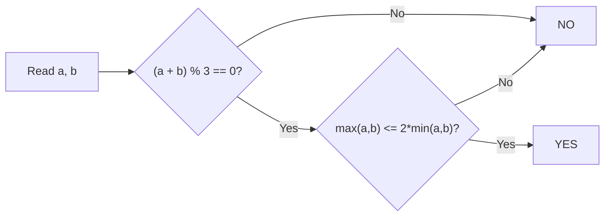

# 16. Coin Piles

## 1. Problem Description

You have two coin piles with `a` and `b` coins. On each move, you can either:
- Remove `1` coin from the left pile and `2` from the right, OR
- Remove `2` coins from the left pile and `1` from the right.

Determine if you can empty both piles.

## 2. Expected Input

- First line: integer `t` — number of test cases.
- Next `t` lines: two integers `a` and `b`.

## 3. Expected Output

For each test case, print `YES` if you can empty both piles, otherwise `NO`.

## 4. Constraints

- `1 <= t <= 10^5`
- `0 <= a, b <= 10^9`
- Time limit: 1.00 s
- Memory limit: 512 MB

## 5. Examples

| Input | Output |
|---|---|
| `3`<br>`2 1`<br>`2 2`<br>`3 3` | `YES`<br>`NO`<br>`YES` |

## 6. Intuition

Each move removes exactly `3` coins total (`1 + 2` or `2 + 1`). So `a + b` must be divisible by `3`.

Additionally, neither pile can be more than twice the other (because each move removes at most `2` from one pile and at least `1` from the other). So `max(a, b) <= 2 * min(a, b)`.

If both conditions hold, the answer is `YES`.

## 7. Thought Process



## 8. Brute-Force Approach

Simulate the moves with BFS/DFS. State space is `O(a * b) = O(10^18)` — infeasible.

## 9. Optimized Solution

```python
def solve(a: int, b: int) -> bool:
    """Return True if both piles can be emptied."""
    total = a + b
    if total % 3 != 0:
        return False
    if max(a, b) > 2 * min(a, b):
        return False
    return True


if __name__ == "__main__":
    t = int(input())
    out = []
    for _ in range(t):
        a, b = map(int, input().split())
        out.append("YES" if solve(a, b) else "NO")
    print("\n".join(out))
```

## 10. Why the Optimized Solution Works

Let `x` be the number of moves of type "1 from left, 2 from right" and `y` be the number of moves of type "2 from left, 1 from right". Then:
- `a = x + 2y`
- `b = 2x + y`

We need to find non-negative integers `x, y` satisfying both equations.

From the equations:
- `a + b = 3(x + y)`, so `a + b` must be divisible by `3`. Let `s = (a + b) / 3 = x + y`.
- `a - b = -x + y = y - x`. So `y - x = a - b`. Combined with `y + x = s`, we get `y = (s + a - b) / 2` and `x = (s - a + b) / 2`.

For `x, y` to be non-negative integers:
- `s + a - b` must be even and `>= 0` → `y >= 0`.
- `s - a + b` must be even and `>= 0` → `x >= 0`.

The parity condition is automatically satisfied: since `a + b = 3s`, `a + b` and `s` have the same parity iff `3s` and `s` have the same parity, which is always true. So `s + a - b = s + (a - b)`. We have `a + b = 3s` so `a = (3s + (a-b))/2`, hence `a - b = 2a - 3s`. Then `s + (a - b) = s + 2a - 3s = 2a - 2s = 2(a - s)`. So `y = a - s` and `x = s - y = s - (a - s) = 2s - a = b - s`.

Wait, let me redo this. `y = (s + (a - b)) / 2 = (s + a - b) / 2`. And `s = (a + b)/3`, so `s + a - b = (a + b)/3 + a - b = (a + b + 3a - 3b)/3 = (4a - 2b)/3`. Hmm, this is getting messy. Let me use a cleaner approach.

The conditions `x >= 0` and `y >= 0` translate to:
- `y = (s + a - b) / 2 >= 0` → `s + a >= b` → `b - a <= s` → `b <= a + s`.
- `x = (s - a + b) / 2 >= 0` → `s + b >= a` → `a - b <= s` → `a <= b + s`.

Since `s = (a+b)/3`, the condition `a <= b + s` becomes `a <= b + (a+b)/3`, i.e., `3a <= 3b + a + b`, i.e., `2a <= 4b`, i.e., `a <= 2b`. Similarly `b <= 2a`.

So the conditions are:
1. `(a + b) % 3 == 0`.
2. `a <= 2b`.
3. `b <= 2a`.

Conditions 2 and 3 together are `max(a, b) <= 2 * min(a, b)`.

**Verification with examples**:
- `a = 2, b = 1`: total = 3, divisible by 3. max = 2, 2*min = 2. `2 <= 2`. YES.
- `a = 2, b = 2`: total = 4, not divisible by 3. NO.
- `a = 3, b = 3`: total = 6, divisible by 3. max = 3, 2*min = 6. `3 <= 6`. YES.

## 11. Algorithm Used

Closed-form mathematical analysis.

## 12. Data Structures Used

- Scalar integers only.

## 13. Time Complexity Analysis

**`O(1)`** per query. Total `O(t)`.

## 14. Space Complexity Analysis

**`O(1)`** per query.

## 15. Step-by-Step Code Walkthrough

1. Read `a` and `b`.
2. Check if `(a + b) % 3 != 0`: if so, return `False`.
3. Check if `max(a, b) > 2 * min(a, b)`: if so, return `False`.
4. Otherwise return `True`.

## 16. Dry Run with Example

| a | b | a+b | (a+b)%3 | max | 2*min | Result |
|---|---|---|---|---|---|---|
| 2 | 1 | 3 | 0 | 2 | 2 | YES (2 <= 2) |
| 2 | 2 | 4 | 1 | — | — | NO (divisibility fails) |
| 3 | 3 | 6 | 0 | 3 | 6 | YES (3 <= 6) |

Matches expected output.

## 17. Common Pitfalls

- **Forgetting the divisibility check.** Some students only check the ratio condition and miss cases like `a = 1, b = 2` (which is `YES`) vs `a = 1, b = 1` (which is `NO` because `1+1=2` isn't divisible by `3`).
- **Forgetting the ratio check.** Just divisibility isn't enough: `a = 5, b = 1` has total `6` divisible by `3`, but `5 > 2*1`. You can't remove `5` from pile A using only moves that take at most `2` from A per move (you'd need `3` moves of type "2 from A", but that requires `3` from B as well, and B only has `1`).
- **Integer overflow in other languages.** `a + b` can be up to `2 * 10^9`, which fits in 32-bit signed int. But `2 * min(a, b)` can be up to `2 * 10^9` too. In Python this is a non-issue.

## 18. Edge Cases

| Case | Expected Behavior |
|---|---|
| `a = 0, b = 0` | `YES` (trivially empty) |
| `a = 0, b = 3` | `YES` (one move of type "1 from A, 2 from B" — wait, that takes 1 from A which is 0. Actually, you can't take 1 from an empty pile. So this should be NO.) |

Hmm, let me re-check the `a = 0, b = 3` case. With `a = 0, b = 3`: total = 3 (divisible by 3), max = 3, 2*min = 0. `3 > 0`, so `NO`. Correct — you can't empty `b = 3` without taking from `a` too.

| `a = 1, b = 2` | `YES` (one move of "1 from A, 2 from B") |
| `a = 10^9, b = 10^9` | `YES` (total = `2*10^9`, divisible by 3 iff `10^9 mod 3 = 1`, so `2*10^9 mod 3 = 2`. NO. Hmm, actually `10^9 mod 3`: `10 mod 3 = 1`, so `10^9 mod 3 = 1`. So `2 * 10^9 mod 3 = 2`. NO.) |

## 19. Alternative Approaches

- **Solving the linear system**: As derived above, `x = b - s` and `y = a - s` where `s = (a+b)/3`. Check that both are non-negative. Equivalent to the conditions above.
- **BFS**: Infeasible for `a, b` up to `10^9`.

## 20. Related Problems

- [[7. Two Sets]]
- [[6. Missing Number]]
- [[23. Raab Game I]]

## 21. Key Takeaways

- **Each move removes a constant total** (here, `3`). So the total must be divisible by that constant.
- **Ratio constraints** (`max <= 2 * min`) arise from the fact that each move removes at most `2` from one pile and at least `1` from the other.
- **Linear Diophantine analysis** (solving `a = x + 2y, b = 2x + y` for non-negative integers) is the rigorous way to derive these conditions.
- For "can you reach a target state" problems, always look for closed-form conditions before simulating.
