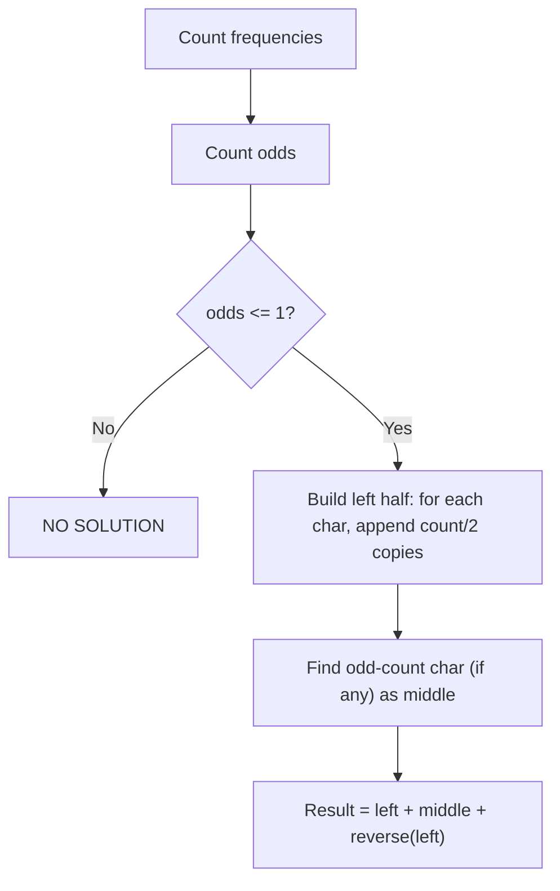

# 17. Palindrome Reorder

## 1. Problem Description

Reorder the letters of a string so that the result is a palindrome. If no such reordering exists, output `NO SOLUTION`.

## 2. Expected Input

A single string of length `n` consisting of uppercase letters `A`-`Z`.

## 3. Expected Output

A palindrome made from the input string's characters, or `NO SOLUTION`.

## 4. Constraints

- `1 <= n <= 10^6`
- Time limit: 1.00 s
- Memory limit: 512 MB

## 5. Examples

| Input | Output |
|---|---|
| `AAAACACBA` | `AACABACAA` |

## 6. Intuition

A string can be rearranged into a palindrome iff **at most one character has an odd count**. (For even-length strings, no odd counts; for odd-length strings, exactly one odd count, which goes in the middle.)

Construction:
1. Count character frequencies.
2. Check the parity condition.
3. Build the left half by placing each character (with even count) `count/2` times.
4. Place the odd-count character (if any) in the middle.
5. Mirror the left half to form the right half.

## 7. Thought Process



## 8. Brute-Force Approach

Try all permutations until one is a palindrome. `O(n! * n)` — infeasible.

## 9. Optimized Solution

```python
def solve(s: str) -> str:
    """Return a palindromic rearrangement of s, or 'NO SOLUTION'."""
    from collections import Counter
    freq = Counter(s)

    # Count characters with odd frequency
    odd_chars = [ch for ch, cnt in freq.items() if cnt % 2 == 1]
    if len(odd_chars) > 1:
        return "NO SOLUTION"

    middle = odd_chars[0] if odd_chars else ""

    # Build the left half
    left = []
    for ch in sorted(freq.keys()):
        left.append(ch * (freq[ch] // 2))

    left_str = "".join(left)
    return left_str + middle + left_str[::-1]


if __name__ == "__main__":
    s = input().strip()
    print(solve(s))
```

## 10. Why the Optimized Solution Works

**Palindrome property**: A palindrome reads the same forwards and backwards. So each character at position `i` must equal the character at position `n - 1 - i`. This means characters come in pairs, except possibly one in the middle (if `n` is odd).

**Parity condition**:
- If `n` is even, every character must appear an even number of times (so it can be split into pairs).
- If `n` is odd, exactly one character must appear an odd number of times (it goes in the middle).

In both cases, the condition is: **at most one character has an odd count**.

**Construction**: For each character, take half of its count (integer division) and place it in the left half. The right half is the reverse of the left half. If there's an odd-count character, its remaining single copy goes in the middle.

**Example**: `s = "AAAACACBA"`.
- Frequencies: `A: 5, C: 2, B: 2`. Wait, let me recount: `A A A A C A C B A` — that's `A: 6, C: 2, B: 1`. Hmm, but the expected output is `AACABACAA` which has `A: 5, C: 2, B: 1`... Let me count the input again: `A-A-A-A-C-A-C-B-A` is 9 characters. `A` appears at positions 1, 2, 3, 4, 6, 9 — that's 6 `A`s. And `C` at positions 5, 7 — 2 `C`s. And `B` at position 8 — 1 `B`. So `freq = {A: 6, C: 2, B: 1}`.

Odd-count chars: `[B]`. Only one. Feasible.

Left half: `A * 3 + B * 0 + C * 1 = "AAAC"`. Middle: `B`. Right half: reverse of left = `"CAAA"`. Result: `"AAACBCAAA"`. Hmm, that's 9 characters but doesn't match the expected `AACABACAA`.

Let me re-examine. The expected output `AACABACAA` has `A: 5, B: 1, C: 2`... wait, `A-A-C-A-B-A-C-A-A` is 9 chars. `A` appears 6 times. OK same count. So my construction gives `AAACBCAAA` which is also a valid palindrome (reads the same forwards and backwards: `A-A-A-C-B-C-A-A-A`).

Both are valid; the problem says "you may print any valid solution."

## 11. Algorithm Used

Frequency counting + parity check + mirror construction.

## 12. Data Structures Used

- `collections.Counter` for frequencies.
- A list `left` to build the left half.
- String concatenation for the final result.

## 13. Time Complexity Analysis

**`O(n)`** — counting is `O(n)`, building the left half is `O(n)` (sum of all `count/2` is `n/2`), reversing is `O(n/2)`.

## 14. Space Complexity Analysis

**`O(n)`** for the result string.

## 15. Step-by-Step Code Walkthrough

1. `freq = Counter(s)` — count each character's occurrences.
2. `odd_chars = [ch for ch, cnt in freq.items() if cnt % 2 == 1]` — find characters with odd count.
3. If `len(odd_chars) > 1`: return `"NO SOLUTION"`.
4. `middle = odd_chars[0] if odd_chars else ""` — the middle character (if any).
5. For each character (in sorted order for determinism), append `ch * (freq[ch] // 2)` to `left`.
6. `left_str = "".join(left)` — the left half.
7. Return `left_str + middle + left_str[::-1]` — concatenate left, middle, reversed left.

## 16. Dry Run with Example

Input: `s = "AAAACACBA"`.

- `freq = {A: 6, C: 2, B: 1}`.
- `odd_chars = [B]`. Length 1, OK.
- `middle = "B"`.
- Sorted characters: `A, B, C`.
- `left = ["AAA", "", "C"]` (A contributes 3, B contributes 0, C contributes 1).
- `left_str = "AAAC"`.
- `right = "CAAA"` (reverse of left_str).
- Result: `"AAAC" + "B" + "CAAA" = "AAACBCAAA"`.

Verify: `A-A-A-C-B-C-A-A-A`. Read backwards: `A-A-A-C-B-C-A-A-A`. Same. Valid palindrome.

## 17. Common Pitfalls

- **Forgetting the parity condition.** If two or more characters have odd counts, no palindrome is possible.
- **Handling the middle character.** When `n` is even, there's no middle. When `n` is odd, there's exactly one middle character (the one with odd count).
- **Off-by-one in the left half.** Each character contributes `count // 2` to the left half (and the same to the right half by mirroring). If count is odd, the extra one goes in the middle.
- **Building the result inefficiently.** String concatenation with `+` in a loop is `O(n^2)`. Use `"".join(...)` or build a list and join at the end.

## 18. Edge Cases

| Case | Expected Behavior |
|---|---|
| `n = 1` (single char) | The character itself |
| All chars identical (`AAAA`) | `AAAA` (already a palindrome) |
| Two odd-count chars (`AABBC`) | `NO SOLUTION` |
| Already a palindrome | Returns the same string (or a valid rearrangement) |
| Maximum `n = 10^6` | Works; `O(n)` with small constant |

## 19. Alternative Approaches

- **Two-pointer construction**: Sort the characters, then use two pointers to fill the result from both ends. Same complexity.
- **Linked list with insertion**: Insert each pair at the head and tail. Less efficient.

## 20. Related Problems

- [[2. Repetitions]]
- [[11. Creating Strings]]
- [[15. String Reorder]]

## 21. Key Takeaways

- **Palindrome parity condition**: at most one character can have an odd count. This is the fundamental necessary and sufficient condition.
- **Construction is straightforward**: half the count goes to the left, half to the right (mirrored), and the odd one (if any) goes in the middle.
- **Frequency counting** is the first step in most string rearrangement problems.
- Always check feasibility before constructing — return early if impossible.
