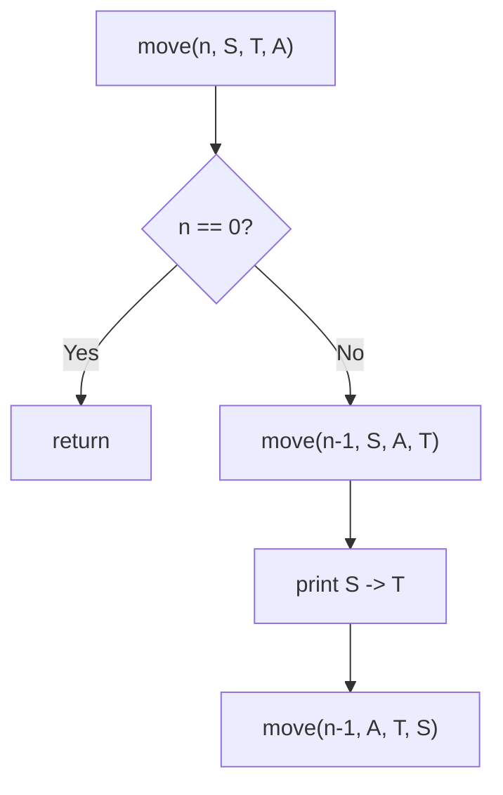

# 18. Tower of Hanoi

## 1. Problem Description

The Tower of Hanoi game has three stacks (left, middle, right) and `n` round disks of different sizes. Initially, all disks are on the left stack in increasing size order from top to bottom (smallest on top). Move all disks to the right stack using the middle stack. On each move, you can move the uppermost disk from one stack to another. You may not place a larger disk on a smaller one.

Find a solution that minimizes the number of moves.

## 2. Expected Input

A single integer `n` — the number of disks.

## 3. Expected Output

- First line: `k` — the minimum number of moves.
- Next `k` lines: two integers `a b` per line, meaning "move a disk from stack `a` to stack `b`".

## 4. Constraints

- `1 <= n <= 16`
- Time limit: 1.00 s
- Memory limit: 512 MB

## 5. Examples

| Input | Output |
|---|---|
| `2` | `3`<br>`1 2`<br>`1 3`<br>`2 3` |

## 6. Intuition

The classic recursive solution:
- To move `n` disks from source `S` to target `T` using auxiliary `A`:
  1. Move `n - 1` disks from `S` to `A` (using `T` as auxiliary).
  2. Move the largest disk from `S` to `T`.
  3. Move `n - 1` disks from `A` to `T` (using `S` as auxiliary).

The number of moves is `2^n - 1`.

## 7. Thought Process



## 8. Brute-Force Approach

The recursive solution **is** the brute force, but it's also optimal. There's no shorter sequence of moves.

## 9. Optimized Solution

```python
def solve(n: int) -> list[tuple[int, int]]:
    """Return the list of moves for Tower of Hanoi with n disks."""
    moves = []

    def move(k: int, src: int, tgt: int, aux: int) -> None:
        if k == 0:
            return
        move(k - 1, src, aux, tgt)
        moves.append((src, tgt))
        move(k - 1, aux, tgt, src)

    move(n, 1, 3, 2)
    return moves


if __name__ == "__main__":
    n = int(input())
    moves = solve(n)
    print(len(moves))
    for src, tgt in moves:
        print(src, tgt)
```

## 10. Why the Optimized Solution Works

**Correctness**: To move `n` disks from `S` to `T`, the largest disk must end up at the bottom of `T`. For that to happen, all `n - 1` smaller disks must be out of the way — they must all be on `A`. So:
1. Move `n - 1` disks from `S` to `A` (recursive subproblem).
2. Move the largest disk from `S` to `T` (single move).
3. Move `n - 1` disks from `A` to `T` (recursive subproblem).

This is the **only** way to move `n` disks while respecting the size constraint. The recursion terminates at `n = 0` (no disks to move).

**Number of moves**: Let `T(n)` be the number of moves for `n` disks. Then `T(n) = 2 * T(n-1) + 1`, with `T(0) = 0`. Solving: `T(n) = 2^n - 1`.

Proof by induction: `T(0) = 0 = 2^0 - 1`. Suppose `T(k) = 2^k - 1`. Then `T(k+1) = 2 * T(k) + 1 = 2 * (2^k - 1) + 1 = 2^(k+1) - 2 + 1 = 2^(k+1) - 1`. QED.

**Minimality**: The above argument shows that any solution must perform at least these moves (because the largest disk can only move when all others are on the auxiliary). So `2^n - 1` is optimal.

## 11. Algorithm Used

Recursive divide and conquer.

## 12. Data Structures Used

- A list `moves` to collect the moves.
- Recursion stack (depth `n`).

## 13. Time Complexity Analysis

**`O(2^n)`** — the number of moves is `2^n - 1`, and each move is `O(1)` work.

For `n = 16`, this is `65535` moves — fast.

## 14. Space Complexity Analysis

**`O(n)`** for the recursion stack, plus `O(2^n)` to store the moves list.

## 15. Step-by-Step Code Walkthrough

1. Initialize an empty `moves` list.
2. Define `move(k, src, tgt, aux)`:
   - Base case: if `k == 0`, return (no disks to move).
   - Recursive step:
     - `move(k - 1, src, aux, tgt)` — move `k-1` disks from source to auxiliary.
     - `moves.append((src, tgt))` — record the move of the largest disk.
     - `move(k - 1, aux, tgt, src)` — move `k-1` disks from auxiliary to target.
3. Call `move(n, 1, 3, 2)` — move `n` disks from stack 1 to stack 3, using stack 2 as auxiliary.
4. Print the count and each move.

## 16. Dry Run with Example

Input: `n = 2`.

- `move(2, 1, 3, 2)`:
  - `move(1, 1, 2, 3)`:
    - `move(0, 1, 3, 2)` — base case, return.
    - Append `(1, 2)` — move disk 1 from stack 1 to stack 2.
    - `move(0, 3, 2, 1)` — base case, return.
  - Append `(1, 3)` — move disk 2 from stack 1 to stack 3.
  - `move(1, 2, 3, 1)`:
    - `move(0, 2, 1, 3)` — base case, return.
    - Append `(2, 3)` — move disk 1 from stack 2 to stack 3.
    - `move(0, 1, 3, 2)` — base case, return.

Moves: `[(1,2), (1,3), (2,3)]`. Count: 3.

Output:
```
3
1 2
1 3
2 3
```

Matches the expected output.

## 17. Common Pitfalls

- **Mixing up the auxiliary and target.** The recursive call `move(k-1, src, aux, tgt)` uses `aux` as the target and `tgt` as the auxiliary. Getting this wrong silently produces incorrect moves.
- **Forgetting the base case.** Without `if k == 0: return`, the recursion never terminates.
- **Off-by-one in counting.** The number of moves is `2^n - 1`, not `2^n` or `2^(n-1)`.
- **Recursion depth.** For `n = 16`, depth is `16`, well within Python's default limit of `1000`.

## 18. Edge Cases

| Case | Expected Behavior |
|---|---|
| `n = 1` | `1` move: `1 3` |
| `n = 16` | `65535` moves |
| `n = 0` (out of constraints) | `0` moves |

## 19. Alternative Approaches

- **Iterative**: There's an iterative solution based on the parity of `n`:
  - If `n` is even: alternate moves between (S, A) and (S, T) and (A, T) in a cycle.
  - If `n` is odd: different cycle.
  - The iterative solution avoids recursion overhead but is harder to remember.
- **Bit manipulation**: The `i`-th move (1-indexed) moves disk `(number of trailing zeros in i) + 1`. The direction depends on `n` and disk parity. Elegant but obscure.

## 20. Related Problems

- [[13. Chessboard and Queens]]
- [[19. Gray Code]]
- [[50. Josephus Problem I]]

## 21. Key Takeaways

- **Tower of Hanoi** is the canonical example of recursive problem solving. The pattern "move n-1, move 1, move n-1" appears in many divide-and-conquer algorithms.
- **`2^n - 1` moves** is the minimum. This is a classic result in combinatorics.
- **Recursive thinking**: "to solve a problem of size `n`, solve two subproblems of size `n-1` and combine." This is the essence of divide and conquer.
- The same recursive structure appears in **Gray code generation** (next problem) and **binary exponentiation**.
