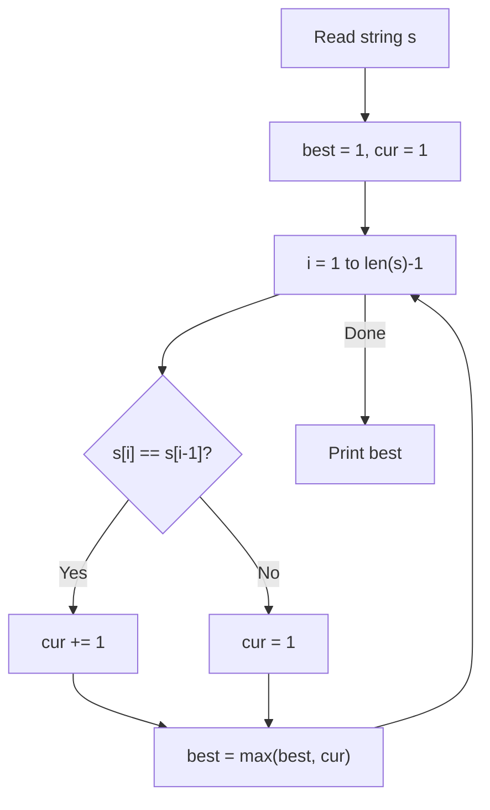

# 2. Repetitions

## 1. Problem Description

You are given a DNA sequence — a string consisting of the characters `A`, `C`, `G`, and `T`. Your task is to find the length of the longest repetition: a maximum-length contiguous substring that contains only one type of character.

For example, for the input `ATTCGGGA`, the longest repetition is `GGG`, which has length `3`.

## 2. Expected Input

A single line containing a string of `n` characters, each being one of `A`, `C`, `G`, `T`.

## 3. Expected Output

A single integer: the length of the longest repetition.

## 4. Constraints

- `1 <= n <= 10^6`
- Time limit: 1.00 s
- Memory limit: 512 MB

## 5. Examples

| Input | Output | Explanation |
|---|---|---|
| `ATTCGGGA` | `3` | `GGG` is the longest run |
| `AAAA` | `4` | The whole string is one run |
| `ACGT` | `1` | No two adjacent characters match |

## 6. Intuition

Walk through the string once, keeping track of the current run length. Whenever the current character matches the previous one, extend the run by `1`. Otherwise, reset the run to `1`. Track the maximum run length seen.

## 7. Thought Process



## 8. Brute-Force Approach

A brute force would examine every substring `(i, j)` and check whether all characters in that range are equal. There are `O(n^2)` substrings, and checking each is `O(n)`, giving `O(n^3)`. For `n = 10^6` this is hopeless.

A slightly better brute force (`O(n^2)`) extends each starting position as far as possible. Still too slow.

## 9. Optimized Solution

```python
def solve(s: str) -> int:
    """Return the length of the longest run of identical characters."""
    if not s:
        return 0
    best = 1
    cur = 1
    for i in range(1, len(s)):
        if s[i] == s[i - 1]:
            cur += 1
            best = max(best, cur)
        else:
            cur = 1
    return best


if __name__ == "__main__":
    s = input().strip()
    print(solve(s))
```

## 10. Why the Optimized Solution Works

The key observation is that **a run either continues or restarts at every position**. If `s[i] == s[i-1]`, the run that ended at `i-1` extends to `i`. If not, a brand new run starts at `i` with length `1`.

The variable `cur` always holds the length of the run ending at the current position `i`. The variable `best` is the maximum `cur` seen so far. Because we examine every position, `best` ends up as the maximum run length over the entire string.

The loop invariant is: **at the start of iteration `i`, `cur` equals the length of the longest suffix of `s[:i]` consisting of identical characters.** This is true at `i = 1` (we initialize `cur = 1` because `s[:1]` is a single character). Each iteration either extends or restarts `cur`, maintaining the invariant.

## 11. Algorithm Used

Single-pass linear scan with running counter.

## 12. Data Structures Used

- The input string `s` (read into memory; `10^6` bytes is trivial).
- Two integer variables `best` and `cur`.

## 13. Time Complexity Analysis

**`O(n)`** — single pass through the string, `O(1)` work per character.

## 14. Space Complexity Analysis

**`O(1)`** extra space (ignoring the input string, which we have to read anyway).

## 15. Step-by-Step Code Walkthrough

1. `if not s: return 0` — defensive check for empty input. The constraints say `n >= 1`, but the guard makes the function safe.
2. `best = 1; cur = 1` — initialize both to `1` because a single character is a run of length `1`.
3. `for i in range(1, len(s)):` — start at index `1` so we can compare with `i-1`.
4. `if s[i] == s[i - 1]:` — character matches the previous one.
5. `cur += 1` — extend the run.
6. `best = max(best, cur)` — update the global maximum. Note we only need to update `best` when `cur` increases, but doing it inside this branch is fine.
7. `else: cur = 1` — different character; reset.
8. `return best` — return the maximum.

## 16. Dry Run with Example

Input: `ATTCGGGA`

| i | s[i] | s[i-1] | Match? | cur | best |
|---|---|---|---|---|---|
| 0 | A | — | — | 1 | 1 |
| 1 | T | A | No | 1 | 1 |
| 2 | T | T | Yes | 2 | 2 |
| 3 | C | T | No | 1 | 2 |
| 4 | G | C | No | 1 | 2 |
| 5 | G | G | Yes | 2 | 2 |
| 6 | G | G | Yes | 3 | 3 |
| 7 | A | G | No | 1 | 3 |

Output: `3`. Correct.

## 17. Common Pitfalls

- **Starting the loop at `i = 0`** and comparing `s[0]` with `s[-1]`. In Python, `s[-1]` is the last character, which is a valid but unintended comparison. Always start at `i = 1`.
- **Forgetting to update `best` when `cur` increases.** A common bug is to only update `best` at the end, but if the longest run extends to the end of the string, you may have already lost the max.
- **Off-by-one on initialization.** Both `best` and `cur` should start at `1` (assuming `n >= 1`).
- **Using `.count()` or regex.** These work but are `O(n)` per call, and you'd need many calls. Stick to one pass.

## 18. Edge Cases

| Case | Expected Behavior |
|---|---|
| Empty string | `0` (handled by the guard) |
| Single character | `1` |
| All identical characters | `n` |
| No two adjacent equal | `1` |
| Maximum input (`n = 10^6`, all `A`s) | `10^6` |

## 19. Alternative Approaches

- **`itertools.groupby`**: `max(len(list(g)) for _, g in groupby(s))`. Concise and idiomatic, same `O(n)` complexity. Slightly more memory because it materializes each group as a list.
- **Regex**: `max(len(m.group()) for m in re.finditer(r'(.)\1*', s))`. Works but is slower due to regex overhead.

## 20. Related Problems

- [[1. Weird Algorithm]]
- [[11. Creating Strings]]
- [[15. String Reorder]]

## 21. Key Takeaways

- **Run-length problems** are almost always solved with a single linear pass and two counters (`cur` and `best`).
- **Loop invariants** make correctness arguments trivial. Here, "cur is the length of the longest uniform suffix of `s[:i]`" is the invariant.
- **Python's `range(1, len(s))`** is the idiomatic way to iterate with access to both `i` and `i-1`.
- For very large inputs, prefer the manual loop over `groupby` because it avoids materializing intermediate lists.
