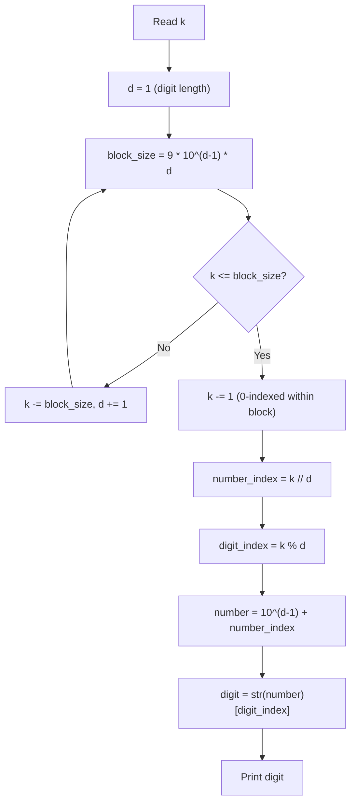

# 20. Digit Queries

## 1. Problem Description

Consider the infinite string formed by concatenating all positive integers in order: `123456789101112131415...`. Given `q` queries, each asking for the digit at position `k` (1-indexed), answer each query.

## 2. Expected Input

- First line: integer `q` — number of queries.
- Next `q` lines: one integer `k` per line.

## 3. Expected Output

For each query, print the digit at position `k`.

## 4. Constraints

- `1 <= q <= 1000`
- `1 <= k <= 10^18`
- Time limit: 1.00 s
- Memory limit: 512 MB

## 5. Examples

| Input | Output |
|---|---|
| `3`<br>`7`<br>`19`<br>`12` | `7`<br>`4`<br>`1` |

## 6. Intuition

The string is built from:
- 1-digit numbers (1-9): 9 numbers × 1 digit = 9 digits.
- 2-digit numbers (10-99): 90 numbers × 2 digits = 180 digits.
- 3-digit numbers (100-999): 900 numbers × 3 digits = 2700 digits.
- In general: `d`-digit numbers contribute `9 * 10^(d-1) * d` digits.

For a query `k`:
1. Find which "block" `k` falls into (1-digit, 2-digit, 3-digit, etc.) by subtracting block sizes.
2. Within the block, find which specific number contains position `k`.
3. Within that number, find which digit.

## 7. Thought Process



## 8. Brute-Force Approach

Build the string up to position `k`. For `k = 10^18`, this is `10^18` characters — completely infeasible.

## 9. Optimized Solution

```python
def solve(k: int) -> int:
    """Return the digit at position k (1-indexed) in the infinite string."""
    d = 1  # number of digits in current block
    while True:
        count = 9 * (10 ** (d - 1))  # how many d-digit numbers
        block_size = count * d
        if k <= block_size:
            break
        k -= block_size
        d += 1
    # k is now 1-indexed within the d-digit block
    k -= 1  # convert to 0-indexed
    number_index = k // d  # which d-digit number (0-indexed from 10^(d-1))
    digit_index = k % d  # which digit within that number
    number = 10 ** (d - 1) + number_index
    return int(str(number)[digit_index])


if __name__ == "__main__":
    q = int(input())
    for _ in range(q):
        k = int(input())
        print(solve(k))
```

## 10. Why the Optimized Solution Works

**Block structure**: The infinite string is the concatenation of:
- Block 1 (1-digit numbers 1-9): 9 × 1 = 9 digits.
- Block 2 (2-digit numbers 10-99): 90 × 2 = 180 digits.
- Block 3 (3-digit numbers 100-999): 900 × 3 = 2700 digits.
- Block `d` (d-digit numbers 10^(d-1) to 10^d - 1): `9 * 10^(d-1) * d` digits.

**Finding the block**: We iterate `d` from 1 upward, subtracting `9 * 10^(d-1) * d` from `k` until `k` falls within the current block. For `k = 10^18`, this loop runs at most `~18` times (since `10^18` has 18 digits).

**Finding the number**: Within the `d`-digit block, the first number is `10^(d-1)`. Position `k` (now 0-indexed within the block) falls in number `10^(d-1) + k // d`.

**Finding the digit**: Within that number, the digit is at index `k % d` (0 = leftmost).

**Example: `k = 12`**:
- Block 1 has 9 digits. `12 > 9`, so `k -= 9` → `k = 3`, `d = 2`.
- Block 2 has 180 digits. `3 <= 180`, so we stop.
- `k = 3` (1-indexed within block). Subtract 1: `k = 2` (0-indexed).
- `number_index = 2 // 2 = 1`. Number = `10 + 1 = 11`.
- `digit_index = 2 % 2 = 0`. Digit = `"11"[0] = '1'`.
- Answer: `1`. Correct.

## 11. Algorithm Used

Closed-form digit-position formula.

## 12. Data Structures Used

- Scalar integers.

## 13. Time Complexity Analysis

**`O(log k)`** per query — the loop runs `O(log_10 k)` times, and string conversion of a `d`-digit number is `O(d)`.

For `k = 10^18`, `d <= 18`, so each query is essentially `O(1)`.

## 14. Space Complexity Analysis

**`O(log k)`** for the string representation of the number.

## 15. Step-by-Step Code Walkthrough

1. Initialize `d = 1` (current digit length).
2. Loop:
   - Compute `count = 9 * 10^(d-1)` — number of `d`-digit numbers.
   - Compute `block_size = count * d` — total digits in this block.
   - If `k <= block_size`: break (we're in the right block).
   - Else: `k -= block_size; d += 1` (move to the next block).
3. Convert `k` to 0-indexed within the block: `k -= 1`.
4. `number_index = k // d` — which `d`-digit number (0-indexed from `10^(d-1)`).
5. `digit_index = k % d` — which digit within the number (0 = leftmost).
6. `number = 10^(d-1) + number_index`.
7. Return the `digit_index`-th character of `str(number)`.

## 16. Dry Run with Example

**Query `k = 7`**:
- `d = 1`: `count = 9`, `block_size = 9`. `7 <= 9`, break.
- `k -= 1` → `k = 6`.
- `number_index = 6 // 1 = 6`. Number = `1 + 6 = 7`.
- `digit_index = 6 % 1 = 0`. Digit = `"7"[0] = '7'`.
- Answer: `7`. Correct.

**Query `k = 19`**:
- `d = 1`: `block_size = 9`. `19 > 9`, so `k -= 9` → `k = 10`, `d = 2`.
- `d = 2`: `count = 90`, `block_size = 180`. `10 <= 180`, break.
- `k -= 1` → `k = 9`.
- `number_index = 9 // 2 = 4`. Number = `10 + 4 = 14`.
- `digit_index = 9 % 2 = 1`. Digit = `"14"[1] = '4'`.
- Answer: `4`. Correct.

**Query `k = 12`**:
- `d = 1`: `block_size = 9`. `12 > 9`, so `k -= 9` → `k = 3`, `d = 2`.
- `d = 2`: `block_size = 180`. `3 <= 180`, break.
- `k -= 1` → `k = 2`.
- `number_index = 2 // 2 = 1`. Number = `10 + 1 = 11`.
- `digit_index = 2 % 2 = 0`. Digit = `"11"[0] = '1'`.
- Answer: `1`. Correct.

## 17. Common Pitfalls

- **1-indexing vs 0-indexing.** The query `k` is 1-indexed. After finding the block, convert to 0-indexed before dividing.
- **Off-by-one in the number.** The first `d`-digit number is `10^(d-1)`, not `10^d` or `10^(d-1) - 1`.
- **Digit index direction.** `digit_index = k % d` gives the leftmost-first index. If you want rightmost-first, use `d - 1 - (k % d)`.
- **Loop termination.** Make sure the loop breaks when `k` is within the current block, not after subtracting.
- **Integer overflow in other languages.** `k` can be up to `10^18`, which overflows 32-bit. Use 64-bit.

## 18. Edge Cases

| Case | Expected Behavior |
|---|---|
| `k = 1` | `1` (first digit) |
| `k = 9` | `9` (last digit of 1-digit block) |
| `k = 10` | `1` (first digit of `10`) |
| `k = 11` | `0` (second digit of `10`) |
| `k = 10^18` | Works; `d` reaches ~18 |

## 19. Alternative Approaches

- **Binary search on `d`**: Instead of linear scan, binary search for the correct `d`. `O(log log k)` per query. Marginal improvement.
- **Precompute prefix sums** of block sizes. Then binary search. Useful if there are many queries.

## 20. Related Problems

- [[10. Trailing Zeros]]
- [[4. Number Spiral]]
- [[9. Bit Strings]]

## 21. Key Takeaways

- **Block decomposition** is the standard technique for "find the `k`-th element in an infinite sequence" problems.
- **`9 * 10^(d-1) * d`** is the number of digits contributed by all `d`-digit numbers.
- **0-indexing trick**: subtract 1 after finding the block to simplify the integer division.
- For `k` up to `10^18`, the loop runs at most ~18 times, so even a linear scan is fast enough.
