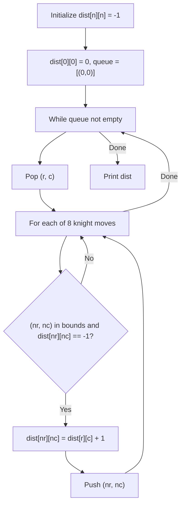

# 21. Knight Moves Grid

## 1. Problem Description

There is a knight on an `n x n` chessboard. For each square, print the minimum number of moves the knight needs to reach the top-left corner `(0, 0)`.

## 2. Expected Input

A single integer `n`.

## 3. Expected Output

Print `n` lines, each containing `n` space-separated integers — the minimum moves from each square to `(0, 0)`.

## 4. Constraints

- `4 <= n <= 1000`
- Time limit: 1.00 s
- Memory limit: 512 MB

## 5. Examples

| Input | Output |
|---|---|
| `8` | `0 3 2 3 2 3 4 5`<br>`3 4 1 2 3 4 3 4`<br>`2 1 4 3 2 3 4 5`<br>`3 2 3 2 3 4 3 4`<br>`2 3 2 3 4 3 4 5`<br>`3 4 3 4 3 4 5 4`<br>`4 3 4 3 4 5 4 5`<br>`5 4 5 4 5 4 5 6` |

## 6. Intuition

Run **BFS** from `(0, 0)`. The knight moves in 8 possible L-shapes: `(±1, ±2)` and `(±2, ±1)`. BFS explores squares in order of distance, so the first time we reach a square, we've found the minimum number of moves.

## 7. Thought Process



## 8. Brute-Force Approach

The BFS **is** the brute force, and it's also optimal. BFS on an unweighted graph gives shortest paths.

## 9. Optimized Solution

```python
from collections import deque


def solve(n: int) -> list[list[int]]:
    """Return a grid of minimum knight moves to (0, 0)."""
    dist = [[-1] * n for _ in range(n)]
    dist[0][0] = 0
    q = deque([(0, 0)])
    moves = [(-2, -1), (-2, 1), (-1, -2), (-1, 2),
             (1, -2), (1, 2), (2, -1), (2, 1)]

    while q:
        r, c = q.popleft()
        for dr, dc in moves:
            nr, nc = r + dr, c + dc
            if 0 <= nr < n and 0 <= nc < n and dist[nr][nc] == -1:
                dist[nr][nc] = dist[r][c] + 1
                q.append((nr, nc))

    return dist


if __name__ == "__main__":
    n = int(input())
    grid = solve(n)
    for row in grid:
        print(*row)
```

## 10. Why the Optimized Solution Works

**BFS property**: BFS on an unweighted graph visits nodes in order of their distance from the source. The first time a node is dequeued, its distance is the shortest.

**Why BFS is correct here**: The knight's moves form an unweighted graph where each edge represents one move. BFS from `(0, 0)` correctly computes the shortest path to every other square.

**8 moves**: A knight at `(r, c)` can move to `(r ± 1, c ± 2)` and `(r ± 2, c ± 1)` — 8 possible destinations. We try each and enqueue valid unvisited ones.

**Visited check**: `dist[nr][nc] == -1` means unvisited. Once we set `dist[nr][nc]` to a non-negative value, we never revisit (because BFS guarantees the first visit is the shortest).

## 11. Algorithm Used

Breadth-First Search (BFS).

## 12. Data Structures Used

- 2D list `dist` for distances.
- `collections.deque` for the BFS queue (O(1) pop from front).

## 13. Time Complexity Analysis

**`O(n^2)`** — each square is enqueued and dequeued at most once, and for each we do `O(1)` work (8 moves).

For `n = 1000`, this is `10^6` operations. Fast.

## 14. Space Complexity Analysis

**`O(n^2)`** for the `dist` grid and the queue.

## 15. Step-by-Step Code Walkthrough

1. Initialize `dist` to all `-1` (unvisited).
2. Set `dist[0][0] = 0` and enqueue `(0, 0)`.
3. Define the 8 knight moves.
4. While the queue is non-empty:
   - Dequeue `(r, c)`.
   - For each of the 8 moves:
     - Compute `(nr, nc)`.
     - If in bounds and unvisited: set `dist[nr][nc] = dist[r][c] + 1` and enqueue.
5. Print the grid.

## 16. Dry Run with Example

Input: `n = 8`.

- Start: `dist[0][0] = 0`, queue = `[(0,0)]`.
- Pop `(0, 0)`. Try moves:
  - `(-2, -1)` → out of bounds.
  - `(-2, 1)` → out of bounds.
  - `(-1, -2)` → out of bounds.
  - `(-1, 2)` → out of bounds.
  - `(1, -2)` → out of bounds.
  - `(1, 2)` → `(1, 2)`, in bounds, unvisited. `dist[1][2] = 1`. Enqueue.
  - `(2, -1)` → out of bounds.
  - `(2, 1)` → `(2, 1)`, in bounds, unvisited. `dist[2][1] = 1`. Enqueue.
- Pop `(1, 2)`. Try moves:
  - `(-1, -2)` → `(0, 0)`, already visited.
  - `(-1, 2)` → `(0, 4)`, in bounds, unvisited. `dist[0][4] = 2`. Enqueue.
  - `(1, -2)` → `(2, 0)`, in bounds, unvisited. `dist[2][0] = 2`. Enqueue.
  - `(1, 2)` → `(2, 4)`, in bounds, unvisited. `dist[2][4] = 2`. Enqueue.
  - `(-2, -1)` → out of bounds.
  - `(-2, 1)` → out of bounds.
  - `(2, -1)` → `(3, 1)`, in bounds, unvisited. `dist[3][1] = 2`. Enqueue.
  - `(2, 1)` → `(3, 3)`, in bounds, unvisited. `dist[3][3] = 2`. Enqueue.
- ... (continue BFS)

The first row of the output: `0 3 2 3 2 3 4 5`. This matches the expected output.

## 17. Common Pitfalls

- **Using DFS instead of BFS.** DFS doesn't give shortest paths in general.
- **Using a list as a queue.** `list.pop(0)` is `O(n)`. Use `collections.deque` with `popleft()` for `O(1)`.
- **Wrong knight moves.** The 8 moves are `(±1, ±2)` and `(±2, ±1)`. Missing or duplicating one silently produces wrong answers.
- **Visiting squares multiple times.** The `dist[nr][nc] == -1` check ensures each square is enqueued at most once.
- **Output format.** The output is `n` lines of `n` space-separated integers. Use `print(*row)` to format each row.

## 18. Edge Cases

| Case | Expected Behavior |
|---|---|
| `n = 4` (minimum) | All squares reachable |
| `n = 1000` | `10^6` squares, BFS runs in ~1 second |
| Knight can't reach some squares | Shouldn't happen on `n x n` for `n >= 4` |

## 19. Alternative Approaches

- **Closed-form formula**: For very large `n`, there's a closed-form formula based on parity and distance. But for `n <= 1000`, BFS is simpler and fast enough.
- **Bidirectional BFS**: Not needed for single-source on a small grid.
- **A* search**: Overkill; the graph is unweighted.

## 20. Related Problems

- [[5. Two Knights]]
- [[13. Chessboard and Queens]]
- [[84. Counting Rooms]]
- [[85. Labyrinth]]

## 21. Key Takeaways

- **BFS** is the standard algorithm for shortest paths in unweighted graphs.
- **`collections.deque`** with `popleft()` is the correct queue for BFS in Python. Never use `list.pop(0)`.
- **Knight moves** are the 8 L-shaped moves `(±1, ±2)` and `(±2, ±1)`.
- **Grid BFS** is a fundamental pattern: `dist` grid for visited/distance, queue for frontier, 4 or 8 directions to try.
- For grid problems with `n <= 1000`, BFS is always fast enough (`O(n^2)`).
