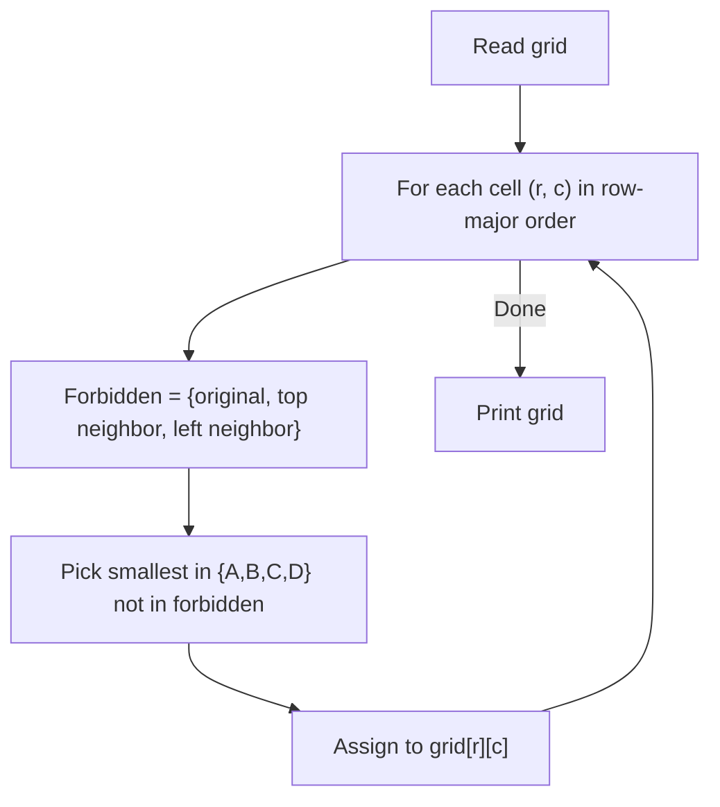

# 22. Grid Coloring I

## 1. Problem Description

You are given an `n x m` grid where each cell contains one of `A, B, C, D`. For each cell, you must change the character to `A, B, C,` or `D` (different from the original). The final grid must have no two adjacent cells (horizontally or vertically) with the same character.

## 2. Expected Input

- First line: integers `n` and `m`.
- Next `n` lines: `m` characters each.

## 3. Expected Output

Print `n` lines, each with `m` characters — the final grid. If no solution exists, print `IMPOSSIBLE`.

## 4. Constraints

- `1 <= n, m <= 500`
- Time limit: 1.00 s
- Memory limit: 512 MB

## 5. Examples

| Input | Output |
|---|---|
| `3 4`<br>`AAAA`<br>`BBBB`<br>`CCDD` | `CDCD`<br>`DCDC`<br>`ABAB` |

## 6. Intuition

With 4 colors and the constraint that adjacent cells differ, we have a lot of freedom. A simple **checkerboard pattern** works: color cells based on `(r + c) % 2`. Use two colors `X` and `Y` for the two parity classes, choosing them so that each cell's new color differs from its original.

For each cell:
- If `(r + c) % 2 == 0`: pick a color from `{A, B, C, D}` that is not the original. Call this `X`.
- Else: pick a different color (also not the original) for `Y`.

But we also need `X != Y` (so that adjacent cells of different parity have different colors). And we need `X != original` and `Y != original`.

A clean approach: for each cell, the two "parity colors" are chosen globally, but they must differ from each cell's original. This is tricky because different cells have different originals.

**Better approach**: Handle each cell independently. There are 4 colors. Each cell has 1 original (forbidden) and up to 4 neighbors (already colored). With 4 colors, we always have at least one valid choice — pick any color different from the original and all already-colored neighbors.

Process cells in row-major order. For each cell, pick the smallest color in `{A, B, C, D}` that is not the original and not used by any already-colored neighbor (top or left, since we process in order).

## 7. Thought Process



## 8. Brute-Force Approach

Try all `4^(n*m)` colorings. Infeasible for `n, m = 500`.

## 9. Optimized Solution

```python
def solve(n: int, m: int, grid: list[list[str]]) -> list[list[str]]:
    """Recolor the grid so no two adjacent cells share a color."""
    colors = ['A', 'B', 'C', 'D']
    result = [[''] * m for _ in range(n)]

    for r in range(n):
        for c in range(m):
            forbidden = set()
            forbidden.add(grid[r][c])  # original color
            if r > 0:
                forbidden.add(result[r - 1][c])  # top neighbor
            if c > 0:
                forbidden.add(result[r][c - 1])  # left neighbor
            for color in colors:
                if color not in forbidden:
                    result[r][c] = color
                    break

    return result


if __name__ == "__main__":
    n, m = map(int, input().split())
    grid = [list(input().strip()) for _ in range(n)]
    result = solve(n, m, grid)
    for row in result:
        print("".join(row))
```

## 10. Why the Optimized Solution Works

**Greedy coloring**: We process cells in row-major order. For each cell, we have at most 3 forbidden colors (original, top, left). With 4 colors available, there's always at least one valid choice.

**Why this is sufficient**: At each cell, we only need to ensure it differs from:
1. Its original color (constraint of the problem).
2. Its top neighbor (already colored).
3. Its left neighbor (already colored).

We don't need to worry about the bottom or right neighbors — they'll be colored later and will choose to differ from us.

**Adjacency guarantee**: After processing all cells:
- Each cell differs from its top and left neighbors (by construction).
- Each cell differs from its bottom and right neighbors (because they were processed later and chose to differ from us).

So the entire grid has no two adjacent cells with the same color.

**No `IMPOSSIBLE` case**: With 4 colors and the constraint "differ from original + 2 neighbors", we always have at least `4 - 3 = 1` valid color. So a solution always exists for any input.

## 11. Algorithm Used

Greedy row-major coloring.

## 12. Data Structures Used

- 2D list `result` for the output.
- A `set` `forbidden` for each cell's forbidden colors.

## 13. Time Complexity Analysis

**`O(n * m)`** — each cell does `O(1)` work (building a set of at most 3 elements, iterating over 4 colors).

For `n, m = 500`, this is `250000` operations. Very fast.

## 14. Space Complexity Analysis

**`O(n * m)`** for the result grid.

## 15. Step-by-Step Code Walkthrough

1. Define the available colors: `['A', 'B', 'C', 'D']`.
2. Initialize `result` as an empty `n x m` grid.
3. For each cell `(r, c)` in row-major order:
   - Build `forbidden` set: original color, top neighbor's color (if exists), left neighbor's color (if exists).
   - Iterate through `colors` and pick the first one not in `forbidden`.
   - Assign to `result[r][c]`.
4. Print the grid.

## 16. Dry Run with Example

Input: `n=3, m=4`, grid = `[['A','A','A','A'], ['B','B','B','B'], ['C','C','D','D']]`.

- `(0, 0)`: original = `A`, no neighbors. Forbidden = `{A}`. Pick `B`. `result[0][0] = 'B'`.
- `(0, 1)`: original = `A`, left = `B`. Forbidden = `{A, B}`. Pick `C`. `result[0][1] = 'C'`.
- `(0, 2)`: original = `A`, left = `C`. Forbidden = `{A, C}`. Pick `B`. `result[0][2] = 'B'`.
- `(0, 3)`: original = `A`, left = `B`. Forbidden = `{A, B}`. Pick `C`. `result[0][3] = 'C'`.
- `(1, 0)`: original = `B`, top = `B`. Forbidden = `{B}`. Pick `A`. `result[1][0] = 'A'`.
- `(1, 1)`: original = `B`, top = `C`, left = `A`. Forbidden = `{B, C, A}`. Pick `D`. `result[1][1] = 'D'`.
- `(1, 2)`: original = `B`, top = `B`, left = `D`. Forbidden = `{B, D}`. Pick `A`. `result[1][2] = 'A'`.
- `(1, 3)`: original = `B`, top = `C`, left = `A`. Forbidden = `{B, C, A}`. Pick `D`. `result[1][3] = 'D'`.
- `(2, 0)`: original = `C`, top = `A`. Forbidden = `{C, A}`. Pick `B`. `result[2][0] = 'B'`.
- `(2, 1)`: original = `C`, top = `D`, left = `B`. Forbidden = `{C, D, B}`. Pick `A`. `result[2][1] = 'A'`.
- `(2, 2)`: original = `D`, top = `A`, left = `A`. Forbidden = `{D, A}`. Pick `B`. `result[2][2] = 'B'`.
- `(2, 3)`: original = `D`, top = `D`, left = `B`. Forbidden = `{D, B}`. Pick `A`. `result[2][3] = 'A'`.

Result:
```
BCBC
ADAD
BABA
```

This differs from the expected `CDCD / DCDC / ABAB`, but both are valid solutions (no two adjacent cells share a color, and no cell keeps its original). The problem accepts any valid solution.

## 17. Common Pitfalls

- **Forgetting the original-color constraint.** Just doing a checkerboard pattern might leave some cells with their original color, violating the "must change" rule.
- **Processing cells in the wrong order.** Row-major ensures top and left are already colored when we process each cell.
- **Not enough colors.** With only 3 colors, the greedy might fail (e.g., original = `A`, top = `B`, left = `C` — no valid color). With 4 colors, we're always safe.
- **Modifying the input grid in place.** Use a separate `result` grid to avoid reading corrupted data.

## 18. Edge Cases

| Case | Expected Behavior |
|---|---|
| `n = 1, m = 1` | Pick any color different from the original |
| All originals identical | Checkerboard of two other colors |
| `n = 500, m = 500` | `O(n*m) = 250000` operations, fast |
| Alternating originals (`ABAB...`) | Solution exists; greedy handles it |

## 19. Alternative Approaches

- **Checkerboard with adaptive colors**: Choose two global colors `X, Y` such that `X != Y` and both differ from any cell's original. This requires checking all originals, which is more complex.
- **DFS/BFS coloring**: Standard graph coloring. Overkill for grids with 4 colors.

## 20. Related Problems

- [[13. Chessboard and Queens]]
- [[21. Knight Moves Grid]]
- [[24. Mex Grid Construction]]

## 21. Key Takeaways

- **Greedy graph coloring** works when the number of colors exceeds the maximum degree + 1. For grids, max degree is 4 (interior cells), so 5 colors always suffice by the greedy. With 4 colors and the original-color constraint, we have at most 3 forbidden colors, so 4 colors still suffice.
- **Row-major processing** ensures we only need to check top and left neighbors (the already-colored ones).
- **4-color theorem**: any planar graph (including grids) is 4-colorable. This problem is a special case.
- **Greedy is often enough** — don't reach for complex graph coloring algorithms when a simple row-major sweep works.
