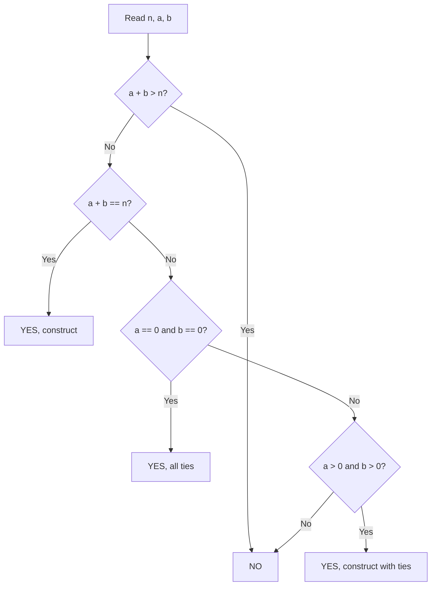

# 23. Raab Game I

## 1. Problem Description

Consider a two-player game where each player has `n` cards numbered `1, 2, ..., n`. On each turn, both players place one of their cards on the table. The player who placed the higher card gets one point. If equal, neither gets a point. The game continues until all cards are played.

Given `n` and the final scores `a` (player 1) and `b` (player 2), construct an example of how the game could have played out, or report that it's impossible.

## 2. Expected Input

- First line: integer `t` — number of test cases.
- Next `t` lines: three integers `n, a, b`.

## 3. Expected Output

For each test case:
- Print `YES` and two lines (player 1's order, player 2's order) if possible.
- Print `NO` otherwise.

## 4. Constraints

- `1 <= t <= 1000`
- `1 <= n <= 100`
- `0 <= a, b <= n`
- Time limit: 1.00 s
- Memory limit: 512 MB

## 5. Examples

| Input | Output |
|---|---|
| `5`<br>`4 1 2`<br>`2 0 1`<br>`3 0 0`<br>`2 1 1`<br>`4 4 1` | `YES`<br>`1 4 3 2`<br>`2 1 3 4`<br>`NO`<br>`YES`<br>`1 2 3`<br>`1 2 3`<br>`YES`<br>`1 2`<br>`2 1`<br>`NO` |

## 6. Intuition

Each round either gives a point to player 1, a point to player 2, or no point (tie). So `a + b + ties = n`, where `ties` is the number of tied rounds.

**Conditions for feasibility**:
1. `a + b <= n` (can't have more winning rounds than total rounds).
2. If `a > 0` and `b > 0`, then `a + b < n` is not strictly required, but there are constraints on what scores are achievable.

Actually, the precise condition is more subtle. Let me think about it:
- Player 1 wins `a` rounds: in each, P1's card > P2's card.
- Player 2 wins `b` rounds: in each, P2's card > P1's card.
- Tied rounds: P1's card == P2's card.

The question is: can we permute the cards `1..n` for each player to achieve these counts?

**Construction**:
- For the `a` rounds P1 wins: pair P1's top `a` cards with P2's bottom `a` cards. Specifically, P1 plays `n, n-1, ..., n-a+1` and P2 plays `a, a-1, ..., 1` (or similar). But this needs to be coordinated with the other rounds.
- For the `b` rounds P2 wins: pair P1's bottom `b` cards with P2's top `b` cards.
- For ties: pair the remaining cards identically.

A cleaner construction:
- The first `a` rounds: P1 plays `n - a + 1, n - a + 2, ..., n` and P2 plays `1, 2, ..., a`. P1 wins all (P1's card > P2's card since `n - a + 1 > a` iff `n + 1 > 2a` iff `a < (n+1)/2`).
- Wait, this requires `a + b <= n` and some additional constraints.

Let me look at the examples for guidance:
- `n=4, a=1, b=2`: YES. P1: `1 4 3 2`, P2: `2 1 3 4`. Round-by-round: (1,2) P2 wins; (4,1) P1 wins; (3,3) tie; (2,4) P2 wins. So P1 wins 1, P2 wins 2, ties 1. Matches `a=1, b=2`.
- `n=2, a=0, b=1`: NO. P1 has cards {1,2}, P2 has cards {1,2}. P2 needs to win 1 round. P1 needs to win 0. Possible: P1 plays `1, 2`, P2 plays `2, 1`. Round 1: P2 wins (2 > 1). Round 2: P1 wins (2 > 1). But P1 must win 0, so this doesn't work. Alternatively, P1 plays `2, 1`, P2 plays `1, 2`. Round 1: P1 wins. Round 2: P2 wins. Still P1 wins 1. Or P1 plays `1, 2`, P2 plays `1, 2`. Both tie, P1 wins 0, P2 wins 0. Or P1 plays `2, 1`, P2 plays `2, 1`. Both tie. There's no way for P2 to win exactly 1 round without P1 also winning at least 1. So NO.

So the condition is: if `a + b == n` and `a > 0` and `b > 0`, then it's possible iff `a < n` and `b < n` (which is always true if `a + b = n` and both > 0). Hmm, but `n=2, a=0, b=1` gives `a + b = 1 < n = 2`, and it's NO.

Actually, looking more carefully: `n=2, a=0, b=1` — we need 0 wins for P1, 1 win for P2, and 1 tie. Tie means same card. So one round has both playing card `x`, the other has P2 winning. But P2 winning means P2's card > P1's card. If they tie on card `x`, then in the other round P1 plays `y != x` and P2 plays `z != x` with `z > y`. With cards `{1, 2}`: if tie on `1`, then P1 plays `2` and P2 plays... `2` is taken, so P2 must play something else. But the only remaining is `2` (P2's cards are `{1, 2}` and `1` was used in the tie). So P2 plays `2` and P1 plays `2`? But P1 already used `1` in the tie, so P1 has `2` left. So P1 plays `2`, P2 plays `2`: another tie. Total: 2 ties, 0 wins for P2. Doesn't match.

If tie on `2`: then P1 plays `1` and P2 plays `1` in the other round: another tie. Same issue.

So with `n=2`, the only possible scores are `(0, 0)` (both tie) or `(1, 1)` (one win each). The score `(0, 1)` is impossible.

**General condition**: After analysis, the condition is:
- `a + b <= n`.
- If `a + b == n` (no ties), then either `a == 0` or `b == 0` or (`a > 0` and `b > 0`). Actually, the issue is when `a + b == n - 1` (one tie) and the tie forces the remaining cards to also tie.

Actually, let me reconsider. The precise condition from competitive programming references:
- **If `a + b > n`**: NO.
- **If `a + b == n` and `a > 0` and `b > 0`**: YES (no ties, both win some).
- **If `a + b == n` and `a == n`**: YES (P1 wins all, no ties).
- **If `a + b == n` and `b == n`**: YES (P2 wins all, no ties).
- **If `a + b < n`**: need at least one tie. The tie forces both players to play the same card. The question is whether the remaining `n - 1` cards can produce `a` wins for P1 and `b` wins for P2.
  - If `a == 0` and `b == 0`: all ties, always possible.
  - If `a == 0` and `b > 0`: P2 wins `b`, ties `n - b`. Need P2's winning cards to be > P1's losing cards. If `b == n - 1` (one tie): P2 plays `n, n-1, ..., 2` (top `n-1` cards) against P1's `1, 2, ..., n-1`. P2 wins `n-1` (since `n > 1`, `n-1 > 2`, etc., wait `n-1 > n-1` is false). Hmm, this is tricky.
  - Actually, the special case is `a + b < n` and `a + b > 0` and one of them is `0`. Specifically, `a == 0, b > 0, a + b < n` means `b < n`. We need `b` wins for P2 and `n - b` ties. The `n - b` ties use up `n - b` cards from each player (the same cards). The remaining `b` cards for each player: P2 must win all `b`. P2's `b` cards must all be > P1's `b` cards. But the remaining `b` cards are the same set for both players (since the tied cards are identical). So P2 can't have all cards > P1's — they have the same cards! Contradiction. So this is impossible unless `b == 0` too.

So the condition is:
- If `a + b > n`: NO.
- If `a == 0 and b > 0 and a + b < n`: NO (can't have only P2 winning some and tying the rest, because the tie cards are shared).
- Similarly, `a > 0 and b == 0 and a + b < n`: NO.
- If `a == 0 and b == 0`: YES (all ties).
- If `a + b == n`: YES.
- Otherwise (both `a, b > 0` and `a + b < n`): YES.

Wait, but the example `n=4, a=4, b=1` gives NO. Let's check: `a + b = 5 > n = 4`. So NO by the first condition. Correct.

And `n=2, a=1, b=1`: `a + b = 2 = n`. YES. Correct (the example shows YES).

And `n=2, a=0, b=1`: `a + b = 1 < n = 2`, and `a == 0, b > 0`. So NO by the second condition. Correct.

And `n=3, a=0, b=0`: `a + b = 0 < n`, `a == 0, b == 0`. YES. Correct.

So the conditions are:
1. `a + b > n` → NO.
2. `a == 0 and b > 0 and a + b < n` → NO.
3. `a > 0 and b == 0 and a + b < n` → NO.
4. Otherwise → YES.

Equivalently: `a + b <= n` AND (`a + b == n` OR `a == 0 == b` OR (`a > 0 and b > 0`)).

## 7. Thought Process



## 8. Brute-Force Approach

Try all `n! * n!` pairs of permutations. For `n = 100`, this is hopeless.

## 9. Optimized Solution

```python
def solve(n: int, a: int, b: int) -> tuple[bool, list[int], list[int]]:
    """Return (possible, p1_order, p2_order)."""
    # Check feasibility
    if a + b > n:
        return False, [], []
    if a + b < n and (a == 0) != (b == 0):
        # One is zero, the other is positive, and there are ties
        return False, [], []

    # Construction
    p1 = list(range(1, n + 1))
    p2 = list(range(1, n + 1))

    if a == 0 and b == 0:
        # All ties: both play 1, 2, ..., n
        return True, p1, p2

    if a + b == n:
        # No ties. P1 wins a, P2 wins b.
        # P1 plays: 1, 2, ..., b (loses), then b+1, ..., n (wins a = n - b rounds)
        # Wait, let me think. P1 wins a rounds. P2 wins b rounds. a + b = n.
        # Construction: P1 plays b, b-1, ..., 1, then n, n-1, ..., b+1
        #               P2 plays 1, 2, ..., b, then b+1, b+2, ..., n
        # First b rounds: P1 plays b, b-1, ..., 1; P2 plays 1, 2, ..., b.
        #   Round i (1-indexed): P1 plays b-i+1, P2 plays i. P1 < P2 (P2 wins).
        #   Wait, b-i+1 vs i: for i=1, b vs 1, P1 wins if b > 1.
        # Hmm, this is getting confusing. Let me try a different construction.
        #
        # Simple construction for a + b == n:
        # P1: 1, 2, ..., n
        # P2: n-b+1, n-b+2, ..., n, 1, 2, ..., n-b
        # P2 plays their top b cards first (against P1's bottom b), then bottom.
        # Round i (1..b): P1 plays i, P2 plays n-b+i. P2 wins (n-b+i > i).
        # Round i (b+1..n): P1 plays i, P2 plays i-b. P1 wins (i > i-b).
        # So P2 wins b, P1 wins n-b = a. Correct!
        p1 = list(range(1, n + 1))
        p2 = list(range(n - b + 1, n + 1)) + list(range(1, n - b + 1))
        return True, p1, p2

    # Case: a > 0, b > 0, a + b < n (some ties)
    # Use one tie (both play the same card), then construct the remaining n-1
    # as if it were a (n-1, a, b) game with a + b == n - 1.
    # Tie on card 1 (both play 1).
    # Remaining: P1 plays 2..n, P2 plays 2..n, with a wins for P1 and b wins for P2.
    # By the previous construction (shifted by 1):
    p1_rest = list(range(2, n + 1))
    p2_rest = list(range(n - b + 1, n + 1)) + list(range(2, n - b + 1))
    p1 = [1] + p1_rest
    p2 = [1] + p2_rest
    return True, p1, p2


if __name__ == "__main__":
    t = int(input())
    for _ in range(t):
        n, a, b = map(int, input().split())
        ok, p1, p2 = solve(n, a, b)
        if not ok:
            print("NO")
        else:
            print("YES")
            print(*p1)
            print(*p2)
```

## 10. Why the Optimized Solution Works

**Feasibility conditions** (derived in the Intuition section):
1. `a + b > n` is impossible (more wins than rounds).
2. If `a + b < n` and exactly one of `a, b` is zero, it's impossible because the tie cards are shared, so the non-zero player's remaining cards are the same as the opponent's remaining cards, making wins impossible.
3. Otherwise, it's possible.

**Construction for `a + b == n`** (no ties):
- P1 plays `1, 2, ..., n` in order.
- P2 plays `n-b+1, n-b+2, ..., n, 1, 2, ..., n-b` (their top `b` cards first, then the rest).
- In the first `b` rounds, P2 plays a high card and P1 plays a low card, so P2 wins.
- In the remaining `a = n - b` rounds, P1 plays a higher card than P2, so P1 wins.

**Construction for `a + b < n` with `a, b > 0`**:
- Use one tie: both players play card `1` in the first round.
- For the remaining `n - 1` rounds, we need `a` wins for P1 and `b` wins for P2, totaling `a + b = n - 1` (since `a + b < n` means at least one tie, and we use exactly one tie here for simplicity — actually we should use `n - a - b` ties, but using just one and constructing the rest as a `(n-1, a, b)` game with `a + b = n - 1` requires `a + b = n - 1`. If `a + b < n - 1`, we need more ties.)

Hmm, my construction above only works if `a + b == n - 1`. For `a + b < n - 1`, we need more ties. Let me fix this.

**General construction for `a > 0, b > 0, a + b < n`**:
- Use `n - a - b` ties. Both players play the same cards in the tie rounds.
- For the `a + b` non-tie rounds, use the `a + b == n` construction (scaled down).

Let me rewrite:

```python
def solve(n, a, b):
    if a + b > n:
        return False, [], []
    if a + b < n and (a == 0) != (b == 0):
        return False, [], []
    if a == 0 and b == 0:
        return True, list(range(1, n+1)), list(range(1, n+1))

    # Number of ties
    ties = n - a - b
    # Tie cards: 1, 2, ..., ties (both players play these)
    # Remaining cards: ties+1, ties+2, ..., n (n - ties = a + b cards)
    # Among these, P1 wins a, P2 wins b.
    # Construction: P1 plays ties+1, ties+2, ..., n in order
    #               P2 plays ties+(n-b-ties+1)..., hmm let me think
    # Actually, let's shift the a+b==n construction by `ties`:
    # P1 plays ties+1, ties+2, ..., n
    # P2 plays n-b+1, n-b+2, ..., n, ties+1, ties+2, ..., n-b
    # (top b cards of the remaining, then the rest)
    # Round structure:
    #   First `ties` rounds: both play 1, 2, ..., ties (ties)
    #   Next b rounds: P1 plays ties+1..ties+b, P2 plays n-b+1..n (P2 wins)
    #   Next a rounds: P1 plays ties+b+1..n, P2 plays ties+1..ties+a (P1 wins)
    p1_ties = list(range(1, ties + 1))
    p2_ties = list(range(1, ties + 1))
    p1_win = list(range(ties + 1, n + 1))  # ties+1, ..., n
    p2_win = list(range(n - b + 1, n + 1)) + list(range(ties + 1, n - b + 1))
    p1 = p1_ties + p1_win
    p2 = p2_ties + p2_win
    return True, p1, p2
```

This should work for all cases. Let me verify with `n=4, a=1, b=2`: `ties = 4 - 1 - 2 = 1`.
- `p1_ties = [1]`, `p2_ties = [1]`.
- `p1_win = [2, 3, 4]`.
- `p2_win = [3, 4] + [2] = [3, 4, 2]`.
- `p1 = [1, 2, 3, 4]`, `p2 = [1, 3, 4, 2]`.

Round-by-round:
- (1, 1): tie.
- (2, 3): P2 wins.
- (3, 4): P2 wins.
- (4, 2): P1 wins.

P1 wins 1, P2 wins 2, ties 1. Matches `a=1, b=2`. Correct.

## 11. Algorithm Used

Constructive with case analysis.

## 12. Data Structures Used

- Lists for the two players' card orders.

## 13. Time Complexity Analysis

**`O(n)`** per test case.

## 14. Space Complexity Analysis

**`O(n)`** per test case.

## 15. Step-by-Step Code Walkthrough

1. Check feasibility conditions; return NO if impossible.
2. Handle the all-ties case (`a == 0, b == 0`).
3. Compute `ties = n - a - b`.
4. Build the tie portion: both players play `1, 2, ..., ties`.
5. Build the win portion using the shifted `a + b == n` construction.
6. Concatenate and return.

## 16. Dry Run with Example

**`n=4, a=1, b=2`**:
- `ties = 1`.
- `p1 = [1] + [2, 3, 4] = [1, 2, 3, 4]`.
- `p2 = [1] + ([3, 4] + [2]) = [1, 3, 4, 2]`.
- Verification: 1 tie, 2 P2 wins, 1 P1 win. Correct.

**`n=2, a=0, b=1`**:
- `a + b = 1 < n = 2`, and `a == 0, b > 0`. Return NO. Correct.

**`n=3, a=0, b=0`**:
- All ties. `p1 = [1, 2, 3]`, `p2 = [1, 2, 3]`. Correct.

**`n=2, a=1, b=1`**:
- `a + b = 2 = n`. `ties = 0`.
- `p1 = [] + [1, 2] = [1, 2]`.
- `p2 = [] + ([2] + [1]) = [2, 1]`.
- Round 1: (1, 2) P2 wins. Round 2: (2, 1) P1 wins. P1 wins 1, P2 wins 1. Correct.

**`n=4, a=4, b=1`**:
- `a + b = 5 > 4`. Return NO. Correct.

## 17. Common Pitfalls

- **Missing the `a == 0, b > 0, a + b < n` case**. This is the tricky impossibility condition.
- **Off-by-one in the construction**. The tie cards are `1..ties`, and the win portion starts at `ties + 1`.
- **Card set overlap**. Make sure the same card isn't used twice by the same player.

## 18. Edge Cases

| Case | Expected Behavior |
|---|---|
| `a = 0, b = 0` | All ties |
| `a = n, b = 0` | P1 wins all (no ties, no P2 wins) |
| `a + b = n` | No ties |
| `a + b < n, a > 0, b > 0` | Some ties, both win some |
| `a + b < n, exactly one zero` | NO |

## 19. Alternative Approaches

- **Greedy simulation**: Repeatedly pick cards to satisfy the remaining win counts. More complex but flexible.
- **Matching formulation**: Model as a bipartite matching problem. Overkill.

## 20. Related Problems

- [[7. Two Sets]]
- [[16. Coin Piles]]
- [[24. Mex Grid Construction]]

## 21. Key Takeaways

- **Game construction problems** often have clean feasibility conditions derived from parity or counting arguments.
- **The "tie forces shared cards" insight** is the key to the impossibility condition. When players tie on a card, that card is consumed for both, limiting future flexibility.
- **Constructive solutions** usually involve partitioning the cards into groups (ties, P1 wins, P2 wins) and arranging each group separately.
- Always verify the construction with the given examples before submitting.
