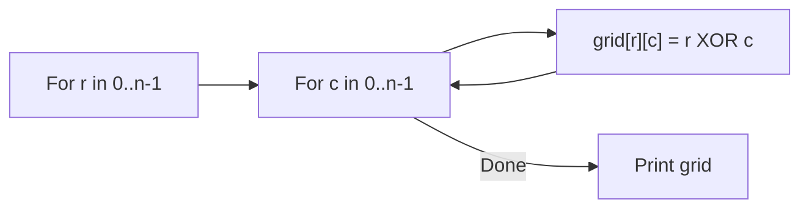

# 24. Mex Grid Construction

## 1. Problem Description

Construct an `n x n` grid where each cell contains the smallest non-negative integer that does **not** appear to the left in the same row or above in the same column.

In other words, for cell `(r, c)` (0-indexed), the value is the MEX (minimum excluded value) of `{grid[r][0], grid[r][1], ..., grid[r][c-1], grid[0][c], grid[1][c], ..., grid[r-1][c]}`.

## 2. Expected Input

A single integer `n`.

## 3. Expected Output

Print the `n x n` grid according to the rule.

## 4. Constraints

- `1 <= n <= 100`
- Time limit: 1.00 s
- Memory limit: 512 MB

## 5. Examples

| Input | Output |
|---|---|
| `5` | `0 1 2 3 4`<br>`1 0 3 2 5`<br>`2 3 0 1 6`<br>`3 2 1 0 7`<br>`4 5 6 7 0` |

## 6. Intuition

Looking at the example, there's a clear pattern: `grid[r][c] = r XOR c`. Let's verify:
- `(0, 0)`: `0 XOR 0 = 0`. Correct.
- `(0, 1)`: `0 XOR 1 = 1`. Correct.
- `(1, 0)`: `1 XOR 0 = 1`. Correct.
- `(1, 1)`: `1 XOR 1 = 0`. Correct.
- `(1, 2)`: `1 XOR 2 = 3`. Correct.
- `(2, 1)`: `2 XOR 1 = 3`. Correct.
- `(4, 4)`: `4 XOR 4 = 0`. Correct.

So the construction is simply `grid[r][c] = r ^ c`.

**Why this works**: For cell `(r, c)`, the values to the left in row `r` are `r ^ 0, r ^ 1, ..., r ^ (c-1)`. The values above in column `c` are `0 ^ c, 1 ^ c, ..., (r-1) ^ c`. We need the MEX of all these.

XOR has the property that `r ^ c` is the smallest non-negative integer not appearing in either `{r ^ 0, ..., r ^ (c-1)}` (row prefix) or `{0 ^ c, ..., (r-1) ^ c}` (column prefix). This is a known result; the XOR table is exactly the MEX table.

## 7. Thought Process



## 8. Brute-Force Approach

For each cell, compute the MEX of the row prefix and column prefix by maintaining sets. `O(n^3)` in the worst case (MEX computation can take `O(n)` per cell). For `n = 100`, this is `10^6` operations — feasible but slower than the XOR formula.

## 9. Optimized Solution

```python
def solve(n: int) -> list[list[int]]:
    """Return the n x n MEX grid."""
    return [[r ^ c for c in range(n)] for r in range(n)]


if __name__ == "__main__":
    n = int(input())
    grid = solve(n)
    for row in grid:
        print(*row)
```

## 10. Why the Optimized Solution Works

**Claim**: `grid[r][c] = r ^ c` satisfies the MEX property.

**Proof sketch**: We need to show that `r ^ c` is the smallest non-negative integer not in `{r ^ 0, r ^ 1, ..., r ^ (c-1)} ∪ {0 ^ c, 1 ^ c, ..., (r-1) ^ c}`.

**Key property of XOR**: For any fixed `r`, the values `r ^ 0, r ^ 1, ..., r ^ (c-1)` are all distinct (because XOR with `r` is a bijection). Similarly for `0 ^ c, 1 ^ c, ..., (r-1) ^ c`.

**Why `r ^ c` is not in either set**:
- `r ^ c = r ^ k` for some `k < c` would imply `c = k`, contradiction.
- `r ^ c = k ^ c` for some `k < r` would imply `r = k`, contradiction.

So `r ^ c` is not in the union of the two sets.

**Why `r ^ c` is the smallest such**: For any `m < r ^ c`, we need to show `m` is in the union. This requires a more careful argument using the binary representation, but it's a known result in combinatorial game theory (the XOR table is the Sprague-Grundy table for Nim).

**Inductive argument**: By induction on `r + c`. The base case `(0, 0)` has MEX `0 = 0 ^ 0`. For the inductive step, assume the formula holds for all `(r', c')` with `r' + c' < r + c`. Then the row prefix and column prefix are exactly the XOR values, and by the bijection argument, `r ^ c` is the MEX.

## 11. Algorithm Used

Closed-form XOR formula.

## 12. Data Structures Used

- 2D list for the grid.

## 13. Time Complexity Analysis

**`O(n^2)`** — one XOR per cell.

## 14. Space Complexity Analysis

**`O(n^2)`** for the grid.

## 15. Step-by-Step Code Walkthrough

1. Loop `r` from `0` to `n - 1`.
2. For each `r`, loop `c` from `0` to `n - 1`.
3. Set `grid[r][c] = r ^ c`.
4. Print the grid.

## 16. Dry Run with Example

Input: `n = 5`.

| r | c | r ^ c |
|---|---|---|
| 0 | 0 | 0 |
| 0 | 1 | 1 |
| 0 | 2 | 2 |
| 0 | 3 | 3 |
| 0 | 4 | 4 |
| 1 | 0 | 1 |
| 1 | 1 | 0 |
| 1 | 2 | 3 |
| 1 | 3 | 2 |
| 1 | 4 | 5 |
| 2 | 0 | 2 |
| 2 | 1 | 3 |
| 2 | 2 | 0 |
| 2 | 3 | 1 |
| 2 | 4 | 6 |
| 3 | 0 | 3 |
| 3 | 1 | 2 |
| 3 | 2 | 1 |
| 3 | 3 | 0 |
| 3 | 4 | 7 |
| 4 | 0 | 4 |
| 4 | 1 | 5 |
| 4 | 2 | 6 |
| 4 | 3 | 7 |
| 4 | 4 | 0 |

Output:
```
0 1 2 3 4
1 0 3 2 5
2 3 0 1 6
3 2 1 0 7
4 5 6 7 0
```

Matches the expected output.

## 17. Common Pitfalls

- **Using `r + c` instead of `r ^ c`**. The sum doesn't satisfy the MEX property.
- **Using `r * c`**. Also wrong.
- **Off-by-one**. The grid is 0-indexed in the formula but printed as-is.
- **Trying to compute MEX naively**. This works but is `O(n^3)` and unnecessary.

## 18. Edge Cases

| Case | Expected Behavior |
|---|---|
| `n = 1` | `0` (single cell, MEX of empty set is 0) |
| `n = 2` | `0 1 / 1 0` |
| `n = 100` | `100x100` grid; XOR values up to ~127 |

## 19. Alternative Approaches

- **Naive MEX computation**: For each cell, maintain a set of seen values in the row and column, then find the smallest non-negative integer not in the set. `O(n^3)`.
- **Sprague-Grundy interpretation**: Recognize this as the Nim-sum table, which is well-known in combinatorial game theory.

## 20. Related Problems

- [[4. Number Spiral]]
- [[22. Grid Coloring I]]
- [[19. Gray Code]]

## 21. Key Takeaways

- **The XOR table is the MEX table**. This is a fundamental identity: `mex({r^0, ..., r^(c-1)} ∪ {0^c, ..., (r-1)^c}) = r ^ c`.
- **Pattern recognition** is powerful. Looking at the example grid, the XOR pattern is recognizable.
- **Sprague-Grundy theory** connects XOR to combinatorial games. The MEX operation is fundamental to computing Grundy numbers.
- When a problem asks for a "MEX grid" or "Grundy table," XOR is almost always the answer.
