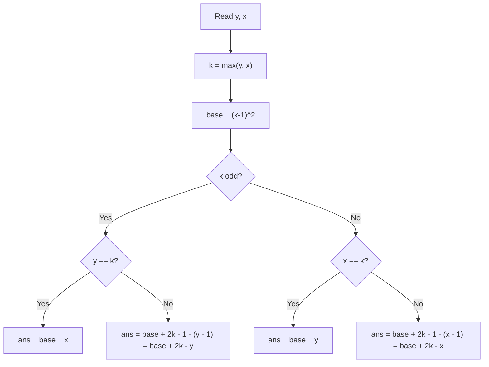

# 4. Number Spiral

## 1. Problem Description

A number spiral is an infinite grid whose upper-left square has the number `1`. The spiral grows outward. Given `t` queries, each specifying a row `y` and column `x`, output the number at that position.

The first few layers look like this (showing the top-left 5x5 portion):

```
1  2  9  10 25
4  3  8  11 24
5  6  7  12 23
16 15 14 13 22
17 18 19 20 21
```

## 2. Expected Input

- First line: integer `t` — the number of test cases.
- Next `t` lines: two integers `y` and `x` (1-indexed row and column).

## 3. Expected Output

For each test case, print the number at row `y`, column `x`.

## 4. Constraints

- `1 <= t <= 10^5`
- `1 <= y, x <= 10^9`
- Time limit: 1.00 s
- Memory limit: 512 MB

## 5. Examples

| Input | Output |
|---|---|
| `3`<br>`2 3`<br>`1 1`<br>`4 2` | `8`<br>`1`<br>`15` |

## 6. Intuition

The number at position `(y, x)` depends on which **layer** of the spiral it lies in. The layer is `max(y, x)`. Each layer `k` starts at value `(k-1)^2 + 1` and ends at `k^2`.

Within layer `k`:
- If `k` is odd, the layer goes **up** the right column then **left** along the top row.
- If `k` is even, the layer goes **down** the left column then **right** along the bottom row.

By checking whether `y` or `x` equals `k` (the layer), and the parity of `k`, we can compute the value in `O(1)`.

## 7. Thought Process



## 8. Brute-Force Approach

Generate the spiral up to `max(y, x) = 10^9`. This is `O(10^18)` memory and time. Completely infeasible.

## 9. Optimized Solution

```python
def solve(y: int, x: int) -> int:
    """Return the value at row y, column x of the number spiral."""
    k = max(y, x)
    base = (k - 1) * (k - 1)
    if k % 2 == 1:  # odd layer: top-right corner is k^2
        if y == k:
            return base + x
        else:
            return base + 2 * k - y
    else:  # even layer: bottom-left corner is k^2
        if x == k:
            return base + y
        else:
            return base + 2 * k - x


if __name__ == "__main__":
    t = int(input())
    out = []
    for _ in range(t):
        y, x = map(int, input().split())
        out.append(str(solve(y, x)))
    print("\n".join(out))
```

## 10. Why the Optimized Solution Works

The spiral has a recursive structure. Layer `k` (where `max(y, x) = k`) is a "ring" that wraps around the `(k-1) x (k-1)` inner square.

- The inner square (layers `1` through `k-1`) contains the values `1` through `(k-1)^2`. So layer `k` starts at `(k-1)^2 + 1`.
- The layer has `4(k-1)` cells forming a square ring.
- The direction in which the ring is filled depends on the parity of `k`:
  - **Odd `k`**: The ring goes up the right column (from row `k-1` to row `1`), then left along the top row (from column `k-1` to column `1`). So the corner `k^2` is at position `(1, k)` — the top-right corner of layer `k`.
  - **Even `k`**: The ring goes down the left column, then right along the bottom row. The corner `k^2` is at position `(k, 1)` — the bottom-left corner.

Let's verify with `k = 3` (odd). Layer 3 wraps the 2x2 inner square (values 1-4). The 3x3 ring has cells:
- Right column (col = 3): rows 2, 1 (going up). Values 5, 6, 7? Wait, `(k-1)^2 + 1 = 5`, so position `(2, 3) = 5`, `(1, 3) = 9`? Let me recheck the example:

```
1  2  9
4  3  8
5  6  7
```

For `k = 3` (odd):
- `(1, 3) = 9 = k^2` — top-right corner.
- `(2, 3) = 8 = base + 2k - y = 4 + 6 - 2 = 8`. Correct.
- `(3, 3) = 7 = base + 2k - y = 4 + 6 - 3 = 7`. Correct.
- `(3, 1) = 5 = base + x = 4 + 1 = 5`. Correct.
- `(3, 2) = 6 = base + x = 4 + 2 = 6`. Correct.

So for odd `k`:
- If `y == k` (bottom row of layer), value = `base + x`. Because the ring goes left along the bottom, the value increases with `x`.
- Otherwise (right column), value = `base + 2k - y`. Because the ring goes up the right column, value decreases as `y` increases.

For even `k`, the direction is mirrored:
- If `x == k` (right column of layer), value = `base + y`.
- Otherwise (bottom row), value = `base + 2k - x`.

## 11. Algorithm Used

Closed-form formula based on layer and parity.

## 12. Data Structures Used

- Scalar integers only.

## 13. Time Complexity Analysis

**`O(1)`** per query. Total: `O(t)`.

## 14. Space Complexity Analysis

**`O(1)`** per query (plus output buffer).

## 15. Step-by-Step Code Walkthrough

1. `k = max(y, x)` — determine the layer.
2. `base = (k - 1) * (k - 1)` — the value just before layer `k` starts.
3. Branch on parity of `k`:
   - Odd `k`: top-right corner is `k^2`.
     - If `y == k` (we're on the bottom edge of the layer), the value increases left-to-right: `base + x`.
     - Else (we're on the right edge), the value decreases top-to-bottom: `base + 2k - y`.
   - Even `k`: bottom-left corner is `k^2`.
     - If `x == k` (right edge), the value increases top-to-bottom: `base + y`.
     - Else (bottom edge), the value decreases left-to-right: `base + 2k - x`.
4. Accumulate output strings and print with `"\n".join()`.

## 16. Dry Run with Example

Input: `y=2, x=3`.

- `k = max(2, 3) = 3` (odd).
- `base = 2*2 = 4`.
- `y != k` (2 != 3), so right edge: `base + 2k - y = 4 + 6 - 2 = 8`. Correct.

Input: `y=1, x=1`.

- `k = 1`, `base = 0`, odd.
- `y == k` (1 == 1), so bottom edge: `base + x = 0 + 1 = 1`. Correct.

Input: `y=4, x=2`.

- `k = 4` (even), `base = 9`.
- `x != k` (2 != 4), so bottom edge: `base + 2k - x = 9 + 8 - 2 = 15`. Correct.

## 17. Common Pitfalls

- **Using `k*k` instead of `(k-1)*(k-1)` for the base.** The base is the value at the end of the previous layer, not the start of the current layer.
- **Mixing up the parity branches.** The formulas for odd and even `k` are mirror images. Test both branches carefully.
- **1-indexed vs 0-indexed.** The problem is 1-indexed. Don't subtract 1 from `y` or `x`.
- **Forgetting to use 64-bit integers.** In Python this is automatic, but in C++ you'd need `long long` because `k^2` can be up to `10^18`.

## 18. Edge Cases

| Case | Expected Behavior |
|---|---|
| `(1, 1)` | `1` |
| `(y, x)` with `y == x` | Value at the corner — either formula gives the same answer |
| `y = 10^9, x = 10^9` | `k = 10^9`, `base = (10^9 - 1)^2 ~ 10^18` — fits in 64-bit |
| `t = 10^5` queries | Total time `O(t)`, well within limit |

## 19. Alternative Approaches

- **Pattern observation**: Notice that the spiral alternates direction each layer. Compute the four corners of layer `k`, then determine which side `(y, x)` lies on and interpolate. Equivalent to the above but more verbose.
- **Simulation**: Build a `k x k` grid. Out of the question for `k = 10^9`.

## 20. Related Problems

- [[24. Mex Grid Construction]]
- [[21. Knight Moves Grid]]
- [[10. Trailing Zeros]]

## 21. Key Takeaways

- **Spiral problems** are best solved with a layer-by-layer closed form. The layer is `max(y, x)`, and the parity of the layer determines direction.
- **Parity branching** is common in spiral/diagonal problems. Always check both branches with concrete examples.
- **`O(1)` per query** is achievable for many grid pattern problems if you find the formula. Don't simulate.
- For problems with up to `10^5` queries and grid coordinates up to `10^9`, only `O(1)` or `O(log n)` per query is acceptable.
