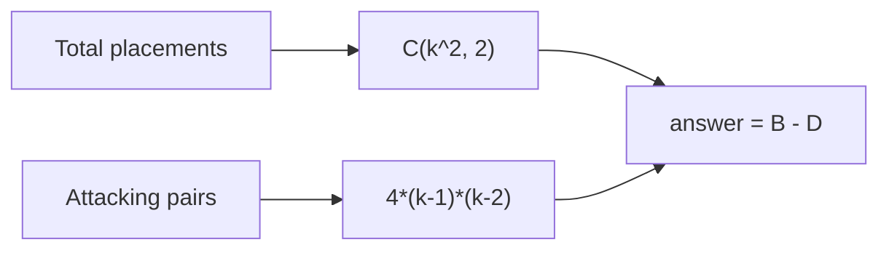

# 5. Two Knights

## 1. Problem Description

For each `k` from `1` to `n`, count the number of ways to place two knights on a `k x k` chessboard such that they do **not** attack each other. The two knights are considered identical (placing knight A on square X and knight B on square Y is the same as the reverse).

## 2. Expected Input

A single integer `n`.

## 3. Expected Output

`n` lines, one per `k` from `1` to `n`, each containing the count for that `k`.

## 4. Constraints

- `1 <= n <= 10000`
- Time limit: 1.00 s
- Memory limit: 512 MB

## 5. Examples

| Input | Output |
|---|---|
| `8` | `0`<br>`6`<br>`28`<br>`96`<br>`252`<br>`550`<br>`1056`<br>`1848` |

## 6. Intuition

Total ways to place two identical knights on a `k x k` board: `C(k^2, 2) = k^2 * (k^2 - 1) / 2`.

From this, subtract the number of placements where the two knights **attack** each other. A knight on square `(r, c)` attacks squares `(r ± 1, c ± 2)` and `(r ± 2, c ± 1)`. Each attacking pair is counted twice (once from each knight's perspective), so the number of unordered attacking pairs is **half the number of attacking positions**.

For each square, count how many of the 8 possible knight moves stay on the board. Sum over all squares, then divide by 2. There is a clean closed form: **the number of attacking pairs on a `k x k` board is `4 * (k - 1) * (k - 2)`**.

Therefore: `answer(k) = C(k^2, 2) - 4 * (k - 1) * (k - 2)`.

## 7. Thought Process



## 8. Brute-Force Approach

For each `k`, iterate over all pairs of squares (`O(k^4)` pairs), and for each pair check whether the knights attack each other (`O(1)` per pair). Total: `O(n * k^4)`, which for `n = 10000` and `k = 10000` is `10^16` — too slow.

## 9. Optimized Solution

```python
def solve(n: int) -> list[int]:
    """Return the list of answers for k = 1 to n."""
    results = []
    for k in range(1, n + 1):
        total = k * k * (k * k - 1) // 2  # C(k^2, 2)
        attacking = 4 * (k - 1) * (k - 2)
        results.append(total - attacking)
    return results


if __name__ == "__main__":
    n = int(input())
    for r in solve(n):
        print(r)
```

## 10. Why the Optimized Solution Works

**Total placements**: Two identical knights on `k^2` squares. The number of ways to choose 2 squares out of `k^2` is `C(k^2, 2) = k^2 * (k^2 - 1) / 2`.

**Attacking pairs**: A knight at `(r, c)` attacks `(r ± 1, c ± 2)` and `(r ± 2, c ± 1)`. We count the number of "2x3 rectangles" on the board, because each such rectangle contains exactly 2 attacking pairs (one in each diagonal direction).

- A `2x3` rectangle on a `k x k` board can be placed in `(k - 1) * (k - 2)` positions (top-left corner rows `1..k-1`, columns `1..k-2`).
- A `3x2` rectangle can also be placed in `(k - 1) * (k - 2)` positions.
- Each `2x3` rectangle contains exactly 2 attacking pairs (the two long diagonals).
- Each `3x2` rectangle also contains 2 attacking pairs.
- Total attacking pairs = `2 * (k-1)(k-2) + 2 * (k-1)(k-2) = 4 * (k-1)(k-2)`.

**Answer**: `total - attacking`.

For `k = 1`: `total = 0`, `attacking = 0`, answer = `0`. Correct.
For `k = 2`: `total = 6`, `attacking = 4 * 1 * 0 = 0`, answer = `6`. Correct.
For `k = 3`: `total = 36`, `attacking = 4 * 2 * 1 = 8`, answer = `28`. Correct.
For `k = 8`: `total = 64 * 63 / 2 = 2016`, `attacking = 4 * 7 * 6 = 168`, answer = `1848`. Correct.

## 11. Algorithm Used

Closed-form combinatorial formula.

## 12. Data Structures Used

- A list to accumulate results.
- Scalar integers.

## 13. Time Complexity Analysis

**`O(n)`** — one formula evaluation per `k`.

## 14. Space Complexity Analysis

**`O(n)`** to store the results list (or `O(1)` if we print incrementally).

## 15. Step-by-Step Code Walkthrough

1. Loop `k` from `1` to `n`.
2. `total = k * k * (k * k - 1) // 2` — the binomial coefficient `C(k^2, 2)`. Note the integer division `//` is exact because `k^2 * (k^2 - 1)` is always even (one of two consecutive integers is even).
3. `attacking = 4 * (k - 1) * (k - 2)` — closed-form count of attacking knight pairs.
4. `results.append(total - attacking)` — the answer for this `k`.
5. Print each result on its own line.

## 16. Dry Run with Example

`n = 8`:

| k | k^2 | total = C(k^2, 2) | attacking = 4(k-1)(k-2) | answer |
|---|---|---|---|---|
| 1 | 1 | 0 | 0 | 0 |
| 2 | 4 | 6 | 0 | 6 |
| 3 | 9 | 36 | 8 | 28 |
| 4 | 16 | 120 | 24 | 96 |
| 5 | 25 | 300 | 48 | 252 |
| 6 | 36 | 630 | 80 | 550 |
| 7 | 49 | 1176 | 120 | 1056 |
| 8 | 64 | 2016 | 168 | 1848 |

Matches the expected output.

## 17. Common Pitfalls

- **Counting ordered vs unordered pairs.** If you compute `k^2 * (k^2 - 1)` (ordered), you double-count. Use `// 2` for unordered.
- **Wrong formula for attacking pairs.** A common mistake is `4 * (k - 1) * (k - 2) / 2` — but the `/2` is wrong because we already accounted for ordering in the binomial coefficient. Verify with small cases.
- **Integer division pitfalls.** In Python `//` is safe here, but in C++ you'd need to be careful with order of operations.
- **Forgetting `k = 1` returns `0`.** With one square, you can't place two knights.

## 18. Edge Cases

| Case | Expected Behavior |
|---|---|
| `k = 1` | `0` (can't place two knights on one square) |
| `k = 2` | `6` (no attacks possible on a 2x2 board) |
| `k = 10000` | `~10^15` — fits in 64-bit integer |

## 19. Alternative Approaches

- **Simulation per `k`**: `O(k^4)`. Infeasible for `k = 10^4`.
- **Simulation per `k` with smarter counting**: `O(k^2)`. Still too slow for `k = 10^4` and `n = 10^4` total queries.

## 20. Related Problems

- [[13. Chessboard and Queens]]
- [[21. Knight Moves Grid]]
- [[24. Mex Grid Construction]]

## 21. Key Takeaways

- **Combinatorial problems** often reduce to "total ways minus bad ways." Always look for this decomposition.
- **Closed forms** for sliding rectangles on a grid are common: `(k - a + 1) * (k - b + 1)` placements of an `a x b` rectangle on a `k x k` grid.
- **Verify with small cases**. The first few values (`0, 6, 28, 96, ...`) are well-known and let you sanity-check your formula.
- **Knights attack in 2x3 rectangles**. This is the key insight that yields the closed form.
