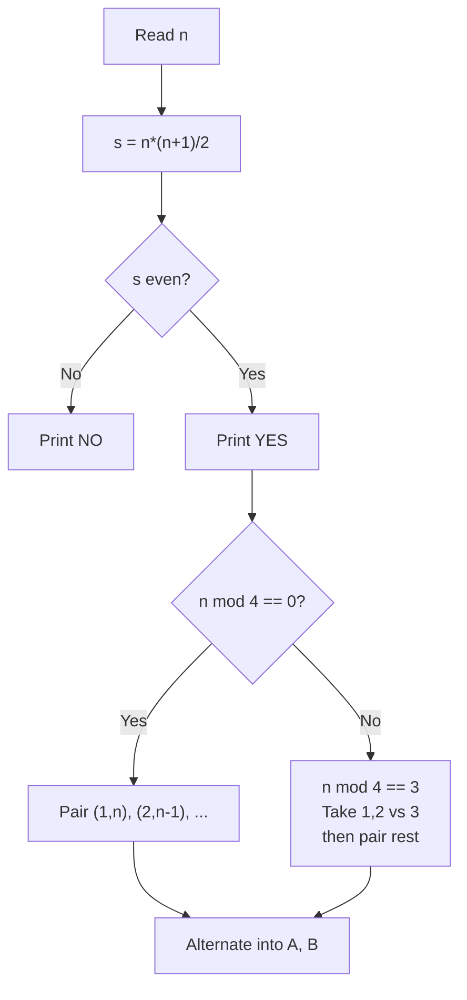

# 7. Two Sets

## 1. Problem Description

Divide the integers `1, 2, ..., n` into two sets with equal sum. If possible, print `YES` and an example partition. Otherwise, print `NO`.

## 2. Expected Input

A single integer `n`.

## 3. Expected Output

- First line: `YES` or `NO`.
- If `YES`: print the size and elements of the first set on one line, then the size and elements of the second set on the next line.

## 4. Constraints

- `1 <= n <= 10^6`
- Time limit: 1.00 s
- Memory limit: 512 MB

## 5. Examples

| Input | Output |
|---|---|
| `7` | `YES`<br>`4`<br>`1 2 4 7`<br>`3`<br>`3 5 6` |
| `6` | `NO` |

## 6. Intuition

The sum `1 + 2 + ... + n = n*(n+1)/2`. For two equal-sum sets, this total must be even, which happens when `n*(n+1)` is divisible by `4`. This holds when `n mod 4 == 0` or `n mod 4 == 3`.

Construction:
- **`n mod 4 == 0`**: Pair numbers `(1, n), (2, n-1), ..., (n/2, n/2+1)`. Each pair sums to `n+1`. Put one element of each pair in set A and the other in set B. Each set has `n/2` elements and sum `(n/2) * (n+1) / 2`.
- **`n mod 4 == 3`**: Take `1, 2` for set A and `3` for set B (so far equal sums of 3). Then the remaining numbers `4, 5, ..., n` count is `n - 3`, which is divisible by 4. Apply the pairing trick to the remaining range, treating each pair as `(4, n), (5, n-1), ...`, with each pair summing to `n + 4`.

## 7. Thought Process



## 8. Brute-Force Approach

Try every subset of `1..n` and check if its sum equals `n*(n+1)/4`. There are `2^n` subsets — infeasible for `n > 30`.

## 9. Optimized Solution

```python
def solve(n: int) -> tuple[bool, list[int], list[int]]:
    """Return (possible, set_a, set_b)."""
    total = n * (n + 1) // 2
    if total % 2 != 0:
        return False, [], []
    target = total // 2

    set_a = []
    set_b = []
    if n % 4 == 0:
        # Pair (1, n), (2, n-1), ...; alternate
        for i in range(1, n // 2 + 1):
            if i % 2 == 1:
                set_a.append(i)
                set_a.append(n - i + 1)
            else:
                set_b.append(i)
                set_b.append(n - i + 1)
    elif n % 4 == 3:
        # Base: {1, 2} vs {3}
        set_a = [1, 2]
        set_b = [3]
        # Remaining: 4 .. n, count is n - 3, divisible by 4
        m = n - 3
        for i in range(m // 2):
            a = 4 + i
            b = n - i
            if i % 2 == 0:
                set_a.append(a)
                set_a.append(b)
            else:
                set_b.append(a)
                set_b.append(b)
    return True, set_a, set_b


if __name__ == "__main__":
    n = int(input())
    ok, a, b = solve(n)
    if not ok:
        print("NO")
    else:
        print("YES")
        print(len(a))
        print(*a)
        print(len(b))
        print(*b)
```

## 10. Why the Optimized Solution Works

**When is it possible?** The total sum `n*(n+1)/2` must be even (so each set gets half). This means `n*(n+1)` is divisible by `4`. Since `n` and `n+1` are consecutive, exactly one is even. So either `n mod 4 == 0` (n is divisible by 4) or `n+1 mod 4 == 0`, i.e., `n mod 4 == 3`.

**Construction for `n mod 4 == 0`**: We have `n/2` pairs each summing to `n+1`. If we alternate which set gets the smaller (or larger) element of each pair, each set gets `n/4` pairs. Each pair contributes `n+1` to its set, so each set sum = `(n/4) * (n+1) = n*(n+1)/4 = target`. Correct.

**Construction for `n mod 4 == 3`**: Start with `{1, 2}` (sum 3) and `{3}` (sum 3). Now the remaining range `4 .. n` has `n - 3` elements. Since `n mod 4 == 3`, `n - 3 mod 4 == 0`, so the remaining count is divisible by 4. Apply the pairing trick: pairs `(4, n), (5, n-1), ...` each sum to `n + 4`. There are `(n-3)/2` pairs, half going to each set. Each set receives `(n-3)/4` pairs, contributing `(n-3)/4 * (n+4)`. Combined with the base 3, each set has total `3 + (n-3)(n+4)/4`. We need to verify this equals `n(n+1)/4`:

`3 + (n-3)(n+4)/4 = (12 + n^2 + n - 12)/4 = (n^2 + n)/4 = n(n+1)/4`. Correct.

## 11. Algorithm Used

Parity-based constructive partitioning.

## 12. Data Structures Used

- Two lists `set_a` and `set_b`.

## 13. Time Complexity Analysis

**`O(n)`** — we visit each number once.

## 14. Space Complexity Analysis

**`O(n)`** — to store the two sets.

## 15. Step-by-Step Code Walkthrough

1. Compute `total = n*(n+1)//2`. If odd, return impossible.
2. Compute `target = total // 2` (each set should sum to this).
3. Branch on `n mod 4`:
   - **Case `n mod 4 == 0`**: Loop `i` from `1` to `n/2`. Pair `(i, n-i+1)`. Alternate: odd `i` → set A, even `i` → set B.
   - **Case `n mod 4 == 3`**: Initialize `set_a = [1, 2]`, `set_b = [3]`. Loop `i` from `0` to `(n-3)/2 - 1`. Pair `(4+i, n-i)`. Alternate.
4. Print the result.

## 16. Dry Run with Example

**Input: `n = 7`** (`n mod 4 == 3`).

- `total = 28`, `target = 14`.
- `set_a = [1, 2]`, `set_b = [3]`.
- `m = 4`. Loop `i` from 0 to 1.
  - `i = 0`: pair `(4, 7)`. `i % 2 == 0`, so `set_a += [4, 7]`. Now `set_a = [1, 2, 4, 7]`.
  - `i = 1`: pair `(5, 6)`. `i % 2 == 1`, so `set_b += [5, 6]`. Now `set_b = [3, 5, 6]`.
- Sum A: `1+2+4+7 = 14`. Sum B: `3+5+6 = 14`. Correct.

**Input: `n = 6`** (`n mod 4 == 2`).

- `total = 21`, odd. Return impossible. Correct.

## 17. Common Pitfalls

- **Forgetting the `n mod 4 == 3` case.** Both cases must be handled.
- **Off-by-one in pairing.** The pair of `i` is `n - i + 1`, not `n - i`. For `n = 8, i = 1`, the pair is `1` and `8`, not `1` and `7`.
- **Index drift in the `n mod 4 == 3` branch.** After taking `1, 2, 3` for the base, the remaining range starts at `4`, not `1`.

## 18. Edge Cases

| Case | Expected Behavior |
|---|---|
| `n = 1` | `NO` (total = 1, odd) |
| `n = 2` | `NO` (total = 3, odd) |
| `n = 3` | `YES`: `{1, 2}` vs `{3}` |
| `n = 4` | `YES`: `{1, 4}` vs `{2, 3}` |
| `n = 10^6` | Works; output has `~5*10^5` integers per set |

## 19. Alternative Approaches

- **Greedy fill**: Start with empty sets. For each number from `n` down to `1`, add it to whichever set has the smaller current sum. This produces a valid partition if one exists, but the partition may not be balanced in size. Time `O(n log n)` due to repeated comparison.
- **DP**: Pseudo-polynomial, infeasible for `n = 10^6`.

## 20. Related Problems

- [[3. Permutations]]
- [[6. Missing Number]]
- [[12. Apple Division]]

## 21. Key Takeaways

- **Parity arguments** are powerful for partition problems. Always check whether the total sum is even before attempting a partition.
- **Pairing tricks** (`(i, n-i+1)` all sum to `n+1`) are a standard technique for partitioning consecutive integer ranges.
- **Constructive problems** usually require a case analysis based on `n mod k` for small `k`.
- The two cases `n mod 4 ∈ {0, 3}` are the only ones where this partition is possible — this is a necessary and sufficient condition.
