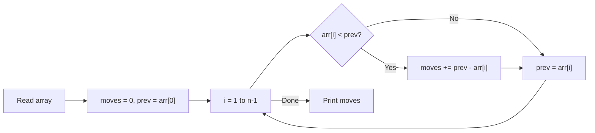

# 8. Increasing Array

## 1. Problem Description

You are given an array of `n` integers. You want to make the array **non-decreasing** (every element is at least as large as the previous one). On each move, you may increase any element by `1`. Find the minimum number of moves required.

## 2. Expected Input

- First line: integer `n`.
- Second line: `n` integers `x_1, x_2, ..., x_n`.

## 3. Expected Output

The minimum number of moves.

## 4. Constraints

- `1 <= n <= 2 * 10^5`
- `1 <= x_i <= 10^9`
- Time limit: 1.00 s
- Memory limit: 512 MB

## 5. Examples

| Input | Output | Explanation |
|---|---|---|
| `5`<br>`3 2 5 1 7` | `5` | Raise 2 to 3 (1 move), raise 1 to 5 (4 moves). Total 5. |

## 6. Intuition

Process the array left to right. At each position, the current element must be at least as large as the previous one (after the previous one has been raised). If it's smaller, raise it to match the previous element. The number of moves for that position is `max(0, prev - current)`. Track the running maximum (which is just the previous adjusted value, since the array is non-decreasing after adjustment).

## 7. Thought Process



## 8. Brute-Force Approach

Repeatedly scan the array and increment any element that is smaller than its predecessor. Stop when the array is non-decreasing. This is `O(n * max_diff)` in the worst case, which can be `O(n * 10^9)` — too slow.

## 9. Optimized Solution

```python
def solve(arr: list[int]) -> int:
    """Return the minimum number of +1 moves to make arr non-decreasing."""
    moves = 0
    prev = arr[0]
    for i in range(1, len(arr)):
        if arr[i] < prev:
            moves += prev - arr[i]
        else:
            prev = arr[i]
    return moves


if __name__ == "__main__":
    n = int(input())
    arr = list(map(int, input().split()))
    print(solve(arr))
```

## 10. Why the Optimized Solution Works

We never need to **lower** any element; we only ever raise them. So the question is: for each position, what is the smallest value it can have while still being `>=` the previous (raised) value?

The answer is: the current value if it's already `>=` the previous raised value, otherwise the previous raised value itself. Because raising an element further than necessary only wastes moves.

The invariant is: **after processing index `i`, `prev` holds the value at index `i` after all moves applied so far, and `moves` is the total number of `+1` operations performed.**

- Initially: `prev = arr[0]` (no moves needed for the first element).
- At index `i`: if `arr[i] >= prev`, no moves needed; update `prev = arr[i]`.
- If `arr[i] < prev`: we need to raise `arr[i]` by `prev - arr[i]` to make it equal to `prev`. After raising, the new value is exactly `prev`, so `prev` stays the same.

The greedy choice (raise to exactly `prev`) is optimal because:
1. Raising less would leave the array non-non-decreasing.
2. Raising more would waste moves without helping future elements (since future elements only need to be `>=` the current, and raising the current higher only makes the constraint stricter).

## 11. Algorithm Used

Single-pass greedy with running maximum.

## 12. Data Structures Used

- The input array `arr`.
- Two scalar variables `moves` and `prev`.

## 13. Time Complexity Analysis

**`O(n)`** — single pass.

## 14. Space Complexity Analysis

**`O(1)`** extra space.

## 15. Step-by-Step Code Walkthrough

1. `moves = 0; prev = arr[0]` — initialize. The first element needs no moves.
2. Loop `i` from `1` to `n - 1`:
   - If `arr[i] < prev`: we need `prev - arr[i]` moves to raise `arr[i]` to `prev`. Add to `moves`. `prev` stays the same (the new value of `arr[i]` is `prev`).
   - Else: `arr[i]` is already large enough. Update `prev = arr[i]`.
3. Return `moves`.

## 16. Dry Run with Example

Input: `arr = [3, 2, 5, 1, 7]`.

| i | arr[i] | prev (before) | Action | moves (after) | prev (after) |
|---|---|---|---|---|---|
| 1 | 2 | 3 | raise 2 to 3 (1 move) | 1 | 3 |
| 2 | 5 | 3 | no move, prev = 5 | 1 | 5 |
| 3 | 1 | 5 | raise 1 to 5 (4 moves) | 5 | 5 |
| 4 | 7 | 5 | no move, prev = 7 | 5 | 7 |

Output: `5`. Correct.

## 17. Common Pitfalls

- **Using `max(0, prev - arr[i])` is fine**, but the if/else is clearer.
- **Updating `prev` incorrectly.** When `arr[i] < prev`, `prev` stays the same (because we raise `arr[i]` to `prev`). When `arr[i] >= prev`, `prev` updates to `arr[i]`.
- **Overflow in other languages.** Total moves can be up to `n * 10^9 = 2*10^14`, which overflows 32-bit `int`. Use 64-bit. In Python this is automatic.

## 18. Edge Cases

| Case | Expected Behavior |
|---|---|
| `n = 1` | `0` (single element is trivially non-decreasing) |
| Already non-decreasing | `0` |
| Strictly decreasing (`5, 4, 3, 2, 1`) | `4 + 3 + 2 + 1 = 10` |
| All equal | `0` |
| Maximum values | Works; `moves` up to `2*10^14` |

## 19. Alternative Approaches

- **Prefix maximum**: `moves = sum(max(0, max_so_far - arr[i]) for i in range(n))`. Equivalent, more functional style.
- **Difference array** (overkill): mark each raise as a range update. Not needed for this problem.

## 20. Related Problems

- [[6. Missing Number]]
- [[25. Towers]]
- [[26. Stick Lengths]]

## 21. Key Takeaways

- **Greedy "make it non-decreasing"** problems are solved by a single left-to-right pass with a running max.
- **Only raise, never lower** — when the operation is monotone (only `+1` allowed), the greedy is trivially optimal.
- **Total moves can overflow 32-bit** — always use 64-bit integers for cumulative sums in languages that need them.
- The same pattern appears in many "minimum operations to make array non-decreasing" problems, often with different operation costs (swap, increment, etc.).
