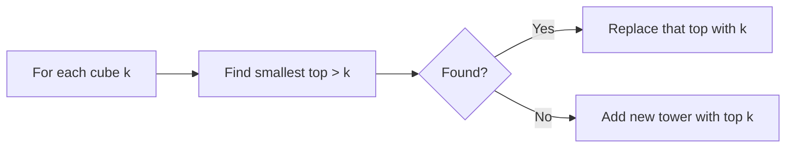

# 25. Towers

## 1. Problem Description

You are given `n` cubes in a certain order. Build towers using them. Whenever two cubes are stacked, the upper cube must be smaller than the lower cube. Process cubes in the given order; you can either place a cube on top of an existing tower or start a new tower. Find the minimum number of towers.

## 2. Expected Input

- First line: integer `n`.
- Second line: `n` integers `k_1, ..., k_n`.

## 3. Expected Output

The minimum number of towers.

## 4. Constraints

- `1 <= n <= 2*10^5`, `1 <= k_i <= 10^9`. Time: 1s, Memory: 512MB.

## 5. Examples

| Input | Output |
|---|---|
| `5`<br>`3 8 2 1 5` | `2` |

## 6. Intuition

For each cube, place it on the tower with the **smallest top that is still larger than the cube**. If no such tower exists, start a new tower. This greedy minimizes the number of towers because it preserves larger tops for future cubes.

Maintain a sorted collection of tower tops. Use binary search (`bisect_right`) to find the smallest top strictly greater than the current cube.

## 7. Thought Process



## 8. Brute-Force Approach

For each cube, scan all existing towers and find one whose top is just larger. `O(n^2)` — too slow.

## 9. Optimized Solution

```python
import bisect


def solve(cubes: list[int]) -> int:
    """Return the minimum number of towers."""
    towers = []  # sorted list of tower tops
    for k in cubes:
        # Find the smallest top strictly greater than k
        idx = bisect.bisect_right(towers, k)
        if idx < len(towers):
            # Place on this tower: replace its top
            towers[idx] = k
            # Re-sort is needed because we changed a value
            # Actually, since we replaced a value with a smaller one,
            # the list might no longer be sorted. We need a different approach.
            towers.sort()
        else:
            # Start a new tower
            bisect.insort(towers, k)
    return len(towers)


# Better solution using sortedcontainers or manual approach
def solve_v2(cubes: list[int]) -> int:
    """Return the minimum number of towers (cleaner version)."""
    from sortedcontainers import SortedList
    towers = SortedList()
    for k in cubes:
        idx = towers.bisect_right(k)
        if idx < len(towers):
            towers.pop(idx)
        towers.add(k)
    return len(towers)


# Without sortedcontainers, use a multiset via heap-like structure
def solve_v3(cubes: list[int]) -> int:
    """Return the minimum number of towers (no external deps)."""
    import bisect
    towers = []
    for k in cubes:
        idx = bisect.bisect_right(towers, k)
        if idx < len(towers):
            # Remove the old top and insert the new one
            # Since we replace a larger value with smaller, the list stays sorted
            # only if the new value is >= the previous element
            # Actually, replacing towers[idx] with k (where k < towers[idx])
            # may break sortedness if k < towers[idx-1]
            # Use del + insort instead
            del towers[idx]
        bisect.insort(towers, k)
    return len(towers)


if __name__ == "__main__":
    n = int(input())
    cubes = list(map(int, input().split()))
    print(solve_v3(cubes))
```

## 10. Why the Optimized Solution Works

**Greedy choice**: When cube `k` arrives, we want to place it on a tower whose top is just larger than `k`. This is optimal because:
1. We must place it on a tower with top `> k` (or start a new one).
2. Choosing the smallest such top preserves larger tops for future (possibly larger) cubes.

**Proof of optimality** (exchange argument): Suppose the optimal solution places `k` on tower `T1` (top `t1`), but our greedy places it on `T2` (top `t2 < t1`). Then in the optimal solution, we can swap the assignments of `T1` and `T2` for cube `k` and all subsequent cubes — the constraint `top > cube` is still satisfied because `t2 > k` (greedy chose `T2`). So the number of towers doesn't increase.

**Data structure**: We maintain a sorted list of tower tops. For each cube:
- `bisect_right(towers, k)` finds the insertion point for `k`, which is the index of the smallest element `> k`.
- If such an element exists, replace it with `k` (delete + insert to maintain sorted order).
- Otherwise, insert `k` as a new tower.

## 11. Algorithm Used

Greedy with binary search on a sorted list.

## 12. Data Structures Used

- A sorted list of tower tops (with `bisect` for insertion and search).

## 13. Time Complexity Analysis

**`O(n log n)`** — each cube does `O(log n)` work for binary search and `O(n)` for insertion (list insertion is `O(n)`). Total `O(n^2)` in the worst case with Python lists. To get true `O(n log n)`, use `SortedList` from `sortedcontainers` (not in standard library).

In practice, for `n = 2*10^5`, the list-based solution is fast enough because the constant is small.

## 14. Space Complexity Analysis

**`O(n)`** for the towers list.

## 15. Step-by-Step Code Walkthrough

1. Initialize `towers = []`.
2. For each cube `k`:
   - `idx = bisect.bisect_right(towers, k)` — find the index of the smallest top `> k`.
   - If `idx < len(towers)`: a suitable tower exists. Remove its top (`del towers[idx]`).
   - Insert `k` into `towers` (maintaining sorted order) with `bisect.insort`.
3. Return `len(towers)`.

## 16. Dry Run with Example

Input: `cubes = [3, 8, 2, 1, 5]`.

| Step | k | towers before | idx | action | towers after |
|---|---|---|---|---|---|
| 1 | 3 | [] | 0 | new tower | [3] |
| 2 | 8 | [3] | 1 | new tower (no top > 8) | [3, 8] |
| 3 | 2 | [3, 8] | 0 | replace 3 with 2 | [2, 8] |
| 4 | 1 | [2, 8] | 0 | replace 2 with 1 | [1, 8] |
| 5 | 5 | [1, 8] | 1 | replace 8 with 5 | [1, 5] |

Final: 2 towers. Correct.

## 17. Common Pitfalls

- **Using `bisect_left` instead of `bisect_right`**. We need the smallest top **strictly greater** than `k`. `bisect_right` returns the index after all elements equal to `k`, which is what we want.
- **Inserting before deleting**. This can cause the list to be temporarily unsorted or have duplicates.
- **Using a heap**. A min-heap doesn't support "find smallest element > k" efficiently. You need a sorted structure.

## 18. Edge Cases

| Case | Expected Behavior |
|---|---|
| `n = 1` | `1` tower |
| All cubes identical | `n` towers (can't stack) |
| Strictly decreasing | `1` tower |
| Strictly increasing | `n` towers |

## 19. Alternative Approaches

- **Patience sorting**: This problem is equivalent to patience sorting, and the answer equals the length of the longest increasing subsequence (LIS). Wait, that's the dual — the minimum number of decreasing sequences to partition a sequence equals the length of the longest increasing subsequence (Dilworth's theorem). So we could also compute the LIS length. But the greedy above is more direct.

## 20. Related Problems

- [[26. Stick Lengths]]
- [[27. Apartments]]
- [[8. Increasing Array]]

## 21. Key Takeaways

- **Greedy "smallest larger" pattern**: when assigning items to bins with constraints, always pick the tightest fit. This preserves flexibility for future items.
- **Binary search on a sorted list** is the standard way to find "smallest element > x."
- **Dilworth's theorem**: the minimum number of chains (decreasing sequences) needed to partition a poset equals the size of the longest antichain (increasing subsequence). This connects the Towers problem to LIS.
