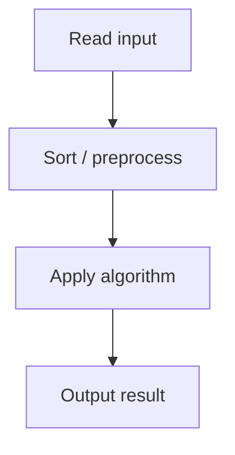

# 26. Stick Lengths

## 1. Problem Description

There are `n` sticks with some lengths. Modify the sticks so each has the same length. Lengthening or shortening by `x` costs `x`. Find the minimum total cost.

## 2. Expected Input

First line: `n`. Second line: `n` integers `p_1, ..., p_n`.

## 3. Expected Output

The minimum total cost.

## 4. Constraints

1 <= n <= 2*10^5, 1 <= p_i <= 10^9. Time 1s, Mem 512MB.

## 5. Examples

| Input | Output |
|---|---|
| `5`<br>`2 3 1 5 2` | `5` |

## 6. Intuition

The optimal target length is the **median** of the stick lengths. The median minimizes the sum of absolute deviations. Sort the array, pick the middle element (or any element between the two middle elements for even `n`), and sum `|p_i - median|`.

## 7. Thought Process



## 8. Brute-Force Approach

Try every possible target length. The search space is up to `10^9`, so this is infeasible.

## 9. Optimized Solution

```python
def solve(sticks: list[int]) -> int:
    sticks.sort()
    median = sticks[len(sticks) // 2]
    return sum(abs(p - median) for p in sticks)

if __name__ == "__main__":
    n = int(input())
    sticks = list(map(int, input().split()))
    print(solve(sticks))
```

## 10. Why the Optimized Solution Works

The median minimizes the L1 norm of deviations. Proof: for any target `t`, the cost is `sum |p_i - t|`. The derivative of this with respect to `t` is `(number of p_i < t) - (number of p_i > t)`. This is zero (optimal) when `t` is the median, where the counts balance out.

## 11. Algorithm Used

Sort and compute median.

## 12. Data Structures Used

Sorted list of stick lengths.

## 13. Time Complexity Analysis

`O(n log n)` for sorting, `O(n)` for the sum. Total `O(n log n)`.

## 14. Space Complexity Analysis

`O(1)` extra (in-place sort).

## 15. Step-by-Step Code Walkthrough

1. Sort the sticks. 2. Pick the middle element as the median. 3. Sum the absolute differences.

## 16. Dry Run with Example

Input `[2, 3, 1, 5, 2]`. Sorted: `[1, 2, 2, 3, 5]`. Median = `sticks[2] = 2`. Cost = `|1-2| + |2-2| + |2-2| + |3-2| + |5-2| = 1+0+0+1+3 = 5`. Correct.

## 17. Common Pitfalls

- Using the **mean** instead of the median. The mean minimizes the sum of *squared* deviations, not absolute. - For even `n`, any value between the two middle elements is optimal; pick either. - Watch for overflow in languages without big integers (cost can be up to `n * 10^9 = 2*10^14`).

## 18. Edge Cases

| Case | Behavior |
|---|---|
| n=1 | 0 |
| All identical | 0 |
| n=2*10^5, all distinct | Cost up to 2*10^14 |

## 19. Alternative Approaches

**Quickselect** finds the median in `O(n)` average time, giving `O(n)` total. But sort is simpler and fast enough.

## 20. Related Problems

[[25. Towers]], [[8. Increasing Array]], [[27. Apartments]]

## 21. Key Takeaways

- **Median minimizes L1 deviation**; mean minimizes L2. - Always sort first when the median is needed. - For minimize-sum-of-absolute-differences problems, the median is the answer.
