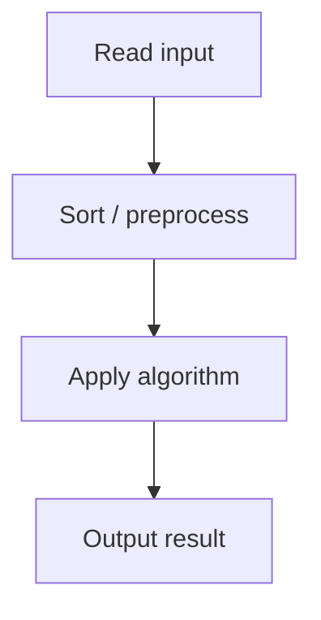

# 27. Apartments

## 1. Problem Description

Distribute `m` apartments to `n` applicants. Applicant `i` accepts apartments within `[a_i - k, a_i + k]`. Maximize the number of applicants who get an apartment.

## 2. Expected Input

First line: `n, m, k`. Second line: `n` integers `a_i`. Third line: `m` integers `b_i`.

## 3. Expected Output

Maximum number of applicants who get an apartment.

## 4. Constraints

1 <= n, m <= 2*10^5, 0 <= k <= 10^9, 1 <= a_i, b_i <= 10^9.

## 5. Examples

| Input | Output |
|---|---|
| `4 3 5`<br>`60 45 80 60`<br>`30 60 75` | `2` |

## 6. Intuition

Sort both arrays. Use two pointers: for each applicant (in sorted order), find the smallest apartment that fits. If the apartment is too small, move to the next apartment. If it fits, assign and advance both pointers.

## 7. Thought Process



## 8. Brute-Force Approach

For each applicant, scan all apartments. `O(n*m)` — too slow.

## 9. Optimized Solution

```python
def solve(n, m, k, applicants, apartments):
    applicants.sort()
    apartments.sort()
    i = j = 0
    count = 0
    while i < n and j < m:
        if abs(applicants[i] - apartments[j]) <= k:
            count += 1
            i += 1
            j += 1
        elif applicants[i] > apartments[j] + k:
            j += 1  # apartment too small
        else:
            i += 1  # applicant can't be satisfied
    return count

if __name__ == "__main__":
    n, m, k = map(int, input().split())
    a = list(map(int, input().split()))
    b = list(map(int, input().split()))
    print(solve(n, m, k, a, b))
```

## 10. Why the Optimized Solution Works

Sorting ensures we consider applicants and apartments in increasing order. When applicant `i` is paired with the smallest available apartment `j` that fits, we don't miss any opportunity: larger applicants will need larger apartments, and we've used the smallest fitting one.

## 11. Algorithm Used

Two-pointer sweep on sorted arrays.

## 12. Data Structures Used

Two sorted arrays.

## 13. Time Complexity Analysis

`O(n log n + m log m)` for sorting, `O(n + m)` for the sweep.

## 14. Space Complexity Analysis

`O(1)` extra.

## 15. Step-by-Step Code Walkthrough

1. Sort both arrays. 2. Initialize `i = j = 0`. 3. While both pointers are in range: if `|a[i] - b[j]| <= k`, assign and advance both; else if `a[i] > b[j] + k`, apartment too small, advance `j`; else applicant can't be satisfied, advance `i`.

## 16. Dry Run with Example

Applicants `[45, 60, 60, 80]`, apartments `[30, 60, 75]`, `k=5`. Sorted: same.
- i=0, j=0: |45-30|=15 > 5, 45 > 30+5, j++.
- i=0, j=1: |45-60|=15 > 5, 45 < 60-5, i++.
- i=1, j=1: |60-60|=0 <= 5, count=1, i++, j++.
- i=2, j=2: |60-75|=15 > 5, 60 < 75-5, i++.
- i=3, j=2: |80-75|=5 <= 5, count=2, i++, j++.
- Done. Answer: 2.

## 17. Common Pitfalls

- Forgetting to sort both arrays. - Wrong comparison direction (`a[i] > b[j] + k` vs `a[i] > b[j] - k`). - Not advancing both pointers on a match.

## 18. Edge Cases

| Case | Behavior |
|---|---|
| k=0 | Exact match required |
| n=0 or m=0 | 0 |
| All applicants want the same apartment | Only one gets it |

## 19. Alternative Approaches

Binary search each applicant's range in apartments. `O(n log m)`. Slower than two-pointer but works.

## 20. Related Problems

[[25. Towers]], [[28. Array Division]], [[29. Ferris Wheel]]

## 21. Key Takeaways

- **Two pointers on sorted arrays** is the standard pattern for matching problems with a tolerance. - Sort first, then sweep. - Greedy matching (smallest fitting) is optimal.
