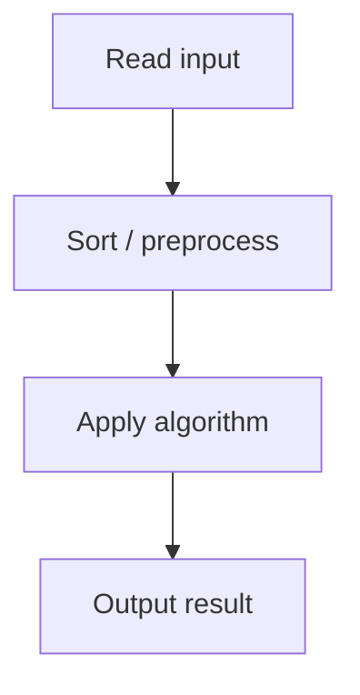

# 28. Array Division

## 1. Problem Description

Divide an array of `n` positive integers into `k` contiguous subarrays so that the maximum subarray sum is minimized. Output that maximum.

## 2. Expected Input

First line: `n, k`. Second line: `n` integers.

## 3. Expected Output

The minimum possible maximum subarray sum.

## 4. Constraints

1 <= n <= 2*10^5, 1 <= k <= n, 1 <= x_i <= 10^9.

## 5. Examples

| Input | Output |
|---|---|
| `5 3`<br>`2 4 7 3 5` | `8` |

## 6. Intuition

**Binary search on the answer**. The answer is in `[max(x), sum(x)]`. For a candidate `S`, check if we can partition the array into `<= k` subarrays each with sum `<= S`. If yes, `S` is feasible; try smaller. If no, try larger.

## 7. Thought Process



## 8. Brute-Force Approach

Try all partitions. Exponential.

## 9. Optimized Solution

```python
def can_partition(arr, k, max_sum):
    count = 1
    current = 0
    for x in arr:
        if x > max_sum:
            return False
        if current + x > max_sum:
            count += 1
            current = x
            if count > k:
                return False
        else:
            current += x
    return True

def solve(n, k, arr):
    lo, hi = max(arr), sum(arr)
    while lo < hi:
        mid = (lo + hi) // 2
        if can_partition(arr, k, mid):
            hi = mid
        else:
            lo = mid + 1
    return lo

if __name__ == "__main__":
    n, k = map(int, input().split())
    arr = list(map(int, input().split()))
    print(solve(n, k, arr))
```

## 10. Why the Optimized Solution Works

The feasibility function is monotonic: if `S` is feasible, any `S' > S` is also feasible. So binary search applies. The greedy partition (extend current subarray until adding the next element would exceed `S`, then start a new subarray) is optimal because we want to minimize the number of subarrays.

## 11. Algorithm Used

Binary search on answer + greedy feasibility check.

## 12. Data Structures Used

Scalar integers for the search range.

## 13. Time Complexity Analysis

`O(n log(sum))` — binary search over `[max, sum]` (range up to `2*10^14`), each check is `O(n)`.

## 14. Space Complexity Analysis

`O(1)` extra.

## 15. Step-by-Step Code Walkthrough

1. Set `lo = max(arr)`, `hi = sum(arr)`. 2. Binary search: `mid = (lo+hi)//2`. 3. Check feasibility with the greedy. 4. If feasible, `hi = mid`; else `lo = mid + 1`. 5. Return `lo`.

## 16. Dry Run with Example

`arr = [2,4,7,3,5]`, `k = 3`. `lo = 7, hi = 21`.
- mid=14: partition [2,4,7],[3,5] — 2 subarrays, feasible. hi=14.
- mid=10: [2,4],[7],[3,5] — 3 subarrays, feasible. hi=10.
- mid=8: [2,4],[7],[3,5] — 3 subarrays, feasible. hi=8.
- mid=7: [2,4],[7],[3],[5] — 4 subarrays, not feasible. lo=8.
- lo=hi=8. Answer: 8.

## 17. Common Pitfalls

- Setting `lo = 0` instead of `lo = max(arr)`. Any subarray containing `max(arr)` has sum `>= max(arr)`, so the answer can't be smaller. - Forgetting to check `x > max_sum` (single element exceeds the candidate). - Off-by-one in binary search (`hi = mid` vs `hi = mid - 1`).

## 18. Edge Cases

| Case | Behavior |
|---|---|
| k=1 | sum(arr) |
| k=n | max(arr) |
| All elements equal | ceil(n/k) * element |

## 19. Alternative Approaches

DP: `dp[i][j]` = min max sum for first `i` elements in `j` subarrays. `O(n^2 * k)`. Too slow.

## 20. Related Problems

[[27. Apartments]], [[29. Ferris Wheel]], [[35. Factory Machines]]

## 21. Key Takeaways

- **Binary search on the answer** is the standard technique for minimax problems. - The feasibility check is usually a greedy sweep. - Monotonicity is the key property that enables binary search.
