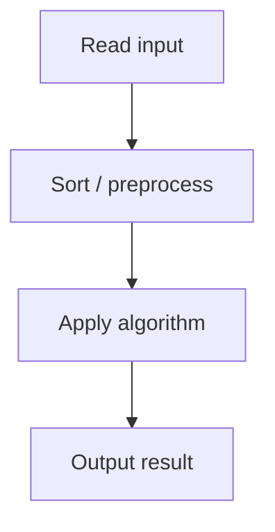

# 29. Ferris Wheel

## 1. Problem Description

Each gondola holds 1 or 2 children, total weight `<= x`. Find the minimum number of gondolas for `n` children.

## 2. Expected Input

First line: `n, x`. Second line: `n` integers `p_i`.

## 3. Expected Output

Minimum number of gondolas.

## 4. Constraints

1 <= n <= 2*10^5, 1 <= x <= 10^9, 1 <= p_i <= x.

## 5. Examples

| Input | Output |
|---|---|
| `4 10`<br>`7 2 3 9` | `3` |

## 6. Intuition

Sort children by weight. Pair the lightest with the heaviest if their combined weight `<= x`. Use two pointers from both ends.

## 7. Thought Process



## 8. Brute-Force Approach

Try all pairings. Exponential.

## 9. Optimized Solution

```python
def solve(n, x, weights):
    weights.sort()
    lo, hi = 0, n - 1
    gondolas = 0
    while lo <= hi:
        if lo < hi and weights[lo] + weights[hi] <= x:
            lo += 1
            hi -= 1
        else:
            hi -= 1  # heaviest goes alone
        gondolas += 1
    return gondolas

if __name__ == "__main__":
    n, x = map(int, input().split())
    w = list(map(int, input().split()))
    print(solve(n, x, w))
```

## 10. Why the Optimized Solution Works

Sort ensures we consider children in order. Pairing the lightest remaining with the heaviest remaining is optimal: if the lightest can't pair with the heaviest, the heaviest must go alone (no one else can pair with them either, since they're the heaviest).

## 11. Algorithm Used

Two-pointer greedy on sorted array.

## 12. Data Structures Used

Sorted list.

## 13. Time Complexity Analysis

`O(n log n)` for sorting, `O(n)` for the sweep.

## 14. Space Complexity Analysis

`O(1)` extra.

## 15. Step-by-Step Code Walkthrough

1. Sort. 2. `lo = 0, hi = n-1`. 3. While `lo <= hi`: if `w[lo] + w[hi] <= x`, pair them (`lo++, hi--`); else heaviest goes alone (`hi--`). 4. Count gondolas.

## 16. Dry Run with Example

`weights = [7, 2, 3, 9]`, `x = 10`. Sorted: `[2, 3, 7, 9]`.
- lo=0, hi=3: 2+9=11 > 10, heaviest alone. gondolas=1, hi=2.
- lo=0, hi=2: 2+7=9 <= 10, pair. gondolas=2, lo=1, hi=1.
- lo=1, hi=1: alone. gondolas=3.
Answer: 3.

## 17. Common Pitfalls

- Forgetting to handle the `lo == hi` case (single child left, goes alone). - Comparing `<=` vs `<`. - Not sorting first.

## 18. Edge Cases

| Case | Behavior |
|---|---|
| n=1 | 1 |
| All pairs fit | ceil(n/2) |
| No pairs fit | n |

## 19. Alternative Approaches

Binary search for each child's partner. Slower.

## 20. Related Problems

[[27. Apartments]], [[25. Towers]], [[30. Concert Tickets]]

## 21. Key Takeaways

- **Two-pointer from both ends** is the pattern for pairing problems. - Sort first, then greedily pair the extremes. - If the lightest can't pair with the heaviest, the heaviest goes alone.
