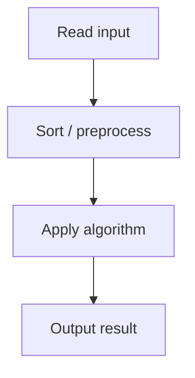

# 30. Concert Tickets

## 1. Problem Description

Each customer will pay at most `t_i` for a ticket. Give each customer the most expensive ticket `<= t_i`. Each ticket sold once.

## 2. Expected Input

First line: `n, m`. Second line: `n` ticket prices `h_i`. Third line: `m` max prices `t_i`.

## 3. Expected Output

For each customer, the price paid, or `-1`.

## 4. Constraints

1 <= n, m <= 2*10^5, 1 <= h_i, t_i <= 10^9.

## 5. Examples

| Input | Output |
|---|---|
| `5 3`<br>`5 3 7 8 5`<br>`4 8 3` | `3`<br>`8`<br>`-1` |

## 6. Intuition

Maintain a sorted multiset of ticket prices. For each customer, binary search for the largest price `<= t_i`. If found, remove it; else `-1`.

## 7. Thought Process



## 8. Brute-Force Approach

For each customer, scan all remaining tickets. `O(n*m)`. Too slow.

## 9. Optimized Solution

```python
import bisect
from collections import Counter

def solve(n, m, tickets, customers):
    tickets.sort()
    freq = Counter(tickets)
    unique_prices = sorted(set(tickets))
    result = []
    for t in customers:
        idx = bisect.bisect_right(unique_prices, t) - 1
        while idx >= 0 and freq[unique_prices[idx]] == 0:
            idx -= 1
        if idx >= 0:
            price = unique_prices[idx]
            freq[price] -= 1
            result.append(price)
        else:
            result.append(-1)
    return result

if __name__ == "__main__":
    n, m = map(int, input().split())
    h = list(map(int, input().split()))
    t = list(map(int, input().split()))
    for r in solve(n, m, h, t):
        print(r)
```

## 10. Why the Optimized Solution Works

For each customer, we want the largest ticket price `<= t_i` (to maximize revenue while satisfying the customer). A sorted multiset supports this query in `O(log n)` via binary search. Removing the ticket after sale prevents double-selling.

## 11. Algorithm Used

Binary search on a sorted multiset.

## 12. Data Structures Used

Sorted list of unique prices + frequency map.

## 13. Time Complexity Analysis

`O((n + m) log n)` — sorting is `O(n log n)`, each customer does `O(log n)` work.

## 14. Space Complexity Analysis

`O(n)` for the multiset.

## 15. Step-by-Step Code Walkthrough

1. Sort tickets, build frequency map. 2. For each customer `t`: binary search for largest price `<= t`. 3. If found, decrement frequency and output; else `-1`.

## 16. Dry Run with Example

Tickets `[5, 3, 7, 8, 5]` → sorted `[3, 5, 5, 7, 8]`. Customers `[4, 8, 3]`.
- t=4: bisect_right([3,5,7,8], 4) = 1, idx=0, price=3. Remove 3. Output: 3.
- t=8: bisect_right([5,5,7,8], 8) = 4, idx=3, price=8. Remove 8. Output: 8.
- t=3: bisect_right([5,5,7], 3) = 0, idx=-1. No ticket. Output: -1.

## 17. Common Pitfalls

- Using `bisect_left` instead of `bisect_right`. We want the largest `<= t`, which is at index `bisect_right(...) - 1`. - Not removing sold tickets. - Linear scan instead of binary search.

## 18. Edge Cases

| Case | Behavior |
|---|---|
| No tickets | All -1 |
| All tickets too expensive | All -1 |
| Multiple customers want the same ticket | Only first gets it |

## 19. Alternative Approaches

Use `SortedList` from `sortedcontainers` for cleaner code. Same complexity.

## 20. Related Problems

[[29. Ferris Wheel]], [[27. Apartments]], [[25. Towers]]

## 21. Key Takeaways

- **Sorted multiset + binary search** is the pattern for 'find largest element <= x and remove it'. - `bisect_right(arr, x) - 1` gives the index of the largest element `<= x`. - Removing elements from a sorted list is `O(n)` in Python; use `SortedList` for `O(log n)`.
