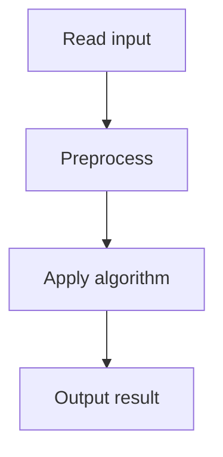

# 31. Playlist

## 1. Problem Description

Given a playlist of `n` songs (by id), find the longest contiguous segment where each song is unique.

## 2. Expected Input

First line: `n`. Second line: `n` integers `k_i`.

## 3. Expected Output

Length of the longest unique segment.

## 4. Constraints

1 <= n <= 2*10^5, 1 <= k_i <= 10^9.

## 5. Examples

| Input | Output |
|---|---|
| `8`<br>`1 2 1 3 2 7 4 2` | `5` |

## 6. Intuition

Use a **sliding window** with two pointers. Maintain a set of songs in the current window. Extend the right pointer; if the new song is already in the window, shrink from the left until it's unique again. Track the maximum window size.

## 7. Thought Process



## 8. Brute-Force Approach

For each starting position, extend until a duplicate. `O(n^2)`. Too slow.

## 9. Optimized Solution

```python
def solve(n, songs):
    seen = set()
    left = 0
    best = 0
    for right in range(n):
        while songs[right] in seen:
            seen.remove(songs[left])
            left += 1
        seen.add(songs[right])
        best = max(best, right - left + 1)
    return best

if __name__ == "__main__":
    n = int(input())
    songs = list(map(int, input().split()))
    print(solve(n, songs))
```

## 10. Why the Optimized Solution Works

The sliding window maintains the invariant: `songs[left..right]` has all unique elements. When we add `songs[right]`, if it's already in the window, we must remove elements from the left until the duplicate is gone. Each element is added and removed at most once, so the total work is `O(n)`.

## 11. Algorithm Used

Sliding window with hash set.

## 12. Data Structures Used

Hash set `seen`, two pointers `left` and `right`.

## 13. Time Complexity Analysis

`O(n)` — each element is added/removed at most once.

## 14. Space Complexity Analysis

`O(n)` for the set.

## 15. Step-by-Step Code Walkthrough

1. Initialize `seen = set()`, `left = 0`, `best = 0`. 2. For each `right`: while `songs[right]` is in `seen`, remove `songs[left]` and increment `left`. 3. Add `songs[right]`. 4. Update `best`.

## 16. Dry Run with Example

`songs = [1, 2, 1, 3, 2, 7, 4, 2]`.
- right=0: {1}, best=1.
- right=1: {1,2}, best=2.
- right=2: 1 in set, remove 1, left=1. {2,1}, best=2.
- right=3: {2,1,3}, best=3.
- right=4: 2 in set, remove 2, left=2. {1,3,2}, best=3.
- right=5: {1,3,2,7}, best=4.
- right=6: {1,3,2,7,4}, best=5.
- right=7: 2 in set, remove 1,3,2. left=5. {7,4,2}, best=5.
Answer: 5.

## 17. Common Pitfalls

- Using `list` instead of `set` for `seen` (O(n) lookup). - Forgetting to update `best` after each iteration. - Not removing elements when shrinking the window.

## 18. Edge Cases

| Case | Behavior |
|---|---|
| n=1 | 1 |
| All unique | n |
| All same | 1 |

## 19. Alternative Approaches

Use a dictionary mapping song id to its last seen index. Jump `left` directly. Same complexity.

## 20. Related Problems

[[30. Concert Tickets]], [[47. Subarray Sums I]]

## 21. Key Takeaways

- **Sliding window with hash set** is the pattern for 'longest subarray with unique elements'. - Two pointers `left` and `right` with a `while` loop to shrink. - Each element enters and leaves the window at most once.
