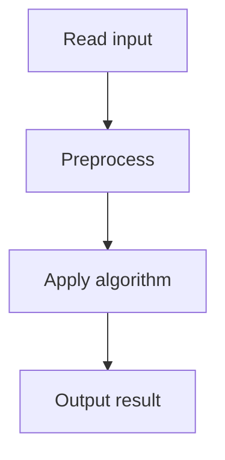

# 32. Traffic Lights

## 1. Problem Description

A street of length `x` has positions `0, 1, ..., x`. Add `n` traffic lights one by one. After each addition, output the length of the longest passage without traffic lights.

## 2. Expected Input

First line: `x, n`. Second line: `n` positions `p_i`.

## 3. Expected Output

After each addition, the longest passage length.

## 4. Constraints

1 <= x <= 10^9, 1 <= n <= 2*10^5, 0 < p_i < x.

## 5. Examples

| Input | Output |
|---|---|
| `8 3`<br>`3 6 2` | `5 3 3` |

## 6. Intuition

Maintain two structures: (1) a sorted set of traffic light positions, (2) a multiset of passage lengths. When adding a light at `p`, find its neighbors `a` and `b` (using the sorted set). Remove the passage `b - a` and add passages `p - a` and `b - p`.

## 7. Thought Process



## 8. Brute-Force Approach

After each addition, scan all passages. `O(n^2)`. Too slow.

## 9. Optimized Solution

```python
from sortedcontainers import SortedList
from collections import Counter

def solve(x, n, positions):
    lights = SortedList([0, x])
    passages = Counter()
    passages[x] = 1
    result = []
    for p in positions:
        idx = lights.bisect_left(p)
        a = lights[idx - 1]
        b = lights[idx]
        # Remove passage b - a
        passages[b - a] -= 1
        if passages[b - a] == 0:
            del passages[b - a]
        # Add passages p - a and b - p
        passages[p - a] += 1
        passages[b - p] += 1
        lights.add(p)
        result.append(max(passages.keys()))
    return result

if __name__ == "__main__":
    x, n = map(int, input().split())
    pos = list(map(int, input().split()))
    print(*solve(x, n, pos))
```

## 10. Why the Optimized Solution Works

Each traffic light splits an existing passage into two. By maintaining a sorted set of lights, we can find the neighbors of a new light in `O(log n)`. By maintaining a multiset of passage lengths, we can query the maximum in `O(1)` (or `O(log n)` with a sorted structure).

## 11. Algorithm Used

Sorted set + multiset simulation.

## 12. Data Structures Used

`SortedList` for light positions, `Counter` (or multiset) for passage lengths.

## 13. Time Complexity Analysis

`O(n log n)` — each addition does `O(log n)` work.

## 14. Space Complexity Analysis

`O(n)`.

## 15. Step-by-Step Code Walkthrough

1. Initialize lights = [0, x], passages = {x: 1}. 2. For each new position `p`: find neighbors `a, b`. Remove passage `b-a`, add `p-a` and `b-p`. Add `p` to lights. 3. Output the max passage length.

## 16. Dry Run with Example

`x=8, positions=[3, 6, 2]`.
- p=3: neighbors 0, 8. Remove 8, add 3, 5. Passages: {3:1, 5:1}. Max: 5.
- p=6: neighbors 3, 8. Remove 5, add 3, 2. Passages: {3:2, 2:1}. Max: 3.
- p=2: neighbors 0, 3. Remove 3, add 2, 1. Passages: {2:1, 1:1, 3:1}. Max: 3.
Output: 5 3 3.

## 17. Common Pitfalls

- Using a list instead of a sorted set (linear search for neighbors). - Not maintaining the multiset of passage lengths (would require O(n) to find max). - Forgetting to add 0 and x as initial lights.

## 18. Edge Cases

| Case | Behavior |
|---|---|
| n=1 | x-1 (one light splits into x-1 and 1) |
| All lights at consecutive positions | Max passage shrinks each step |

## 19. Alternative Approaches

Use a `SortedList` for passage lengths instead of a Counter. `O(log n)` for max.

## 20. Related Problems

[[33. Room Allocation]], [[34. Restaurant Customers]]

## 21. Key Takeaways

- **Sorted set + multiset** is the pattern for 'maintain max/min under insertions and deletions'. - `SortedList` from `sortedcontainers` is the Python equivalent of C++ `std::set`. - Splitting an interval requires knowing both neighbors.
