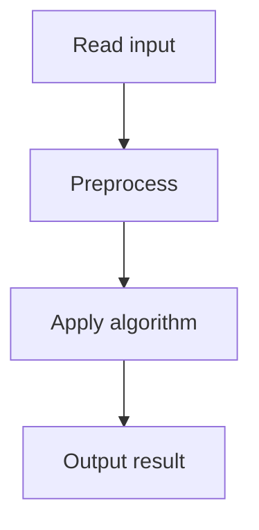

# 33. Room Allocation

## 1. Problem Description

`n` customers each have an arrival and departure day. Two customers can share a room if the first departs before the second arrives. Find the minimum number of rooms and an assignment.

## 2. Expected Input

First line: `n`. Next `n` lines: arrival `a` and departure `b`.

## 3. Expected Output

Minimum rooms, then `n` room numbers (one per customer).

## 4. Constraints

1 <= n <= 2*10^5, 1 <= a <= b <= 10^9.

## 5. Examples

| Input | Output |
|---|---|
| `3`<br>`1 2`<br>`2 4`<br>`4 4` | `2`<br>`1 2 1` |

## 6. Intuition

Sort customers by arrival. Use a min-heap of (departure, room_number). For each customer, if the earliest-departing room is free (departure < arrival), reuse it; otherwise allocate a new room.

## 7. Thought Process



## 8. Brute-Force Approach

Try all room assignments. Exponential.

## 9. Optimized Solution

```python
import heapq

def solve(n, customers):
    # customers: list of (arrival, departure, original_index)
    indexed = [(a, b, i) for i, (a, b) in enumerate(customers)]
    indexed.sort()
    rooms = []  # min-heap of (departure, room_number)
    assignment = [0] * n
    room_count = 0
    for a, b, i in indexed:
        if rooms and rooms[0][0] < a:
            # Reuse this room
            dep, room_num = heapq.heappop(rooms)
            heapq.heappush(rooms, (b, room_num))
            assignment[i] = room_num
        else:
            room_count += 1
            heapq.heappush(rooms, (b, room_count))
            assignment[i] = room_count
    return room_count, assignment

if __name__ == "__main__":
    n = int(input())
    customers = []
    for _ in range(n):
        a, b = map(int, input().split())
        customers.append((a, b))
    k, assign = solve(n, customers)
    print(k)
    print(*assign)
```

## 10. Why the Optimized Solution Works

Sorting by arrival ensures we process customers in chronological order. The min-heap of departures lets us quickly find the room that frees up earliest. If that room is free before the current customer arrives, we reuse it; otherwise, we need a new room. This greedy minimizes the number of rooms because we always reuse when possible.

## 11. Algorithm Used

Greedy with min-heap.

## 12. Data Structures Used

Min-heap of (departure, room_number).

## 13. Time Complexity Analysis

`O(n log n)` — sort + heap operations.

## 14. Space Complexity Analysis

`O(n)`.

## 15. Step-by-Step Code Walkthrough

1. Sort customers by arrival. 2. Initialize empty heap. 3. For each customer: if heap top departs before this arrival, reuse that room; else allocate new. 4. Push (departure, room) to heap.

## 16. Dry Run with Example

Customers: (1,2), (2,4), (4,4). Sorted: same.
- (1,2): heap empty, new room 1. Heap: [(2,1)].
- (2,4): top is (2,1), 2 < 2 is false. New room 2. Heap: [(2,1), (4,2)].
- (4,4): top is (2,1), 2 < 4 is true. Reuse room 1. Heap: [(4,2), (4,1)].
Assignment: [1, 2, 1]. Rooms: 2.

## 17. Common Pitfalls

- Using `<=` instead of `<` for the departure check. The problem says 'departure earlier than arrival', so strict inequality. - Not preserving original indices for output. - Forgetting to push the new (departure, room) after reusing.

## 18. Edge Cases

| Case | Behavior |
|---|---|
| All customers overlap | n rooms |
| No customers overlap | 1 room |
| Same arrival and departure | a == b, one day |

## 19. Alternative Approaches

Sweep line: events at arrival (+1 room) and departure (-1 room). Max concurrent is the answer. But this doesn't give the assignment.

## 20. Related Problems

[[34. Restaurant Customers]], [[32. Traffic Lights]]

## 21. Key Takeaways

- **Min-heap of departures** is the pattern for 'room/meeting allocation'. - Sort by start time, then greedily reuse the earliest-finishing resource. - Always preserve original indices when sorting for output purposes.
