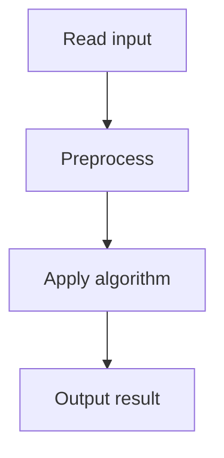

# 34. Restaurant Customers

## 1. Problem Description

Given arrival and leaving times of `n` customers, find the maximum number of customers present at any time.

## 2. Expected Input

First line: `n`. Next `n` lines: arrival `a`, leaving `b`.

## 3. Expected Output

Maximum number of simultaneous customers.

## 4. Constraints

1 <= n <= 2*10^5, 1 <= a < b <= 10^9.

## 5. Examples

| Input | Output |
|---|---|
| `3`<br>`5 8`<br>`2 4`<br>`3 9` | `2` |

## 6. Intuition

**Sweep line**: create events (+1 at arrival, -1 at departure), sort by time, sweep and track the running sum. The maximum is the answer.

## 7. Thought Process



## 8. Brute-Force Approach

For each time, count customers. Infeasible (time up to 10^9).

## 9. Optimized Solution

```python
def solve(n, customers):
    events = []
    for a, b in customers:
        events.append((a, 1))
        events.append((b, -1))
    events.sort()
    current = 0
    best = 0
    for time, delta in events:
        current += delta
        best = max(best, current)
    return best

if __name__ == "__main__":
    n = int(input())
    customers = []
    for _ in range(n):
        a, b = map(int, input().split())
        customers.append((a, b))
    print(solve(n, customers))
```

## 10. Why the Optimized Solution Works

Each customer contributes +1 to the count during `[a, b)`. By sorting events (arrivals before departures at the same time, since +1 comes first in the sort), we correctly compute the count at each event point. The maximum over all event points is the answer.

## 11. Algorithm Used

Sweep line with sorted events.

## 12. Data Structures Used

List of (time, delta) events.

## 13. Time Complexity Analysis

`O(n log n)` for sorting, `O(n)` for the sweep.

## 14. Space Complexity Analysis

`O(n)` for events.

## 15. Step-by-Step Code Walkthrough

1. Create events: (a, +1) and (b, -1) for each customer. 2. Sort by time. 3. Sweep: maintain running sum, track max.

## 16. Dry Run with Example

Customers: (5,8), (2,4), (3,9). Events: (5,+1),(8,-1),(2,+1),(4,-1),(3,+1),(9,-1). Sorted: (2,+1),(3,+1),(4,-1),(5,+1),(8,-1),(9,-1).
- t=2: cur=1, best=1.
- t=3: cur=2, best=2.
- t=4: cur=1.
- t=5: cur=2.
- t=8: cur=1.
- t=9: cur=0.
Answer: 2.

## 17. Common Pitfalls

- Event ordering at the same time. If a customer leaves at time `t` and another arrives at `t`, do they overlap? The problem says `a < b`, so a customer is present during `[a, b)`. Arrivals at `t` increment before departures at `t` decrement. - Forgetting to sort. - Using a counter array (time up to 10^9).

## 18. Edge Cases

| Case | Behavior |
|---|---|
| n=1 | 1 |
| All overlap | n |
| No overlap | 1 |

## 19. Alternative Approaches

Use coordinate compression + prefix sums. More complex but same complexity.

## 20. Related Problems

[[33. Room Allocation]], [[32. Traffic Lights]]

## 21. Key Takeaways

- **Sweep line** is the pattern for 'max concurrent events'. - Create +1/-1 events, sort, sweep. - Event ordering at ties matters: process +1 before -1 if intervals are [a, b).
