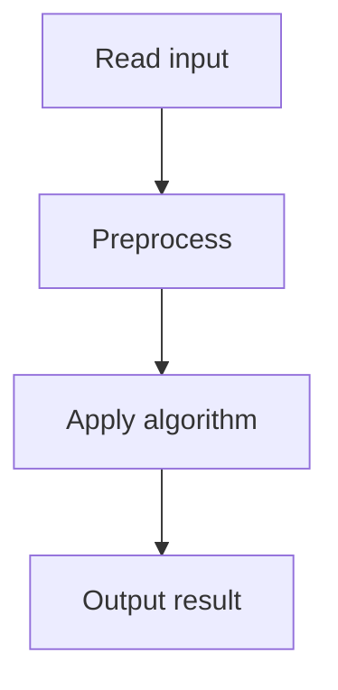

# 35. Factory Machines

## 1. Problem Description

Each machine `i` produces one item every `t_i` seconds. Find the minimum time to produce `k` items using all `n` machines in parallel.

## 2. Expected Input

First line: `n, k`. Second line: `n` integers `t_i`.

## 3. Expected Output

Minimum time to produce `k` items.

## 4. Constraints

1 <= n <= 2*10^5, 1 <= k <= 10^9, 1 <= t_i <= 10^9.

## 5. Examples

| Input | Output |
|---|---|
| `3 7`<br>`3 2 5` | `8` |

## 6. Intuition

**Binary search on time**. In time `T`, machine `i` produces `T // t_i` items. Total = `sum(T // t_i)`. Find the smallest `T` such that total `>= k`.

## 7. Thought Process



## 8. Brute-Force Approach

Simulate second by second. `O(T * n)` where T can be huge. Infeasible.

## 9. Optimized Solution

```python
def solve(n, k, times):
    lo, hi = 1, max(times) * k
    while lo < hi:
        mid = (lo + hi) // 2
        total = sum(mid // t for t in times)
        if total >= k:
            hi = mid
        else:
            lo = mid + 1
    return lo

if __name__ == "__main__":
    n, k = map(int, input().split())
    times = list(map(int, input().split()))
    print(solve(n, k, times))
```

## 10. Why the Optimized Solution Works

The total items produced in time `T` is monotonic in `T`. Binary search applies. The upper bound is `max(times) * k` (the slowest machine alone could produce `k` items in that time).

## 11. Algorithm Used

Binary search on time.

## 12. Data Structures Used

Scalar integers.

## 13. Time Complexity Analysis

`O(n log(max_t * k))` — binary search over `[1, max_t * k]`, each check is `O(n)`.

## 14. Space Complexity Analysis

`O(1)`.

## 15. Step-by-Step Code Walkthrough

1. Set `lo = 1, hi = max(times) * k`. 2. Binary search: `mid = (lo+hi)//2`. 3. Compute `total = sum(mid // t)`. 4. If `total >= k`, `hi = mid`; else `lo = mid + 1`.

## 16. Dry Run with Example

`times = [3, 2, 5]`, `k = 7`. `lo = 1, hi = 35`.
- mid=18: total = 6+9+3 = 18 >= 7. hi=18.
- mid=9: total = 3+4+1 = 8 >= 7. hi=9.
- mid=5: total = 1+2+1 = 4 < 7. lo=6.
- mid=7: total = 2+3+1 = 6 < 7. lo=8.
- mid=8: total = 2+4+1 = 7 >= 7. hi=8.
- lo=hi=8. Answer: 8.

## 17. Common Pitfalls

- Setting `hi` too small. `max(times) * k` is safe. - Integer overflow in other languages (`max_t * k` up to 10^18). - Off-by-one in binary search.

## 18. Edge Cases

| Case | Behavior |
|---|---|
| n=1 | k * t_1 |
| All machines same speed | ceil(k/n) * t |
| k=1 | min(times) |

## 19. Alternative Approaches

Math: closed form is complex with multiple machines. Binary search is simplest.

## 20. Related Problems

[[28. Array Division]], [[36. Distinct Numbers]]

## 21. Key Takeaways

- **Binary search on time** is the pattern for 'how long to produce X items'. - Monotonicity: more time -> more items. - Upper bound: `max(times) * k` (slowest machine alone).
