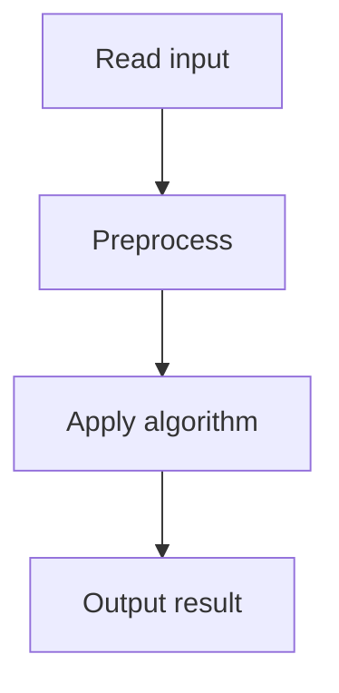

# 36. Distinct Numbers

## 1. Problem Description

Given `n` numbers, count how many are distinct.

## 2. Expected Input

First line: `n`. Second line: `n` integers.

## 3. Expected Output

Number of distinct values.

## 4. Constraints

1 <= n <= 2*10^5, 1 <= x_i <= 10^9.

## 5. Examples

| Input | Output |
|---|---|
| `5`<br>`2 3 2 1 3` | `3` |

## 6. Intuition

Put all numbers in a set and return the set's size.

## 7. Thought Process



## 8. Brute-Force Approach

Sort and count unique. `O(n log n)`. Works but slower.

## 9. Optimized Solution

```python
def solve(nums):
    return len(set(nums))

if __name__ == "__main__":
    n = int(input())
    nums = list(map(int, input().split()))
    print(solve(nums))
```

## 10. Why the Optimized Solution Works

A set automatically deduplicates. `len(set)` is `O(n)` average.

## 11. Algorithm Used

Hash set.

## 12. Data Structures Used

Python `set`.

## 13. Time Complexity Analysis

`O(n)` average.

## 14. Space Complexity Analysis

`O(n)`.

## 15. Step-by-Step Code Walkthrough

1. Read all numbers. 2. Convert to set. 3. Return length.

## 16. Dry Run with Example

`[2, 3, 2, 1, 3]` -> set `{1, 2, 3}` -> length 3.

## 17. Common Pitfalls

- Using `list.count()` which is O(n) per call. - Sorting unnecessarily.

## 18. Edge Cases

| Case | Behavior |
|---|---|
| All same | 1 |
| All distinct | n |

## 19. Alternative Approaches

Sort and count transitions. `O(n log n)`.

## 20. Related Problems

[[37. Movie Festival]], [[31. Playlist]]

## 21. Key Takeaways

- **`len(set(arr))`** is the simplest way to count distinct elements. - Hash sets give `O(1)` average insertion and lookup. - For very large data, consider sorting (avoids hash overhead).
