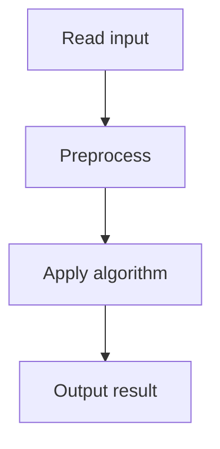

# 37. Movie Festival

## 1. Problem Description

Given `n` movies with start and end times, find the maximum number of movies you can watch entirely (no overlaps).

## 2. Expected Input

First line: `n`. Next `n` lines: start `a`, end `b`.

## 3. Expected Output

Maximum number of non-overlapping movies.

## 4. Constraints

1 <= n <= 2*10^5, 1 <= a < b <= 10^9.

## 5. Examples

| Input | Output |
|---|---|
| `3`<br>`3 5`<br>`4 8`<br>`6 7` | `2` |

## 6. Intuition

**Greedy by end time**: sort movies by ending time. Always pick the next movie that ends earliest and starts after the last picked movie's end.

## 7. Thought Process



## 8. Brute-Force Approach

Try all subsets. Exponential.

## 9. Optimized Solution

```python
def solve(n, movies):
    movies.sort(key=lambda x: x[1])  # sort by end time
    count = 0
    last_end = 0
    for a, b in movies:
        if a >= last_end:
            count += 1
            last_end = b
    return count

if __name__ == "__main__":
    n = int(input())
    movies = []
    for _ in range(n):
        a, b = map(int, input().split())
        movies.append((a, b))
    print(solve(n, movies))
```

## 10. Why the Optimized Solution Works

Sorting by end time and greedily picking the earliest-ending available movie is optimal. Proof (exchange argument): suppose the optimal solution picks a different movie `M'` that ends later than the greedy choice `M`. We can replace `M'` with `M` without reducing the count, because `M` ends earlier, leaving more room for subsequent movies.

## 11. Algorithm Used

Greedy by end time (activity selection).

## 12. Data Structures Used

Sorted list of intervals.

## 13. Time Complexity Analysis

`O(n log n)` for sorting.

## 14. Space Complexity Analysis

`O(1)` extra.

## 15. Step-by-Step Code Walkthrough

1. Sort by end time. 2. `last_end = 0`, `count = 0`. 3. For each movie: if start >= last_end, pick it; update last_end.

## 16. Dry Run with Example

Movies: (3,5), (4,8), (6,7). Sorted by end: (3,5), (6,7), (4,8).
- (3,5): 3 >= 0, pick. last_end=5.
- (6,7): 6 >= 5, pick. last_end=7.
- (4,8): 4 < 7, skip.
Answer: 2.

## 17. Common Pitfalls

- Sorting by start time instead of end time. This doesn't give the optimal solution. - Using `>` instead of `>=` (movies that end exactly when another starts don't overlap).

## 18. Edge Cases

| Case | Behavior |
|---|---|
| All overlap | 1 |
| No overlaps | n |
| Nested intervals | Pick the shortest |

## 19. Alternative Approaches

DP: `dp[i]` = max movies using first `i` (sorted by end). `O(n log n)` with binary search. Same complexity, more code.

## 20. Related Problems

[[38. Tasks and Deadlines]], [[34. Restaurant Customers]], [[40. Movie Festival II]]

## 21. Key Takeaways

- **Activity selection greedy**: sort by end time, pick earliest-ending available. - This is a classic greedy algorithm with a clean exchange-argument proof. - The key insight: picking the earliest-ending movie maximizes remaining time for others.
