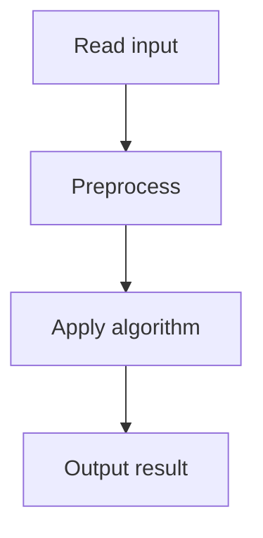

# 38. Tasks and Deadlines

## 1. Problem Description

Each task has a duration `a_i` and deadline `d_i`. You earn `d_i - t` reward for completing task `i` at time `t` (where `t` is its completion time). Schedule tasks to maximize total reward.

## 2. Expected Input

First line: `n`. Next `n` lines: `a_i, d_i`.

## 3. Expected Output

Maximum total reward.

## 4. Constraints

1 <= n <= 2*10^5, 1 <= a_i, d_i <= 10^9.

## 5. Examples

| Input | Output |
|---|---|
| `3`<br>`6 10`<br>`8 15`<br>`5 12` | `2` |

## 6. Intuition

Sort tasks by duration (shortest first). Process in this order. The total reward is `sum(d_i) - sum(a_i * (n - i))` where `i` is the 0-indexed position. Actually, the reward for task at position `i` is `d_i - (cumulative time including this task)`.

## 7. Thought Process



## 8. Brute-Force Approach

Try all orderings. `O(n!)`. Infeasible.

## 9. Optimized Solution

```python
def solve(n, tasks):
    tasks.sort()  # sort by duration
    time = 0
    reward = 0
    for a, d in tasks:
        time += a
        reward += d - time
    return reward

if __name__ == "__main__":
    n = int(input())
    tasks = []
    for _ in range(n):
        a, d = map(int, input().split())
        tasks.append((a, d))
    print(solve(n, tasks))
```

## 10. Why the Optimized Solution Works

Sorting by duration (shortest first) minimizes the total waiting time. Proof: consider two adjacent tasks `i` and `j` with durations `a_i > a_j`. If we do `i` first, the contribution to total time from these two is `a_i + (a_i + a_j) = 2*a_i + a_j`. If we do `j` first, it's `a_j + (a_i + a_j) = a_i + 2*a_j`. The difference is `a_i - a_j > 0`, so doing `j` first is better. By exchange argument, sorting by duration ascending is optimal.

## 11. Algorithm Used

Greedy by duration (shortest first).

## 12. Data Structures Used

Sorted list.

## 13. Time Complexity Analysis

`O(n log n)`.

## 14. Space Complexity Analysis

`O(1)`.

## 15. Step-by-Step Code Walkthrough

1. Sort by duration. 2. Maintain `time = 0`, `reward = 0`. 3. For each task: `time += a`, `reward += d - time`.

## 16. Dry Run with Example

Tasks: (6,10), (8,15), (5,12). Sorted by duration: (5,12), (6,10), (8,15).
- (5,12): time=5, reward=12-5=7.
- (6,10): time=11, reward=10-11=-1.
- (8,15): time=19, reward=15-19=-4.
Total: 7-1-4=2.

## 17. Common Pitfalls

- Sorting by deadline instead of duration. The deadlines don't affect the optimal order; only durations do. - Computing reward as `d_i - a_i` (forgetting cumulative time).

## 18. Edge Cases

| Case | Behavior |
|---|---|
| n=1 | d_1 - a_1 |
| All same duration | Order doesn't matter |
| Very tight deadlines | Reward can be negative |

## 19. Alternative Approaches

DP is unnecessary; greedy is optimal.

## 20. Related Problems

[[37. Movie Festival]], [[39. Reading Books]]

## 21. Key Takeaways

- **Shortest job first** minimizes total completion time. - The reward depends on completion time, which depends on all previous durations. - Sorting by duration is optimal by exchange argument.
