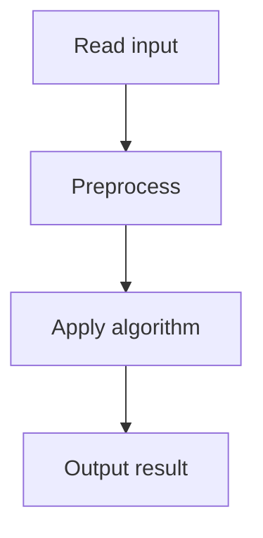

# 41. Sum of Two Values

## 1. Problem Description

Find two distinct indices `i, j` such that `arr[i] + arr[j] = x`.

## 2. Expected Input

First line: `n, x`. Second line: `n` integers.

## 3. Expected Output

Two indices (1-indexed), or `IMPOSSIBLE`.

## 4. Constraints

1 <= n <= 2*10^5, 1 <= x, arr[i] <= 10^9.

## 5. Examples

| Input | Output |
|---|---|
| `4 8`<br>`2 7 5 1` | `2 4` |

## 6. Intuition

Use a hash map from value to index. For each element `a`, check if `x - a` is in the map. If so, output the two indices.

## 7. Thought Process



## 8. Brute-Force Approach

Check all pairs. `O(n^2)`. Too slow.

## 9. Optimized Solution

```python
def solve(n, x, arr):
    seen = {}  # value -> index (1-indexed)
    for i, a in enumerate(arr, 1):
        complement = x - a
        if complement in seen:
            return [seen[complement], i]
        seen[a] = i
    return None

if __name__ == "__main__":
    n, x = map(int, input().split())
    arr = list(map(int, input().split()))
    result = solve(n, x, arr)
    if result:
        print(*result)
    else:
        print("IMPOSSIBLE")
```

## 10. Why the Optimized Solution Works

The hash map stores each value's index as we iterate. For each new element, we check if its complement has been seen. This finds the pair in one pass.

## 11. Algorithm Used

Hash map (two-sum).

## 12. Data Structures Used

Python `dict`.

## 13. Time Complexity Analysis

`O(n)` average.

## 14. Space Complexity Analysis

`O(n)`.

## 15. Step-by-Step Code Walkthrough

1. Initialize empty dict. 2. For each element (1-indexed): compute complement. If in dict, return both indices. Else, add to dict.

## 16. Dry Run with Example

`arr = [2, 7, 5, 1]`, `x = 8`.
- i=1, a=2: complement=6. Not in dict. seen={2:1}.
- i=2, a=7: complement=1. Not in dict. seen={2:1, 7:2}.
- i=3, a=5: complement=3. Not in dict. seen={2:1, 7:2, 5:3}.
- i=4, a=1: complement=7. In dict (index 2). Return [2, 4].

## 17. Common Pitfalls

- Using the same element twice (e.g., `a + a = x`). The check `complement in seen` before adding `a` prevents this. - Returning 0-indexed instead of 1-indexed. - Not handling the `IMPOSSIBLE` case.

## 18. Edge Cases

| Case | Behavior |
|---|---|
| n=2, pair exists | Output both |
| No pair | IMPOSSIBLE |
| Duplicate values | Use first occurrence |

## 19. Alternative Approaches

Sort + two pointers. `O(n log n)`. Works but slower.

## 20. Related Problems

[[42. Sum of Three Values]], [[43. Sum of Four Values]]

## 21. Key Takeaways

- **Hash map for two-sum** is the canonical `O(n)` solution. - Check the complement *before* adding the current element to avoid using it twice. - Hash maps give `O(1)` average lookup.
