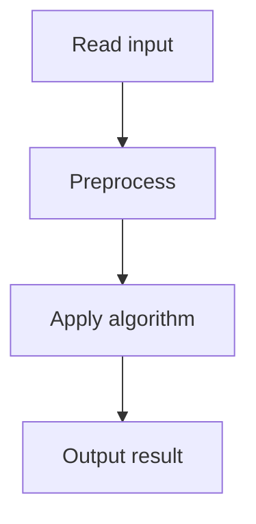

# 44. Maximum Subarray Sum

## 1. Problem Description

Find the maximum sum of a contiguous subarray.

## 2. Expected Input

First line: `n`. Second line: `n` integers (possibly negative).

## 3. Expected Output

Maximum subarray sum.

## 4. Constraints

1 <= n <= 2*10^5, -10^9 <= x_i <= 10^9.

## 5. Examples

| Input | Output |
|---|---|
| `8`<br>`-1 3 -2 5 3 -5 2 2` | `9` |

## 6. Intuition

**Kadane's algorithm**: maintain `current_sum = max(arr[i], current_sum + arr[i])`. Track the maximum `current_sum` seen.

## 7. Thought Process



## 8. Brute-Force Approach

Check all subarrays. `O(n^2)`. Too slow.

## 9. Optimized Solution

```python
def solve(arr):
    best = arr[0]
    current = arr[0]
    for i in range(1, len(arr)):
        current = max(arr[i], current + arr[i])
        best = max(best, current)
    return best

if __name__ == "__main__":
    n = int(input())
    arr = list(map(int, input().split()))
    print(solve(arr))
```

## 10. Why the Optimized Solution Works

At each position, the max subarray ending here is either just `arr[i]` (start fresh) or `current + arr[i]` (extend). The global max is the max over all positions. This is optimal because any max subarray must end somewhere, and we compute the max ending at each position.

## 11. Algorithm Used

Kadane's algorithm.

## 12. Data Structures Used

Scalar integers.

## 13. Time Complexity Analysis

`O(n)`.

## 14. Space Complexity Analysis

`O(1)`.

## 15. Step-by-Step Code Walkthrough

1. Initialize `best = current = arr[0]`. 2. For each subsequent element: `current = max(arr[i], current + arr[i])`, `best = max(best, current)`.

## 16. Dry Run with Example

`arr = [-1, 3, -2, 5, 3, -5, 2, 2]`.
- best=-1, current=-1.
- i=1: current=max(3, -1+3)=3. best=3.
- i=2: current=max(-2, 3-2)=1. best=3.
- i=3: current=max(5, 1+5)=6. best=6.
- i=4: current=max(3, 6+3)=9. best=9.
- i=5: current=max(-5, 9-5)=4. best=9.
- i=6: current=max(2, 4+2)=6. best=9.
- i=7: current=max(2, 6+2)=8. best=9.
Answer: 9.

## 17. Common Pitfalls

- Initializing `best = 0` (fails for all-negative arrays). Use `arr[0]`. - Using `current + arr[i]` without the `max(arr[i], ...)`. This doesn't handle the 'start fresh' case.

## 18. Edge Cases

| Case | Behavior |
|---|---|
| All negative | Max single element |
| All positive | Sum of all |
| Single element | That element |

## 19. Alternative Approaches

Divide and conquer: `O(n log n)`. Slower but instructive.

## 20. Related Problems

[[45. Maximum Subarray Sum II]], [[1. Maximum Subarray]] (NeetCode)

## 21. Key Takeaways

- **Kadane's algorithm** is the canonical `O(n)` solution for max subarray sum. - The key insight: at each position, decide whether to extend the previous subarray or start fresh. - Initialize with `arr[0]`, not `0`, to handle all-negative arrays.
