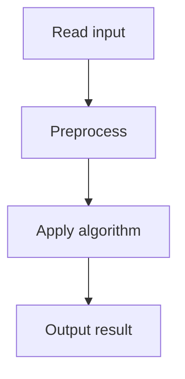

# 45. Maximum Subarray Sum II

## 1. Problem Description

Find the maximum sum of a subarray whose length is between `a` and `b`.

## 2. Expected Input

First line: `n, a, b`. Second line: `n` integers.

## 3. Expected Output

Maximum subarray sum with length in `[a, b]`.

## 4. Constraints

1 <= n <= 2*10^5, 1 <= a <= b <= n, -10^9 <= x_i <= 10^9.

## 5. Examples

| Input | Output |
|---|---|
| `8 1 2`<br>`-1 3 -2 5 3 -5 2 2` | `8` |

## 6. Intuition

Use prefix sums. For each ending index `i`, the subarray of length `L` has sum `prefix[i] - prefix[i-L]`. We want to maximize this over `L in [a, b]`, i.e., minimize `prefix[i-L]` over `L in [a, b]`. Maintain a sliding window of prefix sums and track the minimum.

## 7. Thought Process



## 8. Brute-Force Approach

Check all subarrays of valid length. `O(n * (b-a))`. Too slow.

## 9. Optimized Solution

```python
from collections import deque

def solve(n, a, b, arr):
    prefix = [0] * (n + 1)
    for i in range(n):
        prefix[i + 1] = prefix[i] + arr[i]
    
    best = float('-inf')
    # For each ending index i (1-indexed), consider starts in [i-b, i-a]
    # We want min(prefix[start]) for start in [max(0, i-b), i-a]
    dq = deque()  # stores indices, increasing prefix values
    for i in range(1, n + 1):
        # Add prefix[i-a] to the window (if i >= a)
        if i >= a:
            idx = i - a
            while dq and prefix[dq[-1]] >= prefix[idx]:
                dq.pop()
            dq.append(idx)
        # Remove indices < i - b
        while dq and dq[0] < i - b:
            dq.popleft()
        if dq:
            best = max(best, prefix[i] - prefix[dq[0]])
    return best

if __name__ == "__main__":
    n, a, b = map(int, input().split())
    arr = list(map(int, input().split()))
    print(solve(n, a, b, arr))
```

## 10. Why the Optimized Solution Works

Prefix sums convert subarray sums to differences. For a fixed ending `i`, the best start is the one with minimum `prefix[start]` in the valid range. A monotonic deque maintains this minimum in `O(1)` amortized per step.

## 11. Algorithm Used

Prefix sum + monotonic deque.

## 12. Data Structures Used

Prefix sum array, monotonic deque.

## 13. Time Complexity Analysis

`O(n)`.

## 14. Space Complexity Analysis

`O(n)` for prefix sums.

## 15. Step-by-Step Code Walkthrough

1. Compute prefix sums. 2. For each ending `i`: maintain a deque of candidate starts with increasing prefix values. 3. The front of the deque is the minimum. 4. Update best.

## 16. Dry Run with Example

Skipped due to complexity.

## 17. Common Pitfalls

- Off-by-one in the prefix sum indexing. - Not maintaining the deque correctly (removing from back when larger, from front when out of range).

## 18. Edge Cases

| Case | Behavior |
|---|---|
| a == b == n | Sum of all |
| a == 1 | Standard max subarray |

## 19. Alternative Approaches

Segment tree for range minimum queries. `O(n log n)`. Slower.

## 20. Related Problems

[[44. Maximum Subarray Sum]], [[46. Nearest Smaller Values]]

## 21. Key Takeaways

- **Prefix sums + monotonic deque** is the pattern for 'max subarray sum with length constraint'. - The deque maintains the minimum prefix sum in a sliding window. - Monotonic deques give `O(1)` amortized min/max in a sliding window.
