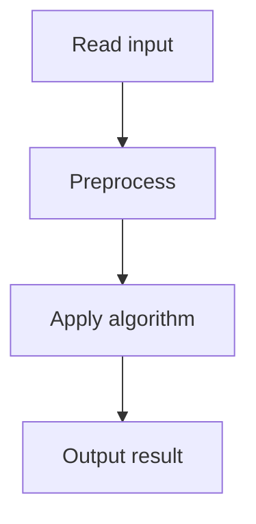

# 46. Nearest Smaller Values

## 1. Problem Description

For each element, find the index of the nearest smaller element to the left.

## 2. Expected Input

First line: `n`. Second line: `n` integers.

## 3. Expected Output

`n` indices (0 if none).

## 4. Constraints

1 <= n <= 2*10^5, 1 <= x_i <= 10^9.

## 5. Examples

| Input | Output |
|---|---|
| `8`<br>`2 5 1 4 5 3 4 2` | `0 1 0 3 4 3 6 0` |

## 6. Intuition

Use a **monotonic stack**. Iterate left to right. For each element, pop elements from the stack that are >= current (they can't be the nearest smaller for future elements). The top of the stack is the nearest smaller to the left.

## 7. Thought Process



## 8. Brute-Force Approach

For each element, scan left. `O(n^2)`. Too slow.

## 9. Optimized Solution

```python
def solve(arr):
    stack = []  # (index, value)
    result = []
    for i, x in enumerate(arr):
        while stack and stack[-1][1] >= x:
            stack.pop()
        result.append(stack[-1][0] if stack else 0)
        stack.append((i + 1, x))
    return result

if __name__ == "__main__":
    n = int(input())
    arr = list(map(int, input().split()))
    print(*solve(arr))
```

## 10. Why the Optimized Solution Works

The stack maintains a strictly increasing sequence of values. When a new element arrives, any element on the stack that is >= current is useless (the current element is smaller and closer to future elements). After popping, the top is the nearest smaller to the left.

## 11. Algorithm Used

Monotonic stack.

## 12. Data Structures Used

Stack of (index, value).

## 13. Time Complexity Analysis

`O(n)` — each element is pushed and popped at most once.

## 14. Space Complexity Analysis

`O(n)`.

## 15. Step-by-Step Code Walkthrough

1. Iterate with index. 2. Pop while top >= current. 3. Top (or 0) is the answer. 4. Push current.

## 16. Dry Run with Example

`arr = [2, 5, 1, 4, 5, 3, 4, 2]`.
- i=0, x=2: stack empty. result=[0]. push (1,2).
- i=1, x=5: top=2 < 5. result=[0,1]. push (2,5).
- i=2, x=1: pop (2,5) since 5>=1. pop (1,2) since 2>=1. stack empty. result=[0,1,0]. push (3,1).
- i=3, x=4: top=1 < 4. result=[0,1,0,3]. push (4,4).
...

## 17. Common Pitfalls

- Using `>` instead of `>=` (we want strictly smaller). - Forgetting to use 1-indexed positions. - Not popping correctly.

## 18. Edge Cases

| Case | Behavior |
|---|---|
| Strictly increasing | 0 1 2 3 ... |
| Strictly decreasing | 0 0 0 ... |

## 19. Alternative Approaches

Segment tree for range minimum. `O(n log n)`. Overkill.

## 20. Related Problems

[[45. Maximum Subarray Sum II]], [[44. Maximum Subarray Sum]]

## 21. Key Takeaways

- **Monotonic stack** is the pattern for 'nearest smaller/greater element'. - Pop elements that can't be the answer for future elements. - Each element enters and leaves the stack at most once.
