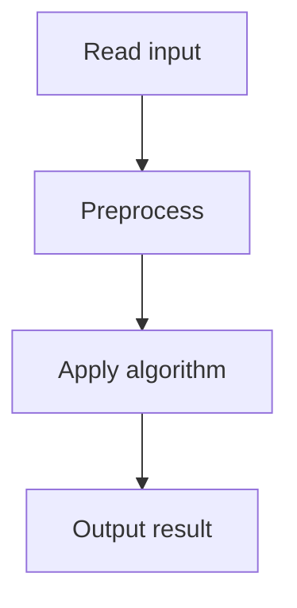

# 47. Subarray Sums I

## 1. Problem Description

Count subarrays with sum exactly `x`.

## 2. Expected Input

First line: `n, x`. Second line: `n` integers (positive).

## 3. Expected Output

Count of subarrays with sum `x`.

## 4. Constraints

1 <= n <= 2*10^5, 1 <= x <= 10^9, 1 <= arr[i] <= 10^9.

## 5. Examples

| Input | Output |
|---|---|
| `5 7`<br>`2 4 1 2 7` | `3` |

## 6. Intuition

Use prefix sums. For each ending index, count how many starting indices have `prefix[end] - prefix[start] = x`, i.e., `prefix[start] = prefix[end] - x`. Maintain a hash map of prefix sum frequencies.

## 7. Thought Process



## 8. Brute-Force Approach

Check all subarrays. `O(n^2)`. Too slow.

## 9. Optimized Solution

```python
def solve(n, x, arr):
    from collections import defaultdict
    count = 0
    prefix = 0
    freq = defaultdict(int)
    freq[0] = 1  # empty prefix
    for a in arr:
        prefix += a
        count += freq[prefix - x]
        freq[prefix] += 1
    return count

if __name__ == "__main__":
    n, x = map(int, input().split())
    arr = list(map(int, input().split()))
    print(solve(n, x, arr))
```

## 10. Why the Optimized Solution Works

The prefix sum at index `i` is `sum(arr[0..i])`. A subarray `arr[l..r]` has sum `prefix[r] - prefix[l-1]`. For each `r`, we count `l` such that `prefix[l-1] = prefix[r] - x`. The hash map tracks how many times each prefix sum has been seen.

## 11. Algorithm Used

Prefix sum + hash map.

## 12. Data Structures Used

Hash map of prefix sum frequencies.

## 13. Time Complexity Analysis

`O(n)`.

## 14. Space Complexity Analysis

`O(n)`.

## 15. Step-by-Step Code Walkthrough

1. Initialize `freq[0] = 1` (empty prefix). 2. For each element: update prefix, add `freq[prefix - x]` to count, increment `freq[prefix]`.

## 16. Dry Run with Example

`arr = [2, 4, 1, 2, 7]`, `x = 7`.
- prefix=2: count += freq[-5]=0. freq[2]=1.
- prefix=6: count += freq[-1]=0. freq[6]=1.
- prefix=7: count += freq[0]=1. count=1. freq[7]=1.
- prefix=9: count += freq[2]=1. count=2. freq[9]=1.
- prefix=16: count += freq[9]=1. count=3. freq[16]=1.
Answer: 3.

## 17. Common Pitfalls

- Forgetting `freq[0] = 1` (the empty prefix). - Using the wrong sign (`prefix - x` vs `prefix + x`).

## 18. Edge Cases

| Case | Behavior |
|---|---|
| Empty array | 0 |
| All zeros, x=0 | n*(n+1)/2 |

## 19. Alternative Approaches

Two pointers (works for positive arrays only). `O(n)`.

## 20. Related Problems

[[48. Subarray Sums II]], [[49. Subarray Divisibility]]

## 21. Key Takeaways

- **Prefix sum + hash map** is the pattern for 'count subarrays with sum X'. - Initialize `freq[0] = 1` to handle subarrays starting at index 0. - Works for arrays with negative numbers (two pointers don't).
