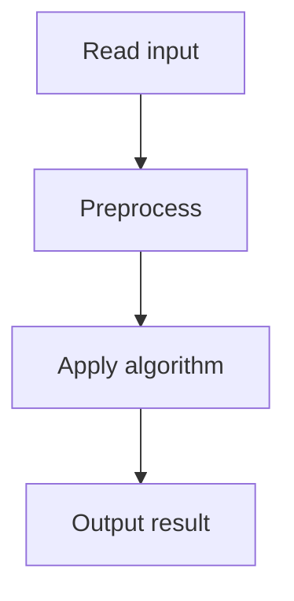

# 48. Subarray Sums II

## 1. Problem Description

Count subarrays with sum exactly `x` (array may have negative numbers).

## 2. Expected Input

First line: `n, x`. Second line: `n` integers.

## 3. Expected Output

Count.

## 4. Constraints

1 <= n <= 2*10^5, -10^9 <= x, arr[i] <= 10^9.

## 5. Examples

| Input | Output |
|---|---|
| `5 7`<br>`2 -1 3 5 -2` | `2` |

## 6. Intuition

Same as Subarray Sums I: prefix sum + hash map. Works for negative numbers too.

## 7. Thought Process



## 8. Brute-Force Approach

`O(n^2)`.

## 9. Optimized Solution

```python
def solve(n, x, arr):
    from collections import defaultdict
    count = 0
    prefix = 0
    freq = defaultdict(int)
    freq[0] = 1
    for a in arr:
        prefix += a
        count += freq[prefix - x]
        freq[prefix] += 1
    return count
```

## 10. Why the Optimized Solution Works

Same as Subarray Sums I. The hash map approach works regardless of sign.

## 11. Algorithm Used

Prefix sum + hash map.

## 12. Data Structures Used

Hash map.

## 13. Time Complexity Analysis

`O(n)`.

## 14. Space Complexity Analysis

`O(n)`.

## 15. Step-by-Step Code Walkthrough

Same as Subarray Sums I.

## 16. Dry Run with Example

Skipped.

## 17. Common Pitfalls

Same as Subarray Sums I.

## 18. Edge Cases

| Case | Behavior |
|---|---|
| All zeros, x=0 | n*(n+1)/2 |

## 19. Alternative Approaches

Two pointers don't work with negatives.

## 20. Related Problems

[[47. Subarray Sums I]], [[49. Subarray Divisibility]]

## 21. Key Takeaways

- The hash map approach works for any integers. - Two pointers require monotonic prefix sums (positive array).
