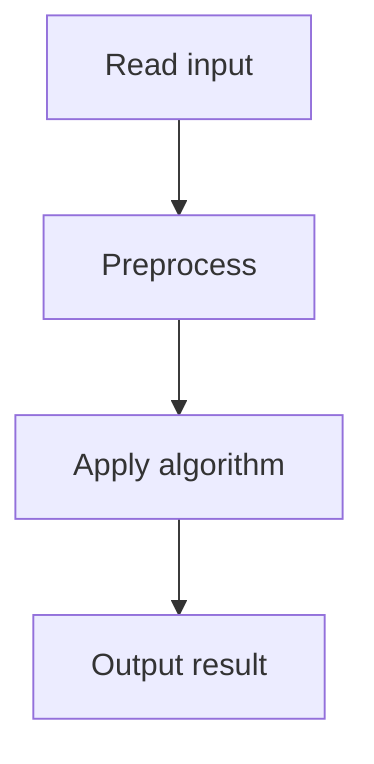

# 50. Josephus Problem I

## 1. Problem Description

`n` children in a circle. Remove every second child. Print the removal order.

## 2. Expected Input

`n`.

## 3. Expected Output

Removal order.

## 4. Constraints

1 <= n <= 2*10^5.

## 5. Examples

| Input | Output |
|---|---|
| `7` | `2 4 6 1 5 3 7` |

## 6. Intuition

Simulate with a queue. Pop the front, skip it (push back), pop the next and output.

## 7. Thought Process



## 8. Brute-Force Approach

Linked list simulation. `O(n^2)`.

## 9. Optimized Solution

```python
from collections import deque

def solve(n):
    q = deque(range(1, n + 1))
    result = []
    while q:
        # Skip first
        q.append(q.popleft())
        # Remove second
        result.append(q.popleft())
    return result

if __name__ == "__main__":
    n = int(input())
    print(*solve(n))
```

## 10. Why the Optimized Solution Works

The queue simulates the circle. Popping and appending the first element skips it. Popping the next removes it.

## 11. Algorithm Used

Queue simulation.

## 12. Data Structures Used

`collections.deque`.

## 13. Time Complexity Analysis

`O(n)`.

## 14. Space Complexity Analysis

`O(n)`.

## 15. Step-by-Step Code Walkthrough

1. Initialize queue with 1..n. 2. While queue: pop front, push back (skip); pop front, output (remove).

## 16. Dry Run with Example

n=7. Queue: [1,2,3,4,5,6,7].
- Skip 1, remove 2. Queue: [3,4,5,6,7,1].
- Skip 3, remove 4. Queue: [5,6,7,1,3].
- Skip 5, remove 6. Queue: [7,1,3,5].
- Skip 7, remove 1. Queue: [3,5,7].
- Skip 3, remove 5. Queue: [7,3].
- Skip 7, remove 3. Queue: [7].
- Skip 7, remove 7. Queue: [].
Output: 2 4 6 1 5 3 7.

## 17. Common Pitfalls

- Using a list (O(n) pop from front). - Off-by-one in skip/remove.

## 18. Edge Cases

| n=1 | Output: 1 |

## 19. Alternative Approaches

Closed-form Josephus formula exists for k=2, but simulation is simpler.

## 20. Related Problems

[[51. Josephus Problem II]], [[18. Tower of Hanoi]]

## 21. Key Takeaways

- **Deque** for O(1) pop from both ends. - Queue simulation is natural for circular problems.
