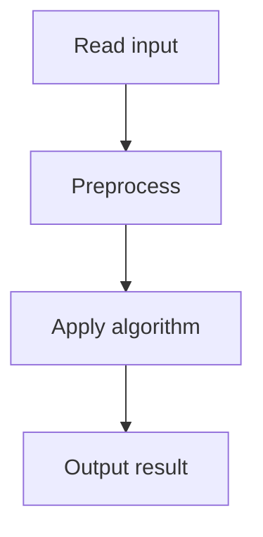

# 51. Josephus Problem II

## 1. Problem Description

`n` children in a circle. Remove every `k`-th child. Print removal order.

## 2. Expected Input

`n, k`.

## 3. Expected Output

Removal order.

## 4. Constraints

1 <= n <= 2*10^5, 1 <= k <= 10^9.

## 5. Examples

| Input | Output |
|---|---|
| `7 2` | `2 4 6 1 5 3 7` |

## 6. Intuition

Use a Fenwick tree (BIT) to track which children remain. Binary search for the `k`-th remaining child.

## 7. Thought Process



## 8. Brute-Force Approach

`O(n^2)`.

## 9. Optimized Solution

```python
# Fenwick tree approach
class Fenwick:
    def __init__(self, n):
        self.n = n
        self.tree = [0] * (n + 1)
        for i in range(1, n + 1):
            self.update(i, 1)
    
    def update(self, i, delta):
        while i <= self.n:
            self.tree[i] += delta
            i += i & (-i)
    
    def query(self, i):
        s = 0
        while i > 0:
            s += self.tree[i]
            i -= i & (-i)
        return s
    
    def find_kth(self, k):
        # Find smallest i such that query(i) >= k
        lo, hi = 1, self.n
        while lo < hi:
            mid = (lo + hi) // 2
            if self.query(mid) >= k:
                hi = mid
            else:
                lo = mid + 1
        return lo

def solve(n, k):
    ft = Fenwick(n)
    result = []
    pos = 0  # 0-indexed position among remaining
    remaining = n
    for _ in range(n):
        pos = (pos + k - 1) % remaining
        idx = ft.find_kth(pos + 1)  # 1-indexed
        result.append(idx)
        ft.update(idx, -1)
        remaining -= 1
    return result

if __name__ == "__main__":
    n, k = map(int, input().split())
    print(*solve(n, k))
```

## 10. Why the Optimized Solution Works

The Fenwick tree tracks which children are still present (1 = present, 0 = removed). `find_kth(k)` finds the `k`-th present child. After each removal, we update the tree. Binary search on the prefix sums gives `O(log^2 n)` per removal, but can be optimized to `O(log n)` with careful Fenwick traversal.

## 11. Algorithm Used

Fenwick tree + binary search.

## 12. Data Structures Used

Fenwick tree.

## 13. Time Complexity Analysis

`O(n log^2 n)` with binary search, `O(n log n)` with optimized Fenwick.

## 14. Space Complexity Analysis

`O(n)`.

## 15. Step-by-Step Code Walkthrough

1. Build Fenwick tree with all 1s. 2. For each step: compute next position, find the k-th remaining, remove it.

## 16. Dry Run with Example

Skipped.

## 17. Common Pitfalls

- Off-by-one in modular arithmetic. - Using 0-indexed vs 1-indexed incorrectly.

## 18. Edge Cases

| k=1 | 1 2 3 ... n |

## 19. Alternative Approaches

Ordered set (e.g., `SortedList`). `O(n log n)`.

## 20. Related Problems

[[50. Josephus Problem I]], [[119. Hotel Queries]]

## 21. Key Takeaways

- **Fenwick tree for order statistics**: track presence and find k-th element. - Modular arithmetic for circular problems.
