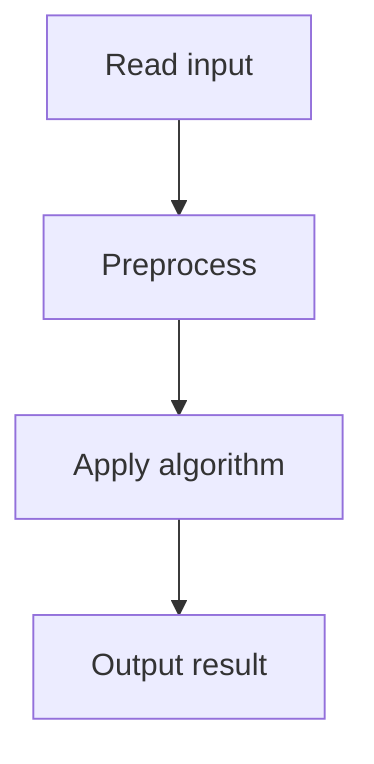

# 52. Nested Ranges Check

## 1. Problem Description

For each range, check if it contains another range and if another range contains it.

## 2. Expected Input

First line: `n`. Next `n` lines: `a, b` (range [a, b]).

## 3. Expected Output

For each range: 1 if it contains another, 1 if another contains it.

## 4. Constraints

1 <= n <= 2*10^5, 1 <= a < b <= 10^9.

## 5. Examples

| Input | Output |
|---|---|
| `4`<br>`1 6`<br>`2 4`<br>`4 6`<br>`3 5` | `1 0 0 0`<br>`0 1 0 1` |

## 6. Intuition

Sort ranges by start ascending, end descending. Use a Fenwick tree on compressed end coordinates. For 'contains another': when processing range `i`, check if any previous range has end <= `i`'s end (meaning it's nested inside `i`). For 'contained by another': check if any previous range has end >= `i`'s end.

## 7. Thought Process



## 8. Brute-Force Approach

`O(n^2)`.

## 9. Optimized Solution

```python
import bisect

def solve(n, ranges):
    # Compress end coordinates
    ends = sorted(set(b for a, b in ranges))
    
    # Sort by start asc, end desc
    indexed = sorted(enumerate(ranges), key=lambda x: (x[1][0], -x[1][1]))
    
    contains = [0] * n
    contained = [0] * n
    
    # Fenwick tree for end counts
    ft = [0] * (len(ends) + 1)
    def update(i, delta):
        while i < len(ft):
            ft[i] += delta
            i += i & (-i)
    def query(i):
        s = 0
        while i > 0:
            s += ft[i]
            i -= i & (-i)
        return s
    
    for orig_idx, (a, b) in indexed:
        # Number of ranges with end <= b (nested inside this one)
        # Since we sorted by start asc, end desc, all previous ranges have start <= a
        # Ranges with end <= b are nested inside
        b_compressed = bisect.bisect_left(ends, b) + 1
        if query(b_compressed) > 0:
            contains[orig_idx] = 1
        # Ranges with end >= b contain this one
        # Total so far - ranges with end < b
        total = query(len(ends))
        less_than_b = query(b_compressed - 1)
        if total - less_than_b > 0:
            contained[orig_idx] = 1
        update(b_compressed, 1)
    
    return contains, contained

if __name__ == "__main__":
    n = int(input())
    ranges = []
    for _ in range(n):
        a, b = map(int, input().split())
        ranges.append((a, b))
    c1, c2 = solve(n, ranges)
    print(*c1)
    print(*c2)
```

## 10. Why the Optimized Solution Works

Sorting by start asc, end desc ensures that when we process range `i`, all previous ranges have start <= `i`'s start. A previous range with end <= `i`'s end is nested inside `i`. A previous range with end >= `i`'s end contains `i`. The Fenwick tree tracks end coordinate counts for efficient range queries.

## 11. Algorithm Used

Sort + Fenwick tree + coordinate compression.

## 12. Data Structures Used

Fenwick tree, sorted list.

## 13. Time Complexity Analysis

`O(n log n)`.

## 14. Space Complexity Analysis

`O(n)`.

## 15. Step-by-Step Code Walkthrough

1. Compress end coordinates. 2. Sort by start asc, end desc. 3. For each range: query Fenwick for ends <= current end (contains), ends >= current end (contained by). 4. Update Fenwick.

## 16. Dry Run with Example

Skipped.

## 17. Common Pitfalls

- Sorting by end descending (not ascending) when starts are equal. - Coordinate compression errors.

## 18. Edge Cases

| All disjoint | 0 0 ... |

## 19. Alternative Approaches

Sweep line with two passes.

## 20. Related Problems

[[53. Nested Ranges Count]], [[40. Movie Festival II]]

## 21. Key Takeaways

- **Sort by start asc, end desc** for range containment problems. - Fenwick tree for efficient prefix queries on compressed coordinates. - Coordinate compression is needed when values are up to 10^9.
