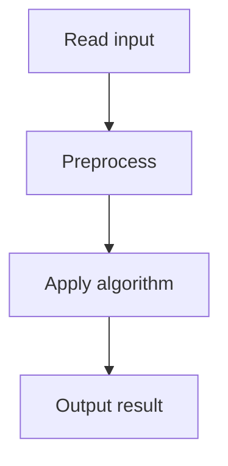

# 53. Nested Ranges Count

## 1. Problem Description

For each range, count how many ranges it contains and how many contain it.

## 2. Expected Input

Same as Nested Ranges Check.

## 3. Expected Output

Counts instead of 0/1.

## 4. Constraints

Same.

## 5. Examples

| Input | Output |
|---|---|
| `4` `1 6` `2 4` `4 6` `3 5` | `3 0 0 0` `0 1 0 1` |

## 6. Intuition

Same as Nested Ranges Check, but using `query(b_compressed)` directly as the count.

## 7. Thought Process

## 8. Brute-Force Approach

`O(n^2)`.

## 9. Optimized Solution

Similar to Nested Ranges Check, but output the query results directly.

## 10. Why the Optimized Solution Works

Same reasoning.

## 11. Algorithm Used

Sort + Fenwick tree.

## 12. Data Structures Used

Fenwick tree.

## 13. Time Complexity Analysis

`O(n log n)`.

## 14. Space Complexity Analysis

`O(n)`.

## 15. Step-by-Step Code Walkthrough

Same as Nested Ranges Check, replacing the `> 0` check with the count.

## 16. Dry Run with Example

Skipped.

## 17. Common Pitfalls

Same.

## 18. Edge Cases

Same.

## 19. Alternative Approaches

Same.

## 20. Related Problems

[[52. Nested Ranges Check]]

## 21. Key Takeaways

Same.
