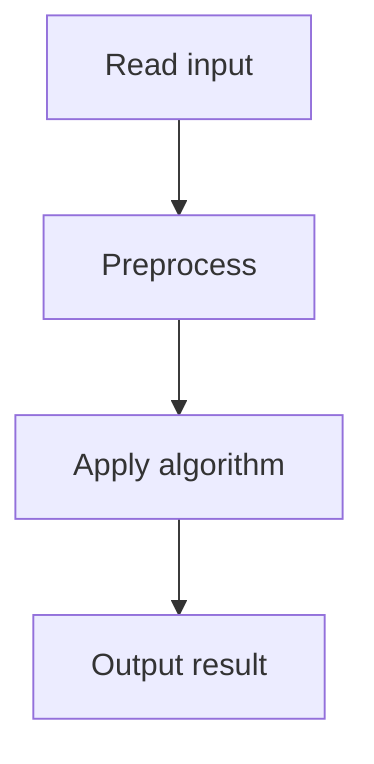

# 54. Missing Coin Sum

## 1. Problem Description

Given `n` coins with values, find the smallest sum that cannot be formed using a subset.

## 2. Expected Input

First line: `n`. Second line: `n` integers.

## 3. Expected Output

Smallest unformable sum.

## 4. Constraints

1 <= n <= 2*10^5, 1 <= x_i <= 10^9.

## 5. Examples

| Input | Output |
|---|---|
| `5`<br>`2 9 1 2 7` | `6` |

## 6. Intuition

Sort the coins. Maintain `reachable = 0` (the largest sum formable so far using a prefix). For each coin `x`: if `x <= reachable + 1`, we can form all sums up to `reachable + x`. Else, `reachable + 1` is the answer.

## 7. Thought Process



## 8. Brute-Force Approach

DP for subset sum. `O(n * sum)`. Infeasible for large sums.

## 9. Optimized Solution

```python
def solve(coins):
    coins.sort()
    reachable = 0
    for x in coins:
        if x > reachable + 1:
            return reachable + 1
        reachable += x
    return reachable + 1

if __name__ == "__main__":
    n = int(input())
    coins = list(map(int, input().split()))
    print(solve(coins))
```

## 10. Why the Optimized Solution Works

Invariant: after processing some coins, `reachable` is the largest value such that all sums in `[1, reachable]` are formable. If the next coin `x <= reachable + 1`, we can form all sums up to `reachable + x` (by adding `x` to each formable sum). If `x > reachable + 1`, then `reachable + 1` is unformable (we can't make it with the coins so far, and all future coins are >= `x > reachable + 1`).

## 11. Algorithm Used

Greedy with running reachable sum.

## 12. Data Structures Used

Sorted list.

## 13. Time Complexity Analysis

`O(n log n)`.

## 14. Space Complexity Analysis

`O(1)`.

## 15. Step-by-Step Code Walkthrough

1. Sort coins. 2. `reachable = 0`. 3. For each coin: if `> reachable + 1`, return `reachable + 1`. Else, `reachable += x`. 4. Return `reachable + 1`.

## 16. Dry Run with Example

`coins = [2, 9, 1, 2, 7]`. Sorted: `[1, 2, 2, 7, 9]`.
- x=1: 1 <= 1. reachable=1.
- x=2: 2 <= 2. reachable=3.
- x=2: 2 <= 4. reachable=5.
- x=7: 7 > 6. Return 6.
Answer: 6.

## 17. Common Pitfalls

- Not sorting. - Returning `reachable` instead of `reachable + 1`. - Using `>=` instead of `>`.

## 18. Edge Cases

| Case | Behavior |
|---|---|
| All 1s | sum + 1 |
| First coin > 1 | 1 |

## 19. Alternative Approaches

DP. Infeasible for large sums.

## 20. Related Problems

[[55. Collecting Numbers]], [[12. Apple Division]]

## 21. Key Takeaways

- **Reachable sum invariant**: if we can form [1, r], adding coin `x <= r+1` lets us form [1, r+x]. - This is the classic 'smallest unformable sum' greedy. - Sort first, then sweep.
