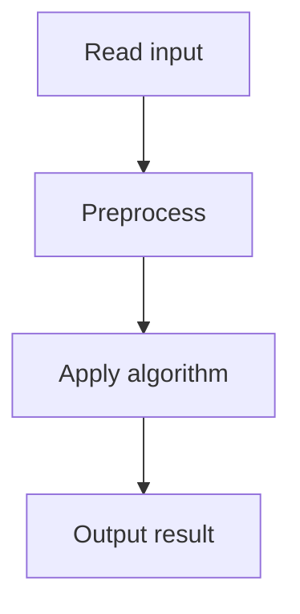

# 55. Collecting Numbers

## 1. Problem Description

Given a permutation of 1..n, find the minimum number of rounds to collect all numbers. In each round, you collect numbers in increasing order.

## 2. Expected Input

First line: `n`. Second line: `n` integers (a permutation).

## 3. Expected Output

Minimum rounds.

## 4. Constraints

1 <= n <= 2*10^5.

## 5. Examples

| Input | Output |
|---|---|
| `5`<br>`4 2 1 5 3` | `3` |

## 6. Intuition

A new round starts when we need to collect `x` but `x-1` comes after `x` in the array. Count the number of `x` (from 2 to n) where `position[x] < position[x-1]`, plus 1.

## 7. Thought Process



## 8. Brute-Force Approach

Simulation. `O(n^2)`.

## 9. Optimized Solution

```python
def solve(n, arr):
    pos = [0] * (n + 1)
    for i, x in enumerate(arr):
        pos[x] = i
    rounds = 1
    for x in range(2, n + 1):
        if pos[x] < pos[x - 1]:
            rounds += 1
    return rounds

if __name__ == "__main__":
    n = int(input())
    arr = list(map(int, input().split()))
    print(solve(n, arr))
```

## 10. Why the Optimized Solution Works

We can collect `x` in the same round as `x-1` iff `x` appears after `x-1` in the array. Otherwise, we need a new round. Starting from 1, each time `x` appears before `x-1`, we increment the round count.

## 11. Algorithm Used

Position tracking.

## 12. Data Structures Used

Array of positions.

## 13. Time Complexity Analysis

`O(n)`.

## 14. Space Complexity Analysis

`O(n)`.

## 15. Step-by-Step Code Walkthrough

1. Build position map. 2. For x from 2 to n: if pos[x] < pos[x-1], increment rounds.

## 16. Dry Run with Example

`arr = [4, 2, 1, 5, 3]`. pos = [_, 2, 1, 4, 0, 3].
- x=2: pos[2]=1 < pos[1]=2. rounds=2.
- x=3: pos[3]=4 > pos[2]=1. No.
- x=4: pos[4]=0 < pos[3]=4. rounds=3.
- x=5: pos[5]=3 > pos[4]=0. No.
Answer: 3.

## 17. Common Pitfalls

- Using 0-indexed positions incorrectly. - Starting from x=1 instead of x=2.

## 18. Edge Cases

| Sorted | 1 |
| Reverse sorted | n |

## 19. Alternative Approaches

None needed.

## 20. Related Problems

[[54. Missing Coin Sum]], [[56. Collecting Numbers II]]

## 21. Key Takeaways

- Track positions for permutation problems. - A new round starts when the next number appears before the current.
