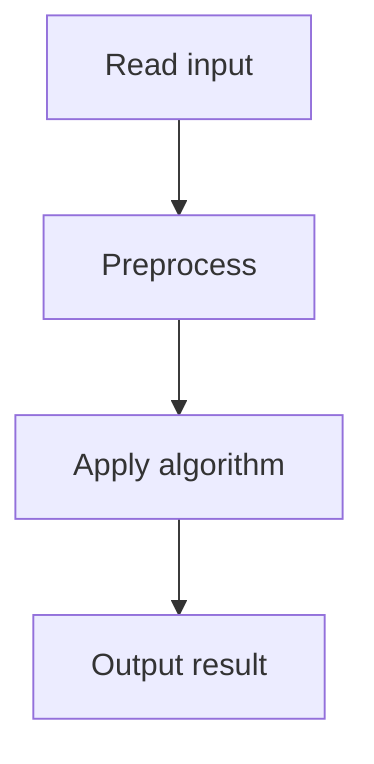

# 56. Collecting Numbers II

## 1. Problem Description

Same as Collecting Numbers, but with `m` swaps. After each swap, output the round count.

## 2. Expected Input

First line: `n, m`. Second line: permutation. Next `m` lines: two indices to swap.

## 3. Expected Output

Round count after each swap.

## 4. Constraints

1 <= n, m <= 2*10^5.

## 5. Examples

| Input | Output |
|---|---|
| `5 3`<br>`4 2 1 5 3`<br>`2 3`<br>`1 5`<br>`2 3` | `2`<br>`1`<br>`2` |

## 6. Intuition

Maintain the round count incrementally. Each swap affects at most 4 pairs: (x-1, x) and (x, x+1) for both swapped values. Recompute these pairs' contributions.

## 7. Thought Process



## 8. Brute-Force Approach

Recompute from scratch after each swap. `O(n*m)`. Too slow.

## 9. Optimized Solution

```python
def solve(n, m, arr, swaps):
    pos = [0] * (n + 1)
    for i, x in enumerate(arr):
        pos[x] = i
    
    def contributes(x):
        # Does x need a new round (i.e., pos[x] < pos[x-1])?
        if x == 1:
            return 0
        return 1 if pos[x] < pos[x - 1] else 0
    
    rounds = 1 + sum(contributes(x) for x in range(2, n + 1))
    results = []
    
    for a, b in swaps:
        a -= 1; b -= 1  # 0-indexed
        va, vb = arr[a], arr[b]
        # Affected values: va, va+1, vb, vb+1 (and their predecessors)
        affected = set([va, va + 1, vb, vb + 1])
        # Subtract old contributions
        for x in affected:
            if 2 <= x <= n:
                rounds -= contributes(x)
        # Swap
        arr[a], arr[b] = vb, va
        pos[va] = b
        pos[vb] = a
        # Add new contributions
        for x in affected:
            if 2 <= x <= n:
                rounds += contributes(x)
        results.append(rounds)
    
    return results

if __name__ == "__main__":
    n, m = map(int, input().split())
    arr = list(map(int, input().split()))
    swaps = [tuple(map(int, input().split())) for _ in range(m)]
    for r in solve(n, m, arr[:], swaps):
        print(r)
```

## 10. Why the Optimized Solution Works

Each swap only changes the positions of two values. The round count only changes for pairs involving these values. We recompute only the affected pairs.

## 11. Algorithm Used

Incremental update.

## 12. Data Structures Used

Position array.

## 13. Time Complexity Analysis

`O(n + m)`.

## 14. Space Complexity Analysis

`O(n)`.

## 15. Step-by-Step Code Walkthrough

1. Compute initial round count. 2. For each swap: identify affected values, subtract old contributions, swap, add new contributions.

## 16. Dry Run with Example

Skipped.

## 17. Common Pitfalls

- Forgetting to handle va+1 and vb+1. - Off-by-one in index handling. - Not updating `pos` after swap.

## 18. Edge Cases

| Swapping same index | No change |

## 19. Alternative Approaches

Recompute from scratch. `O(nm)`. Too slow.

## 20. Related Problems

[[55. Collecting Numbers]], [[57. Distinct Values Subarrays II]]

## 21. Key Takeaways

- **Incremental updates** are key for problems with queries. - Each swap affects only a constant number of pairs. - Track positions, not values.
