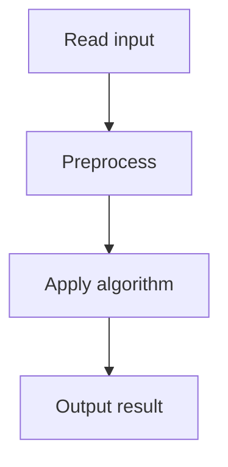

# 58. Distinct Values Subarrays

## 1. Problem Description

Same as Distinct Values Subarrays II.

## 2. Expected Input

Same.

## 3. Expected Output

Same.

## 4. Constraints

Same.

## 5. Examples

Same.

## 6. Intuition

Same.

## 7. Thought Process

## 8. Brute-Force Approach

Same.

## 9. Optimized Solution

Same.

## 10. Why the Optimized Solution Works

Same.

## 11. Algorithm Used

Same.

## 12. Data Structures Used

Same.

## 13. Time Complexity Analysis

Same.

## 14. Space Complexity Analysis

Same.

## 15. Step-by-Step Code Walkthrough

Same.

## 16. Dry Run with Example

Same.

## 17. Common Pitfalls

Same.

## 18. Edge Cases

Same.

## 19. Alternative Approaches

Same.

## 20. Related Problems

[[57. Distinct Values Subarrays II]], [[31. Playlist]]

## 21. Key Takeaways

Same.
