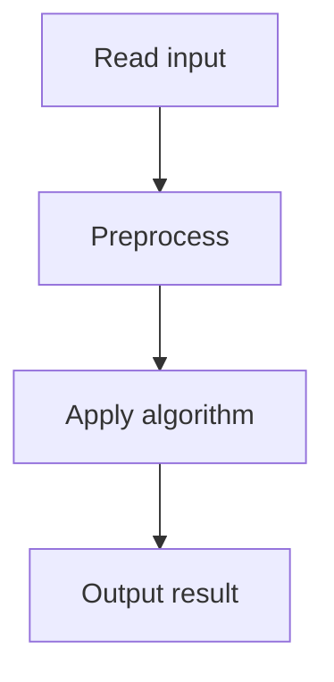

# 59. Distinct Values Subsequences

## 1. Problem Description

Count distinct subsequences of a string (mod 10^9+7).

## 2. Expected Input

A string of length `n`.

## 3. Expected Output

Count of distinct subsequences.

## 4. Constraints

1 <= n <= 10^6.

## 5. Examples

| Input | Output |
|---|---|
| `abcb` | `13` |

## 6. Intuition

DP: `dp[i]` = number of distinct subsequences of `s[:i]`. `dp[i] = 2 * dp[i-1] - dp[last_seen[s[i]] - 1]`. Subtract the duplicates created when the same character appeared before.

## 7. Thought Process



## 8. Brute-Force Approach

Generate all subsequences. Exponential.

## 9. Optimized Solution

```python
def solve(s):
    MOD = 10**9 + 7
    n = len(s)
    dp = [0] * (n + 1)
    dp[0] = 1  # empty subsequence
    last = {}  # char -> index (1-indexed)
    for i in range(1, n + 1):
        dp[i] = 2 * dp[i - 1]
        if s[i - 1] in last:
            dp[i] -= dp[last[s[i - 1]] - 1]
        dp[i] %= MOD
        last[s[i - 1]] = i
    return (dp[n] - 1) % MOD  # exclude empty

if __name__ == "__main__":
    s = input().strip()
    print(solve(s))
```

## 10. Why the Optimized Solution Works

Each subsequence either includes `s[i]` or not, giving `2 * dp[i-1]`. But if `s[i]` appeared before at index `j`, the subsequences that included `s[i]` at position `j` are double-counted. We subtract `dp[j-1]`.

## 11. Algorithm Used

DP with last-seen tracking.

## 12. Data Structures Used

DP array, hash map.

## 13. Time Complexity Analysis

`O(n)`.

## 14. Space Complexity Analysis

`O(n)`.

## 15. Step-by-Step Code Walkthrough

1. `dp[0] = 1` (empty). 2. For each `i`: `dp[i] = 2*dp[i-1] - (dp[last[s[i]]-1] if seen else 0)`. 3. Return `dp[n] - 1` (exclude empty).

## 16. Dry Run with Example

`s = 'abcb'`.
- dp[0]=1.
- i=1, 'a': dp[1]=2*1=2. last['a']=1.
- i=2, 'b': dp[2]=2*2=4. last['b']=2.
- i=3, 'c': dp[3]=2*4=8. last['c']=3.
- i=4, 'b': dp[4]=2*8 - dp[2-1]=16-2=14. last['b']=4.
Answer: 14-1=13.

## 17. Common Pitfalls

- Forgetting to subtract duplicates. - Not excluding the empty subsequence. - Modulo issues with negative numbers.

## 18. Edge Cases

| All same | n+1 (each length 0..n) |

## 19. Alternative Approaches

None.

## 20. Related Problems

[[57. Distinct Values Subarrays II]], [[15. String Reorder]]

## 21. Key Takeaways

- **Distinct subsequences DP**: `dp[i] = 2*dp[i-1] - dp[last[char]-1]`. - Track last occurrence of each character. - Handle modulo carefully (negative results need `+ MOD`).
