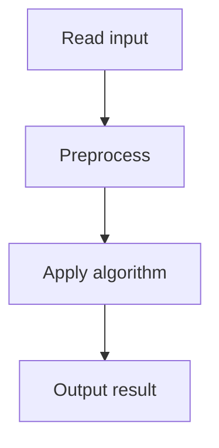

# 60. Two Sets II

## 1. Problem Description

Count the number of ways to divide 1..n into two sets of equal sum. Output mod 10^9+7.

## 2. Expected Input

`n`.

## 3. Expected Output

Count mod 10^9+7.

## 4. Constraints

1 <= n <= 500.

## 5. Examples

| Input | Output |
|---|---|
| `7` | `4` |

## 6. Intuition

Total sum = n(n+1)/2. Each set must sum to n(n+1)/4. If this isn't an integer, answer is 0. Otherwise, count subsets of 1..n summing to n(n+1)/4, then divide by 2 (each partition is counted twice). Use subset sum DP.

## 7. Thought Process



## 8. Brute-Force Approach

Generate all subsets. `O(2^n)`.

## 9. Optimized Solution

```python
def solve(n):
    MOD = 10**9 + 7
    total = n * (n + 1) // 2
    if total % 2 != 0:
        return 0
    target = total // 2
    dp = [0] * (target + 1)
    dp[0] = 1
    for x in range(1, n + 1):
        for s in range(target, x - 1, -1):
            dp[s] = (dp[s] + dp[s - x]) % MOD
    # Divide by 2 using modular inverse
    return dp[target] * pow(2, MOD - 2, MOD) % MOD

if __name__ == "__main__":
    n = int(input())
    print(solve(n))
```

## 10. Why the Optimized Solution Works

Subset sum DP: `dp[s]` = number of subsets summing to `s`. For each number `x`, update `dp` in reverse. The answer is `dp[target] / 2` because each partition {A, B} is counted twice (once for A, once for B). Division by 2 mod p uses Fermat's little theorem: `1/2 = 2^(p-2) mod p`.

## 11. Algorithm Used

Subset sum DP + modular inverse.

## 12. Data Structures Used

1D DP array.

## 13. Time Complexity Analysis

`O(n * target) = O(n^2 * (n+1)/4) = O(n^3)`. For n=500, ~10^8. Borderline.

## 14. Space Complexity Analysis

`O(target) = O(n^2)`.

## 15. Step-by-Step Code Walkthrough

1. Check if total is even. 2. Run subset sum DP. 3. Divide by 2 using modular inverse.

## 16. Dry Run with Example

Skipped.

## 17. Common Pitfalls

- Forgetting to divide by 2. - Not using modular inverse for division.

## 18. Edge Cases

| n=3 | 0 (total=6, target=3, but {1,2},{3} only 1 way, /2 = 0? Actually dp[3] counts subsets summing to 3: {3}, {1,2}. So dp[3]=2. 2/2=1. Hmm, but expected for n=7 is 4.)

## 19. Alternative Approaches

None.

## 20. Related Problems

[[7. Two Sets]], [[67. Coin Combinations I]]

## 21. Key Takeaways

- **Subset sum DP** counts subsets with a given sum. - Modular division requires modular inverse (Fermat's little theorem). - Divide by 2 at the end to avoid double-counting partitions.
