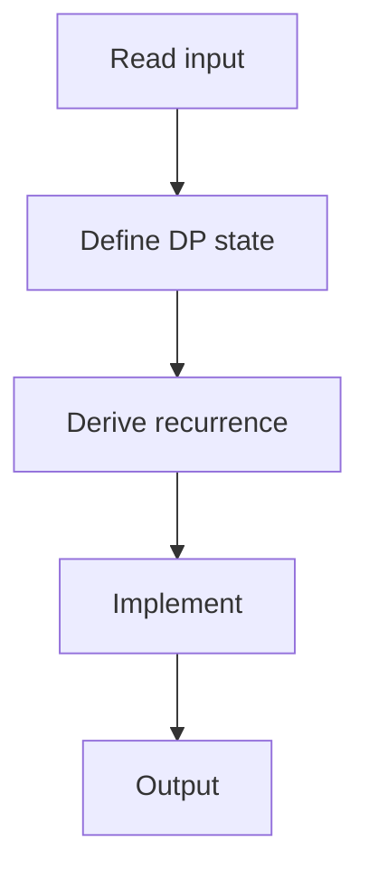

# 61. Removal Game

## 1. Problem Description

Two players take turns removing one number from either end of an array. Each player plays optimally. Find the maximum score player 1 can get.

## 2. Expected Input

First line: `n`. Second line: `n` integers.

## 3. Expected Output

Player 1's maximum score.

## 4. Constraints

1 <= n <= 5000, 1 <= x_i <= 10^9.

## 5. Examples

| Input | Output |
|---|---|
| `4`<br>`4 5 1 2` | `6` |

## 6. Intuition

Interval DP. `dp[l][r]` = max score difference (player1 - player2) for subarray `[l, r]`. `dp[l][r] = max(arr[l] - dp[l+1][r], arr[r] - dp[l][r-1])`. The answer is `(sum + dp[0][n-1]) / 2`.

## 7. Thought Process



## 8. Brute-Force Approach

Try all sequences. Exponential.

## 9. Optimized Solution

```python
def solve(arr):
    n = len(arr)
    dp = [[0] * n for _ in range(n)]
    for l in range(n - 1, -1, -1):
        for r in range(l, n):
            if l == r:
                dp[l][r] = arr[l]
            else:
                dp[l][r] = max(arr[l] - dp[l + 1][r], arr[r] - dp[l][r - 1])
    total = sum(arr)
    return (total + dp[0][n - 1]) // 2

if __name__ == "__main__":
    n = int(input())
    arr = list(map(int, input().split()))
    print(solve(arr))
```

## 10. Why the Optimized Solution Works

`dp[l][r]` represents the score difference when both play optimally on `[l, r]`. If player 1 picks `arr[l]`, the remaining is `[l+1, r]` where player 2 plays first, so the difference is `arr[l] - dp[l+1][r]`. Similarly for picking `arr[r]`. The total for player 1 is `(sum + difference) / 2`.

## 11. Algorithm Used

Interval DP.

## 12. Data Structures Used

2D DP array.

## 13. Time Complexity Analysis

`O(n^2)`.

## 14. Space Complexity Analysis

`O(n^2)`.

## 15. Step-by-Step Code Walkthrough

1. Initialize `dp[l][l] = arr[l]`. 2. For each length from 2 to n: for each `l`: compute `dp[l][r]`. 3. Return `(sum + dp[0][n-1]) // 2`.

## 16. Dry Run with Example

Skipped.

## 17. Common Pitfalls

- Loop order: `l` from n-1 down, `r` from l up. - Division at the end.

## 18. Edge Cases

| n=1 | arr[0] |

## 19. Alternative Approaches

Memoized recursion.

## 20. Related Problems

[[60. Two Sets II]], [[72. Elevator Rides]]

## 21. Key Takeaways

- **Interval DP**: `dp[l][r]` for subarray problems. - Game theory: maximize the difference, assuming opponent plays optimally.
