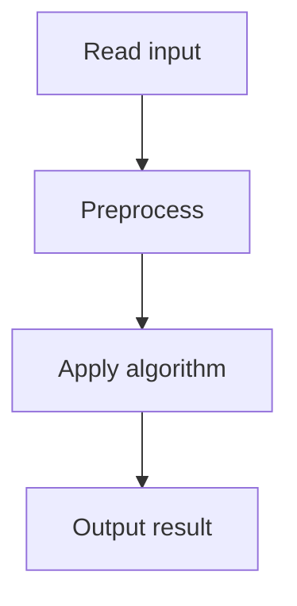

# 65. Dice Combinations

## 1. Problem Description

Count the number of ways to form sum `n` by rolling a 6-sided die. Output mod 10^9+7.

## 2. Expected Input

`n`.

## 3. Expected Output

Count mod 10^9+7.

## 4. Constraints

1 <= n <= 10^6.

## 5. Examples

| Input | Output |
|---|---|
| `3` | `4` |

## 6. Intuition

`dp[i]` = number of ways to form sum `i`. `dp[i] = sum(dp[i - j] for j in 1..6 if i >= j)`. Base: `dp[0] = 1`.

## 7. Thought Process



## 8. Brute-Force Approach

Recursion without memoization. Exponential.

## 9. Optimized Solution

```python
def solve(n):
    MOD = 10**9 + 7
    dp = [0] * (n + 1)
    dp[0] = 1
    for i in range(1, n + 1):
        for j in range(1, 7):
            if i >= j:
                dp[i] = (dp[i] + dp[i - j]) % MOD
    return dp[n]

if __name__ == "__main__":
    n = int(input())
    print(solve(n))
```

## 10. Why the Optimized Solution Works

To form sum `i`, the last roll was `j` (1-6), and the previous sum was `i - j`. Summing over all valid `j` gives the recurrence.

## 11. Algorithm Used

1D DP.

## 12. Data Structures Used

DP array.

## 13. Time Complexity Analysis

`O(n)`.

## 14. Space Complexity Analysis

`O(n)`.

## 15. Step-by-Step Code Walkthrough

1. `dp[0] = 1`. 2. For each `i` from 1 to n: sum `dp[i-j]` for j in 1..6.

## 16. Dry Run with Example

n=3. dp[0]=1, dp[1]=1, dp[2]=2 (1+1, 2), dp[3]=4 (1+1+1, 1+2, 2+1, 3).

## 17. Common Pitfalls

- Forgetting mod. - Not handling the base case.

## 18. Edge Cases

| n=1 | 1 |

## 19. Alternative Approaches

Matrix exponentiation for very large n. Overkill here.

## 20. Related Problems

[[66. Minimizing Coins]], [[67. Coin Combinations I]]

## 21. Key Takeaways

- **Coin/dice combinations DP**: `dp[i] = sum(dp[i - coin])`. - Base case `dp[0] = 1` (one way to make sum 0: use no coins).
