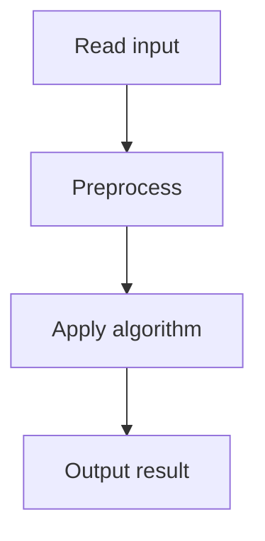

# 66. Minimizing Coins

## 1. Problem Description

Find the minimum number of coins to make sum `n`. If impossible, output -1.

## 2. Expected Input

First line: `n, k` (sum and number of coin values). Second line: `k` coin values.

## 3. Expected Output

Minimum coins, or -1.

## 4. Constraints

1 <= n <= 10^6, 1 <= k <= 100, 1 <= c_i <= 10^6.

## 5. Examples

| Input | Output |
|---|---|
| `10 3`<br>`1 5 7` | `2` | (5+5)

## 6. Intuition

`dp[i]` = min coins for sum `i`. `dp[i] = min(dp[i - c] + 1 for c in coins if i >= c)`. Base: `dp[0] = 0`.

## 7. Thought Process



## 8. Brute-Force Approach

Try all combinations. Exponential.

## 9. Optimized Solution

```python
def solve(n, coins):
    INF = float('inf')
    dp = [INF] * (n + 1)
    dp[0] = 0
    for i in range(1, n + 1):
        for c in coins:
            if i >= c:
                dp[i] = min(dp[i], dp[i - c] + 1)
    return dp[n] if dp[n] != INF else -1

if __name__ == "__main__":
    n, k = map(int, input().split())
    coins = list(map(int, input().split()))
    print(solve(n, coins))
```

## 10. Why the Optimized Solution Works

To make sum `i` with minimum coins, the last coin used was `c`, and the minimum for `i - c` is `dp[i - c]`. Take the min over all valid `c`.

## 11. Algorithm Used

1D DP (coin change).

## 12. Data Structures Used

DP array.

## 13. Time Complexity Analysis

`O(n * k)`.

## 14. Space Complexity Analysis

`O(n)`.

## 15. Step-by-Step Code Walkthrough

1. `dp[0] = 0`, rest INF. 2. For each `i`: min over coins of `dp[i-c] + 1`.

## 16. Dry Run with Example

n=10, coins=[1,5,7]. dp[0]=0, dp[1]=1, dp[2]=2, dp[3]=3, dp[4]=4, dp[5]=1, dp[6]=2, dp[7]=1, dp[8]=2, dp[9]=3, dp[10]=2 (5+5).

## 17. Common Pitfalls

- Using INF incorrectly. - Not checking `i >= c`.

## 18. Edge Cases

| Impossible | -1 |

## 19. Alternative Approaches

BFS on the state graph.

## 20. Related Problems

[[65. Dice Combinations]], [[67. Coin Combinations I]]

## 21. Key Takeaways

- **Min coin change DP**: `dp[i] = min(dp[i-c] + 1)`. - Initialize with INF, `dp[0] = 0`.
