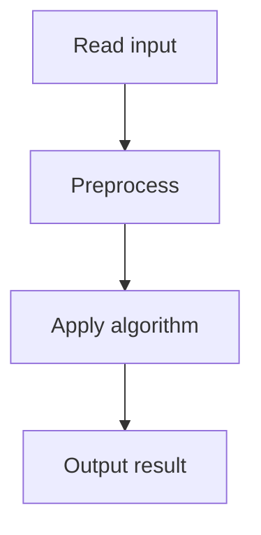

# 67. Coin Combinations I

## 1. Problem Description

Count the number of ordered ways to make sum `n` using given coins. Mod 10^9+7.

## 2. Expected Input

First line: `n, k`. Second line: `k` coin values.

## 3. Expected Output

Count mod 10^9+7.

## 4. Constraints

1 <= n <= 10^6, 1 <= k <= 100, 1 <= c_i <= 10^6.

## 5. Examples

| Input | Output |
|---|---|
| `5 3`<br>`1 2 5` | `9` |

## 6. Intuition

`dp[i]` = number of ordered ways to make sum `i`. `dp[i] = sum(dp[i - c] for c in coins if i >= c)`. Base: `dp[0] = 1`. Order matters (1+2 != 2+1).

## 7. Thought Process



## 8. Brute-Force Approach

Recursion. Exponential.

## 9. Optimized Solution

```python
def solve(n, coins):
    MOD = 10**9 + 7
    dp = [0] * (n + 1)
    dp[0] = 1
    for i in range(1, n + 1):
        for c in coins:
            if i >= c:
                dp[i] = (dp[i] + dp[i - c]) % MOD
    return dp[n]

if __name__ == "__main__":
    n, k = map(int, input().split())
    coins = list(map(int, input().split()))
    print(solve(n, coins))
```

## 10. Why the Optimized Solution Works

The outer loop over `i` (sum) and inner loop over coins means we count ordered sequences. For each sum, we add the last coin and recurse.

## 11. Algorithm Used

1D DP (ordered combinations).

## 12. Data Structures Used

DP array.

## 13. Time Complexity Analysis

`O(n * k)`.

## 14. Space Complexity Analysis

`O(n)`.

## 15. Step-by-Step Code Walkthrough

1. `dp[0] = 1`. 2. For each `i`: sum `dp[i-c]` over all coins.

## 16. Dry Run with Example

n=5, coins=[1,2,5]. dp[0]=1, dp[1]=1, dp[2]=2, dp[3]=3, dp[4]=5, dp[5]=9.

## 17. Common Pitfalls

- Loop order: outer over sum, inner over coins (for ordered). Swap for unordered (Coin Combinations II).

## 18. Edge Cases

| n=0 | 1 |

## 19. Alternative Approaches

None.

## 20. Related Problems

[[65. Dice Combinations]], [[68. Coin Combinations II]], [[66. Minimizing Coins]]

## 21. Key Takeaways

- **Ordered vs unordered combinations**: loop order matters. Outer over sum, inner over coins = ordered. Outer over coins, inner over sum = unordered.
