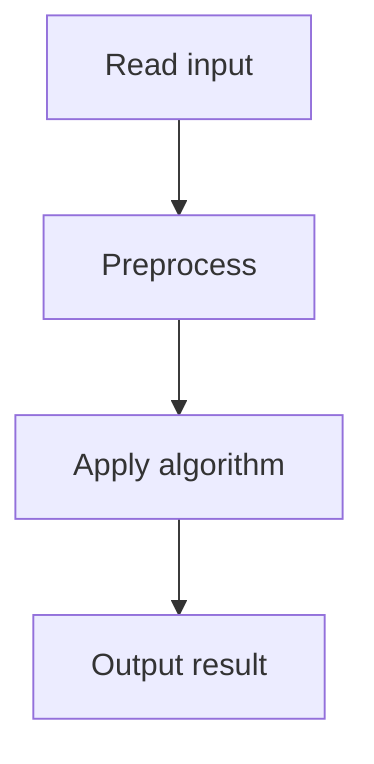

# 68. Coin Combinations II

## 1. Problem Description

Count the number of unordered ways to make sum `n`. Mod 10^9+7.

## 2. Expected Input

Same as Coin Combinations I.

## 3. Expected Output

Count mod 10^9+7.

## 4. Constraints

Same.

## 5. Examples

| Input | Output |
|---|---|
| `5 3`<br>`1 2 5` | `4` |

## 6. Intuition

Same as Coin Combinations I, but loop order is reversed: outer over coins, inner over sum. This counts unordered combinations.

## 7. Thought Process



## 8. Brute-Force Approach

Recursion.

## 9. Optimized Solution

```python
def solve(n, coins):
    MOD = 10**9 + 7
    dp = [0] * (n + 1)
    dp[0] = 1
    for c in coins:
        for i in range(c, n + 1):
            dp[i] = (dp[i] + dp[i - c]) % MOD
    return dp[n]

if __name__ == "__main__":
    n, k = map(int, input().split())
    coins = list(map(int, input().split()))
    print(solve(n, coins))
```

## 10. Why the Optimized Solution Works

Outer loop over coins ensures each coin is considered once, in order. This counts combinations where order doesn't matter (each subset of coins is counted once).

## 11. Algorithm Used

1D DP (unordered combinations).

## 12. Data Structures Used

DP array.

## 13. Time Complexity Analysis

`O(n * k)`.

## 14. Space Complexity Analysis

`O(n)`.

## 15. Step-by-Step Code Walkthrough

1. `dp[0] = 1`. 2. For each coin: for each sum from coin to n: `dp[sum] += dp[sum - coin]`.

## 16. Dry Run with Example

n=5, coins=[1,2,5]. After coin 1: dp=[1,1,1,1,1,1]. After coin 2: dp=[1,1,2,2,3,3]. After coin 5: dp=[1,1,2,2,3,4]. Answer: 4.

## 17. Common Pitfalls

- Wrong loop order. - Inner loop direction (forward for unbounded, reverse for 0/1).

## 18. Edge Cases

| n=0 | 1 |

## 19. Alternative Approaches

None.

## 20. Related Problems

[[67. Coin Combinations I]], [[66. Minimizing Coins]]

## 21. Key Takeaways

- **Unbounded knapsack / coin change**: outer over coins, inner forward over sum. - Loop order determines ordered vs unordered.
